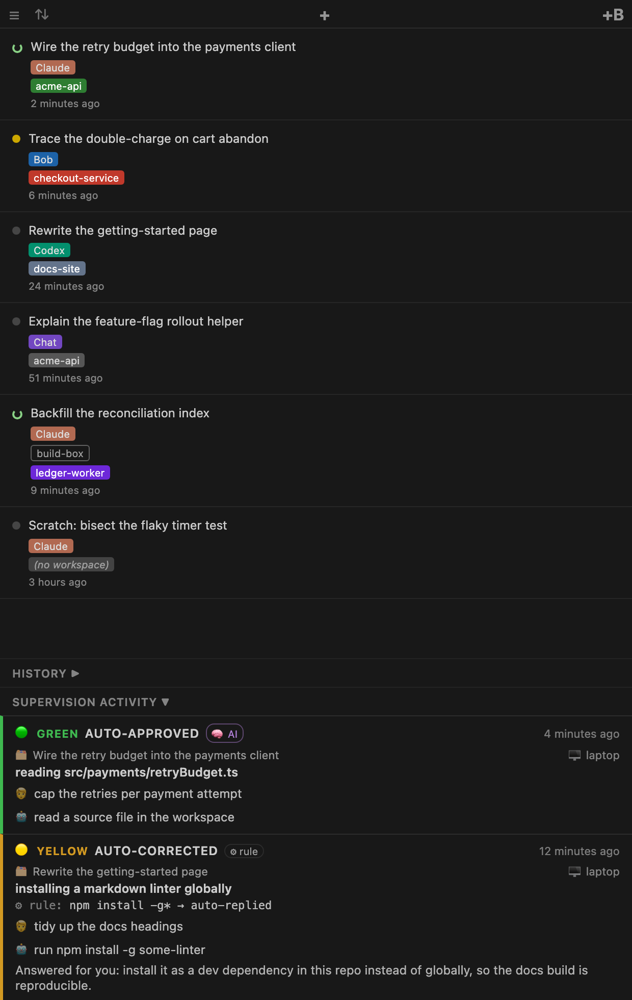

<p align="center">
  <picture>
    <source media="(prefers-color-scheme: light)" srcset="docs/branding/wordmark-light.png">
    
  </picture>
</p>

<p align="center">
  <b>Agent governance for the terminal.</b><br>
  Your coding agents run unattended under your team's written rules — every decision citing the
  rule it applied, unsafe calls rewritten into safe ones, and one durable record per action.
</p>

<p align="center"><em>Silence is never approval.</em></p>

<p align="center">
  <a href="https://github.com/eranra/session-sitter/actions/workflows/ci.yml"></a>
  <a href="https://github.com/eranra/session-sitter/releases/latest"></a>
  <a href="LICENSE"></a>
</p>

<p align="center">
  <a href="#what-changes">What changes</a> ·
  <a href="#install">Install</a> ·
  <a href="#supervision">Supervision</a> ·
  <a href="#how-this-relates-to-claude-codes-own-features">vs. first-party</a> ·
  <a href="docs/">Docs</a>
</p>

<!--
  TODO(demo): a 20-second silent GIF goes here — one `git push --force` prompt being caught,
  corrected, and recorded, with the cited practice visible. It cannot be captured in CI or by an
  agent: it needs a screen. The shot list is in docs/screenshots/README.md. No placeholder image on
  purpose — a broken image is worse than none, and ci/check-links.mjs resolves image paths.
-->

<p align="center">
  <picture>
    <source media="(prefers-color-scheme: light)" srcset="docs/screenshots/panel-wide-light.png">
    
  </picture>
  <br>
  <sub>The panel — every live session, and what the supervisor decided. <a href="docs/screenshots/">More shots</a>.</sub>
</p>

---

## What one decision looks like

The agent asked to force-push. It was not blocked — it was corrected, and told why:

<!--
  CAPTURE — MUST BE REPLACED BEFORE MERGE. Run the supervisor against a real `git push --force`
  prompt and paste the genuine record from records/ into the block below, trimmed to the fields
  that matter. Do not hand-write it, and do not merge with the marker still in place: invented
  terminal output in the README of a project whose selling point is evidence would be the worst
  possible thing to ship.
-->

```
<!-- CAPTURE: paste the real record here. Placeholder — do not merge. -->
```

Every decision names the practice it applied. That is the whole difference between a governance
layer and a classifier: `Blocked by classifier` is not something you can hand to your security
lead, and it is not something an agent can act on.

---

## Install

```bash
# Grab the .vsix from the latest release, then:
code --install-extension session-sitter-*.vsix
```

[Latest release ↓](https://github.com/eranra/session-sitter/releases/latest) · or in the IDE:
Extensions panel → `···` → **Install from VSIX…** · reload the window and you are done.

> [!NOTE]
> Not on the VS Code Marketplace yet, so installation is by VSIX. A Claude Code plugin and a
> `session-sitter` CLI are designed and in review — until they land, the extension is the way in.
> [The design](docs/superpowers/specs/2026-09-01-claude-code-plugin-design.md).

Every pull request also attaches a build, under the CI run's **Artifacts** — handy for trying a
change before it lands.

**Or from source:**

```bash
git clone https://github.com/eranra/session-sitter.git
cd session-sitter
make install
```

That builds the extension and installs it. Then reload the window — `Ctrl+Shift+P` →
**Developer: Reload Window**. Done.

<details>
<summary><strong>Installing into IBM Bob IDE, Cursor, or another VS Code build</strong></summary>

`make install` shells out to `code`. Point it at any other CLI:

```bash
make install CODE=bobide     # IBM Bob IDE
make install CODE=cursor     # Cursor
make install CODE=code-insiders
```
</details>

<details>
<summary><strong>Hacking on it</strong></summary>

```bash
npm ci        # once
make check    # type-check + lint + the test suite
```

Then press **F5** for an Extension Development Host with live reloading — no packaging step.
`make` on its own lists every target.
</details>

---

## What changes

A coding agent that pauses for approval and gets no answer is not safe — it is stopped, or it is
waved through. Session Sitter is the layer that answers, in writing, and keeps the receipt.

| | Without it | With it |
|---|---|---|
| **An overnight run** | stalls at the first prompt, or runs under `--dangerously-skip-permissions` and you hope | keeps going on the actions your rules already allow |
| **A safe, boring prompt** | you approve `read_file` for the ninetieth time | resolved by rule, before any model call |
| **An unsafe action** | approved, or blocked with nothing to act on | blocked, and the agent is handed the safe alternatives instead |
| **A judgment call** | it waits until you look | a decision card on your phone with a countdown — and on timeout it is **denied**, never approved |
| **"What did it actually do?"** | scroll four transcripts | one durable JSON record per decision, plus the activity feed |
| **An agent stuck in another window** | you find out when you get there | it is in this window's worklist, marked as waiting on you |
| **A session on another machine** | you go and look for it | it is in the same list, one click to focus the window that owns it |

---

## Supervision

Coding agents do not stop when you close the laptop. Supervision is for the moments you are not
there: it classifies each action an agent pauses on, against your own written practices, and acts.

<p align="center">
  
</p>

The deterministic tier is what keeps a governance layer off the critical path of every read, and
the two timeout edges are the whole principle: an unanswered card is a denial.

Every one of those decisions lands in the activity feed, saying which light it was, who decided —
**🧠 AI** or **⚙ rule** — and what the agent was actually asked to do:

<p align="center">
  <picture>
    <source media="(prefers-color-scheme: light)" srcset="docs/screenshots/activity-light.png">
    
  </picture>
  <br>
  <sub>One card per decision. An orange card names its options and its countdown; a red one says why it stands.</sub>
</p>

**Everything is a setting** — no environment variables to maintain, no `.env`. Open
**☰ → All settings…** in the panel, or search `sessionSitter` in the Settings UI. There is nothing
to run: the supervisor lives inside the extension, with no daemon and no interpreter.

→ [`docs/SUPERVISION.md`](docs/SUPERVISION.md) — turning it on, the lifecycle, the CLI, troubleshooting.
→ [`docs/CONFIGURATION.md`](docs/CONFIGURATION.md) — every setting, flag and command.
→ [`docs/KNOWLEDGE.md`](docs/KNOWLEDGE.md) — the practices files the classifier reads.

---

## Telegram remote control (optional)

Your **active** sessions as **topics** in a Telegram forum group. The thread you type in *is* the
session you are talking to, so there is no mode to get wrong.

```
GROUP "Session Sitter"  (Topics enabled)

  # General                            ← the active list, /sessions /history /new /who /help
  # 🟠 sitter / sort order · claude              2
  # 🔄 payments / refund flow · bob
  # ⚪ scratch / spike · codex@laptop2
```

The group holds the same sessions the **Sessions panel** does — one shared rule, so the two cannot
disagree — and every name reads status, workspace, title, then the agent and the machine. A session
that leaves the active list has its topic closed, keeping its scrollback. `/history` reaches the rest:
tap a row to open its topic and bring the session back.

Open a topic and you get that session's turns as they happen, its supervision cards, a **Full
transcript** upload, **Focus in IDE**, and a text box that sends straight into the agent.

Reading works for all four agents. Writing works for Bob — any task, live or historical — and for
Claude sessions open in their own window. Codex and VS Code Chat expose no message API, so their
topics say they are read-only rather than dropping what you type.

Turning it on, once per machine:

```jsonc
{
  "sessionSitter.telegram.remoteControl": true,
  "sessionSitter.telegram.allowedUserIds": ["123456789"]
}
```

plus a group with Topics enabled, a bot with **privacy mode disabled** (otherwise it cannot see what
you type in a topic), and `TELEGRAM_BOT_TOKEN` / `TELEGRAM_CHAT_ID` in your environment or `.env`.

Two things to know before you start:

- **`allowedUserIds` is empty by default, and empty authorises nobody.** A group is not a private
  chat, and acting on a message means typing into a live coding agent.
- **Use one bot per machine.** A bot token has a single message stream and reading it is destructive,
  so two machines sharing one steal each other's messages. Add each machine's bot to the same group;
  the fleet view is the union.

Full walk-through, including the failure table: → [`docs/TELEGRAM.md`](docs/TELEGRAM.md)

---

## How this relates to Claude Code's own features

Leave Auto mode on. It is a better default than approving by reflex. What it does not do is the
part that has to be yours, because the policy is yours:

| | Claude Code, first-party | Session Sitter |
|---|---|---|
| **Who decides** | Auto mode, with Anthropic's judgment | your team's written practices |
| **What you are told** | `Blocked by classifier` | the clause it applied — `denied — practices §4: never force-push to a shared branch` |
| **An unsafe call** | blocked | rewritten into the safe one — `git push --force` → `--force-with-lease` — so the run continues |
| **Afterwards** | nothing to hand anyone | one durable JSONL record per decision, queryable |
| **Unattended** | a session that cannot prompt denies silently | a standing policy decides, and deny-on-timeout is explicit |
| **Scope** | Claude Code, one machine (Agent view is local by design) | Claude Code, IBM Bob, Codex, VS Code Chat — unioned across windows and peer machines |

Both layers run at once, and the supervision half of this extension is off until you turn it on.

---

## Features

- **Practices as policy, with the clause cited** — every decision names the rule it applied, not a
  fixed string.
- **The correction lane** — an unsafe call is rewritten into the safe one and re-checked against
  your deny rules, so a blocked agent gets a way forward instead of a wall.
- **Deny on timeout, always** — an escalated decision with no answer is denied. Silence never
  writes an approval.
- **A durable record per decision** — which light, who decided (🧠 AI or ⚙ rule), what was asked,
  what happened. JSON on disk, plus an activity feed that expands failures to their recorded error.
- **A deterministic tier in front of the classifier** — read-only actions never cost a model call,
  so governance stays off the critical path.
- **Four agents, one policy** — Claude Code, IBM Bob IDE, Codex CLI, VS Code Chat, by reading only
  what they already write to disk. → [how](docs/ARCHITECTURE.md)
- **Across windows and across machines** — peers are discovered from the remote windows your IDE
  already opened and probed over SSH, with nothing to install on the far side. One click focuses
  the window that owns a session, even on another box.
- **Six live states, not three** — working, waiting for your approval, waiting for your answer,
  finished-unread, finished-read, dormant. An agent that is stuck is not an agent that is busy.
- **Copy transcript** as handoff-clean markdown — prose only, tool calls stripped, all four sources.

---

## First run

Open the **Secondary Sidebar** — `Ctrl+Alt+B`, or **View → Secondary Side Bar**. The
**Session Sitter** panel is there. Open a Claude or Bob session and it shows up within seconds.

| I want to… | Do this |
|---|---|
| Switch to a session | Click the row |
| Close its tab | Click `×` on the row |
| Start a new session | Click `+` (Claude) or `+B` (Bob) |
| Peek at the conversation | Hover a row |
| Reorder the list | Click **⇅** — recency, machine, workspace, agent, title, or needs-you-first |
| Colour a project | **☰ → Settings** — one colour per workspace, or `auto` for all of them |
| See older sessions | Click **History ▶** |
| Copy a transcript | Right-click → **Copy transcript** → editor / clipboard / file |
| Open About or Settings | Click **☰** |

The main list is a **live worklist** — only sessions you can act on right now. Claude and Bob are
judged by what their extension hosts report as open, unioned across every window, so a session
open in another window still appears here. Codex and Chat expose no such signal, so they count as
active while recently updated. Everything else moves to History.

Each row carries a status marker — six states, distinguished by shape as well as colour, so they
survive a screenshot and a colour-blind reader: working · waiting for your approval · waiting for
your answer · finished-unread · finished-read · dormant.
Titles come from each agent's own naming — Claude's generated title, Bob's task title, Codex's
thread name, Chat's first request — and the non-recency sort orders hold rows still while sessions
update, so you do not lose your place.

<p align="center">
  
  
  <br>
  <sub>Needs-you-first ordering · hovering a row previews the conversation</sub>
</p>

### What you need

| | |
|---|---|
| **VS Code or IBM Bob IDE** | 1.65 or later |
| **Linux, WSL or macOS** | for Claude liveness detection — `/proc/<pid>/stat` on Linux, `ps` elsewhere |
| **`python3`** | to read IBM Bob's SQLite store. Only needed for Bob sessions. |
| **Node 20+** | only to build from source |

---

## Documentation

Every document is indexed in [`docs/README.md`](docs/README.md). The short version:

| Document | What it covers |
|---|---|
| [`docs/ARCHITECTURE.md`](docs/ARCHITECTURE.md) | components, session detection, cross-machine, the supervision layer, the agent bridges |
| [`docs/SUPERVISION.md`](docs/SUPERVISION.md) | the traffic lights, the lifecycle, the CLI, troubleshooting |
| [`docs/TELEGRAM.md`](docs/TELEGRAM.md) | the remote interface: setup, ownership, write limits, troubleshooting |
| [`docs/KNOWLEDGE.md`](docs/KNOWLEDGE.md) | the BDI schema, the three tiers, routing |
| [`docs/CORPUS.md`](docs/CORPUS.md) | collecting sessions, bulk import, secret masking |
| [`docs/CONFIGURATION.md`](docs/CONFIGURATION.md) | every setting, environment variable, flag and command |

---

## Known limitations

- **On Windows, Claude liveness loses its recycled-PID guard** — Linux and WSL cross-check the PID
  against `/proc/<pid>/stat`, macOS against `ps -o lstart=`. With neither available the `kill(pid, 0)`
  signal alone decides, so sessions still list but a recycled PID could in principle look live.
- **`python3` is required for Bob sessions** — a VS Code extension has no SQLite driver, and a
  native module would break VSIX portability. Confined to one file, read-only.
  → [why](docs/ARCHITECTURE.md#why-one-python3-call-remains)
- **Claude message injection cannot always pick a session** — the sessionId↔channel link is searched
  for at send time and is not exposed by every Claude build. When a window has several Claude
  sessions open and none matches, nothing is sent and you are told: delivering a prompt to the wrong
  agent is worse than not delivering it.
- **Supervision needs a classifier CLI** — `bob` or `claude` on your `PATH`.
- **Telegram remote control needs a bot per machine** — a bot token has one destructive message
  stream, so machines cannot share one. → [`docs/TELEGRAM.md`](docs/TELEGRAM.md#use-one-bot-per-machine)
- **Telegram cannot write to Codex or VS Code Chat sessions** — neither exposes a message API. Their
  topics are read-only and say so.
- **Peer visibility is one-way** — a machine behind NAT with no reachable sshd can see its peers
  and will not be seen by them. Unreachable peers are named as unreachable rather than shown empty.
- **No motion demo yet** — the screenshots are real; the 20-second GIF of a correction being made
  needs a machine with a screen. Shot list: [`docs/screenshots/README.md`](docs/screenshots/README.md).

The per-agent liveness caveats behind these — when a new Claude session first appears, what Bob can
and cannot report about its sidebar, and why Codex and Chat fall back to recency — are in
[`docs/ARCHITECTURE.md`](docs/ARCHITECTURE.md).

---

## Contributing

`make check` — type-check, lint and tests, the same gate CI applies. Then `make` on its own lists
every target. Issues and pull requests welcome; the guards, the TypeScript-only rule and the
release process are in [`CONTRIBUTING.md`](CONTRIBUTING.md). For a vulnerability please use the
private path in [`SECURITY.md`](SECURITY.md) rather than an issue.

## License

MIT
