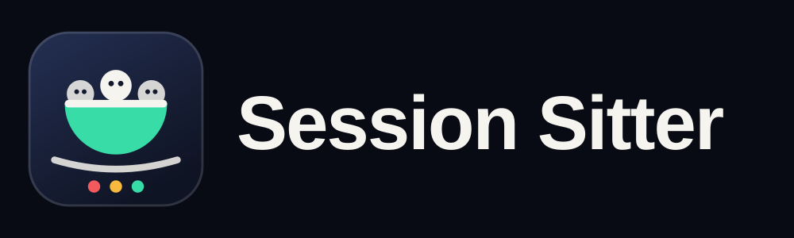
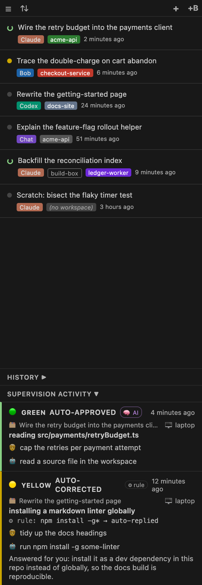
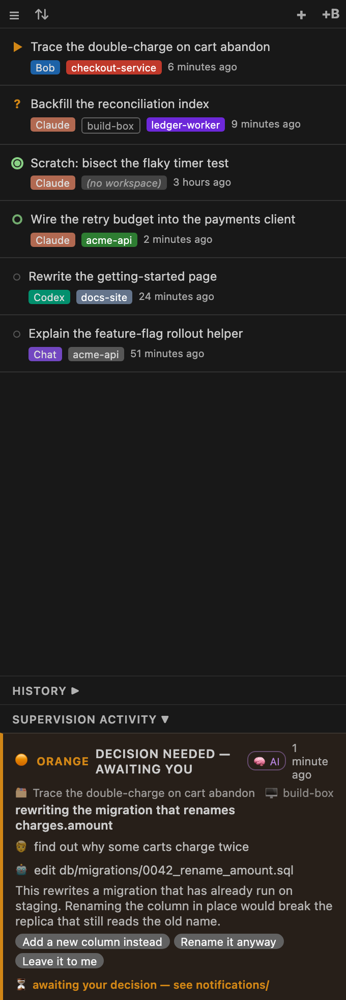
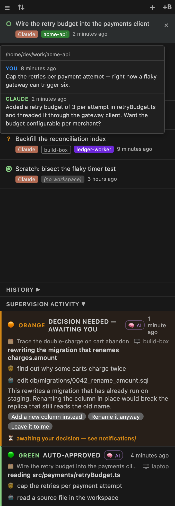
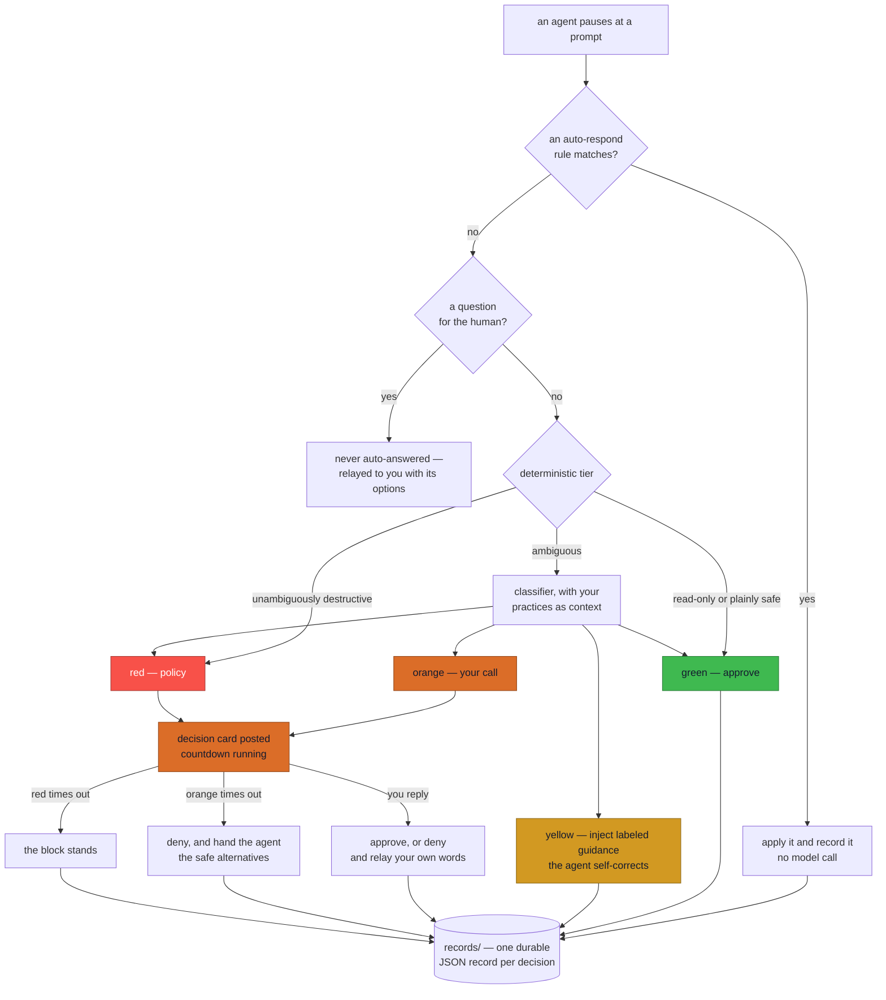
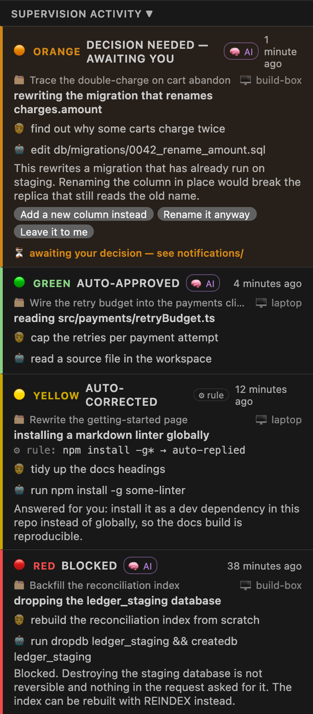
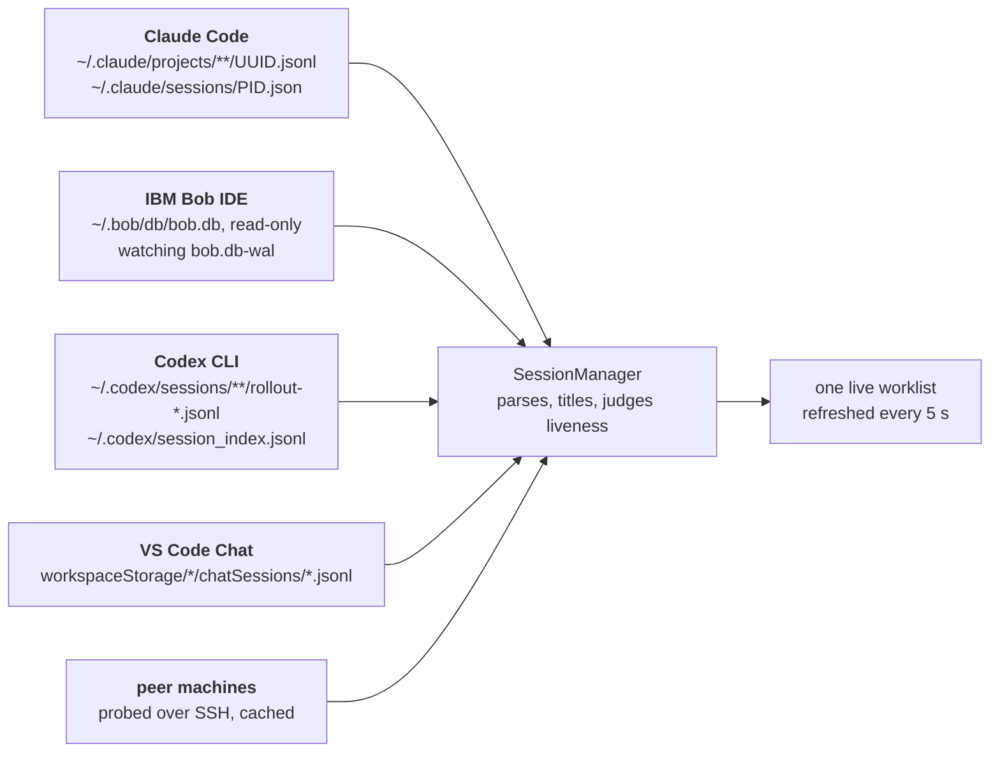

<p align="center">
  <picture>
    <source media="(prefers-color-scheme: light)" srcset="docs/branding/wordmark-light.png">
    
  </picture>
</p>

<h3 align="center">Unattended agents, under written policy.<br><em>Silence is never approval.</em></h3>

<p align="center">
Your agents can run while you are not watching — under your team's own written rules,<br>
with a durable record of every action they were allowed to take.<br>
Across Claude Code, IBM Bob IDE, Codex and VS Code Chat. Across windows, and across machines.
</p>

<p align="center">
  <a href="https://github.com/eranra/session-sitter/actions/workflows/ci.yml"></a>
  
  
  
</p>

<p align="center">
  <a href="#what-changes">What changes</a> ·
  <a href="#isnt-this-already-in-claude-code">Isn't this already in Claude Code?</a> ·
  <a href="#features">Features</a> ·
  <a href="#install">Install</a> ·
  <a href="#supervision">Supervision</a> ·
  <a href="docs/">Docs</a>
</p>

<!--
  TODO(demo): a 20-second silent GIF goes here, directly under the badges — one `git push --force`
  prompt being caught, corrected, and recorded, with the cited practice visible. It cannot be
  captured in CI or by an agent: it needs a screen. The exact shot list, and where each frame is
  referenced from, is in docs/screenshots/README.md. No placeholder image on purpose — a broken
  image is worse than none, and ci/check-links.mjs resolves image paths.
-->

<p align="center">
  <picture>
    <source media="(prefers-color-scheme: light)" srcset="docs/screenshots/panel-light.png">
    
  </picture>
  <br>
  <sub>The panel — every live session, and what the supervisor decided. <a href="docs/screenshots/">More shots</a>.</sub>
</p>

---

## What changes

A coding agent that pauses for approval and gets no answer is not safe — it is stopped, or it is
waved through. Session Sitter is the layer that answers, in writing, and keeps the receipt.

| | Without it | With it |
|---|---|---|
| **An overnight run** | stalls at the first prompt, or runs under `--dangerously-skip-permissions` and you hope | keeps going on the actions your rules already allow |
| **A safe, boring prompt** | you approve `read_file` for the ninetieth time | resolved by rule, before any model call |
| **An unsafe action** | approved, or blocked with nothing to act on | blocked, and the agent is handed the safe alternatives instead |
| **A judgment call** | it waits until you look | a decision card on your phone with a countdown — and on timeout it is **denied**, never approved |
| **"What did it actually do?"** | scroll four transcripts | one durable JSON record per decision, plus the activity feed |
| **An agent stuck in another window** | you find out when you get there | it is in this window's worklist, marked as waiting on you |
| **A session on another machine** | you go and look for it | it is in the same list, one click to focus the window that owns it |

Two front ends today: the **VS Code panel** (what this repo installs) and a **supervisor CLI** for
offline runs and replays. A third — a **Claude Code plugin** so the same policy engine governs a
bare terminal session, plus a `session-sitter` binary for `status`, `log` and `digest` — is
designed but not yet built: [`docs/superpowers/specs/2026-09-01-claude-code-plugin-design.md`](docs/superpowers/specs/2026-09-01-claude-code-plugin-design.md).
Nothing in the table above depends on it.

<!--
  TODO(cli): once the `session-sitter` bin exists, paste the REAL output of `session-sitter status`
  here as a code block — genuine, capturable text, and the honest stand-in for a GIF until one is
  recorded. It is deliberately absent rather than mocked up: invented terminal output in the README
  of a project whose selling point is evidence would be the worst possible thing to ship.
-->

## Isn't this already in Claude Code?

Partly, and it is worth being exact about which parts — the answer is the reason this project
still has a shape.

**Agent view** (`claude agents`) is a first-party worklist of Claude Code sessions: grouped by
`Needs input` / `Working` / `Completed`, with waiting timers, peek and attach. It is good, and if
you only run Claude Code on one machine it is probably all the worklist you need. Its sessions are
local to that machine and to that one agent. Session Sitter's list is four agents wide — Claude
Code, IBM Bob IDE, Codex CLI, VS Code Chat — unioned across every window you have open, and across
peer machines reached over SSH, with one click focusing the window that owns the session even when
that window is on the other box.

**Auto mode** is a first-party classifier that reviews every tool call and blocks the irreversible
ones. It is on by default on Pro, Max and Team plans, it reads your `CLAUDE.md`, and you should
leave it on: it is a strictly better default than approving everything by reflex. What it does not
do is tell you *which* of your rules it applied — a blocked call reports `Blocked by classifier` —
and it keeps no record you can hand to anyone afterwards.

So: Auto mode decides with Anthropic's judgment and tells you it decided. Session Sitter decides
against your team's written practices, hands a blocked agent the safe alternatives so the run
continues, escalates the genuine judgment calls to a human with an explicit deny-on-timeout, and
leaves one durable record per decision. Both layers can be on at once, and the supervision half of
this extension is off until you turn it on.

---

## Features

- **Four sources in one panel** — Claude Code, IBM Bob IDE, Codex CLI, VS Code Chat.
- **Across machines** — peers are discovered from the remote windows your IDE has already opened,
  probed over SSH with nothing to install on the far side beyond the `python3` it already needs, and
  their sessions merge into the same list.
- **Cross-window switching** — clicking a session owned by another window brings that window
  forward, on this machine or on a peer.
- **Live status** per row, refreshed every 5 s — six states, shape as well as colour: working ·
  waiting for your approval · waiting for your answer · finished-unread · finished-read · dormant.
- **Sort the list your way** — recency, machine + workspace, workspace, agent, title, or
  needs-you-first. The non-recency orders keep rows still while sessions update, so you do not lose
  your place.
- **A colour per workspace** — pick one per project, or `auto` to derive one for every project.
- **Hover preview** of the last few messages.
- **Copy transcript** as handoff-clean markdown: user and assistant prose only, tool calls and
  scaffolding stripped. All four sources.
- **Smart titles** — Claude's AI-generated title, Bob's task title, Codex's thread name, Chat's
  first request.
- **Traffic-light supervision** against your own written practices, with a deterministic tier in
  front of it so read-only actions never cost a model call.
- **Auto-respond and auto-approve rules**, scopable per project and per IDE.
- **Every intervention is recorded** — one durable JSON record per decision, an activity feed that
  expands failures to their recorded error, and a one-way update on your messaging channel. Nothing
  it does to your sessions is invisible.
- **Upload to corpus** — add a session to the store your rules are learned from, secrets redacted
  before anything is committed.

---

## Install

**A Claude Code plugin is the plan, and is not built yet.** When it lands, install will be two
slash commands — `/plugin marketplace add eranra/session-sitter`, then
`/plugin install session-sitter@session-sitter`. Until then the extension is the way in, and this
README will not pretend otherwise.

**The VS Code extension, from a prebuilt `.vsix` (no toolchain):**

Grab the `.vsix` from the [latest release](https://github.com/eranra/session-sitter/releases/latest), then either:

- **In the IDE:** Extensions panel → `···` → **Install from VSIX…**
- **From a terminal:** `code --install-extension session-sitter-*.vsix`

Every pull request also attaches a build, under the CI run's **Artifacts** — handy for trying a
change before it lands. Not on the Marketplace yet, so installation is by VSIX.

**Or from source:**

```bash
git clone https://github.com/eranra/session-sitter.git
cd session-sitter
make install
```

That builds the extension and installs it. Then reload the window — `Ctrl+Shift+P` →
**Developer: Reload Window**. Done.

<details>
<summary><strong>Installing into IBM Bob IDE, Cursor, or another VS Code build</strong></summary>

`make install` shells out to `code`. Point it at any other CLI:

```bash
make install CODE=bobide     # IBM Bob IDE
make install CODE=cursor     # Cursor
make install CODE=code-insiders
```
</details>

<details>
<summary><strong>Hacking on it</strong></summary>

```bash
npm ci        # once
make check    # type-check + lint + the test suite
```

Then press **F5** for an Extension Development Host with live reloading — no packaging step.
`make` on its own lists every target.
</details>

### What you need

| | |
|---|---|
| **VS Code or IBM Bob IDE** | 1.65 or later |
| **Linux, WSL or macOS** | for Claude liveness detection — `/proc/<pid>/stat` on Linux, `ps` elsewhere |
| **`python3`** | to read IBM Bob's SQLite store. Only needed for Bob sessions. |
| **Node 20+** | only to build from source |

---

> **Upgrading from before 0.5.0?** The project was renamed, and every setting now lives under one
> `sessionSitter.*` namespace — earlier names are no longer read. The old-to-new table is in
> [`CHANGELOG.md`](CHANGELOG.md#050). Your supervision state directory carries over untouched.

---

## First run

Open the **Secondary Sidebar** — `Ctrl+Alt+B`, or **View → Secondary Side Bar**. The
**Session Sitter** panel is there. Open a Claude or Bob session and it shows up within seconds.

| I want to… | Do this |
|---|---|
| Switch to a session | Click the row |
| Close its tab | Click `×` on the row |
| Start a new session | Click `+` (Claude) or `+B` (Bob) |
| Peek at the conversation | Hover a row |
| See older sessions | Click **History ▶** |
| Copy a transcript | Right-click → **Copy transcript** → editor / clipboard / file |
| Open About or Settings | Click **☰** |

The main list is a **live worklist** — only sessions you can act on right now. Claude and Bob are
judged by what their extension hosts report as open, unioned across every window, so a session
open in another window still appears here. Codex and Chat expose no such signal, so they count as
active while recently updated. Everything else moves to History.

### The marker on each row

Every row carries a marker saying whose turn it is, and why.

| Marker | Means | Your move |
|---|---|---|
| spinning green ring | Running a tool, or writing a reply | Nothing — it is busy |
| solid amber arrow | Paused on a permission prompt | Approve or reject it |
| amber question mark | Asked you a question | Answer it |
| green dot in a ring | Finished, and you have not opened it since | Read the result |
| small grey dot | Finished, and you have read it | Nothing |
| hollow grey circle | Nothing happening, or no signal to tell | Nothing |

Each state has its own shape, not only its own colour, so the row still reads at 10px and in a
high-contrast theme. Only the working marker moves — a marker that animates says "leave this
alone", which is the wrong thing to say about a session blocked waiting for you. Hover any marker
for the reason in words. Sort by **Needs you first** (**⇅**) to put the blocked ones on top.

A session waiting for your approval never ages out of the worklist: it is stuck, not stale.

→ [`docs/STATUS-INDICATORS.md`](docs/STATUS-INDICATORS.md) for exactly how each state is decided,
separately for Claude and Bob, and where the answer is inferred rather than known.

<p align="center">
  
  
  <br>
  <sub>Needs-you-first ordering · hovering a row previews the conversation</sub>
</p>

---

## Supervision

Coding agents do not stop when you close the laptop. Supervision is for the moments you are not
there: it classifies each action an agent pauses on, against your own written practices, and acts.

<p align="center">
  
</p>

The path a paused action takes, end to end:



The deterministic tier is what keeps a governance layer off the critical path of every read, and
the two timeout edges are the whole principle: an unanswered card is a denial.

Every one of those decisions lands in the activity feed, saying which light it was, who decided —
**🧠 AI** or **⚙ rule** — and what the agent was actually asked to do:

<p align="center">
  <picture>
    <source media="(prefers-color-scheme: light)" srcset="docs/screenshots/activity-light.png">
    
  </picture>
  <br>
  <sub>One card per decision. An orange card names its options and its countdown; a red one says why it stands.</sub>
</p>

**Everything is a setting** — no environment variables to maintain, no `.env`. Open
**☰ → All settings…** in the panel, or search `sessionSitter` in the Settings UI. There is nothing
to run: the supervisor lives inside the extension, with no daemon and no interpreter.

→ [`docs/SUPERVISION.md`](docs/SUPERVISION.md) — turning it on, the lifecycle, the CLI, troubleshooting.
→ [`docs/CONFIGURATION.md`](docs/CONFIGURATION.md) — every setting, flag and command.
→ [`docs/KNOWLEDGE.md`](docs/KNOWLEDGE.md) — the practices files the classifier reads.

---

## How it finds your sessions

Only by reading what the agents already write. Nothing about their internals is reimplemented, so
an agent's next release does not break the panel:



Claude liveness is a PID plus the kernel's start-time for that PID, so a recycled PID cannot fake a
live session. Bob and Claude also report which sessions their extension hosts have *open*, which is
what makes the worklist a worklist rather than a directory listing.

Acting on a *blocked* session is a different problem: a task waiting at a permission prompt cannot
be reached by a chat message. That path uses each agent's own approval emitter, reached in-process
through the V8 inspector. → [`docs/ARCHITECTURE.md`](docs/ARCHITECTURE.md#the-agent-bridges)

---

## Documentation

Every document is indexed in [`docs/README.md`](docs/README.md). The short version:

| Document | What it covers |
|---|---|
| [`docs/ARCHITECTURE.md`](docs/ARCHITECTURE.md) | components, session detection, cross-machine, the supervision layer, the agent bridges |
| [`docs/STATUS-INDICATORS.md`](docs/STATUS-INDICATORS.md) | the six row markers, and the rules that pick one — per agent |
| [`docs/CLI.md`](docs/CLI.md) | the `session-sitter` terminal command: status, log, digest, policy check |
| [`docs/SUPERVISION.md`](docs/SUPERVISION.md) | the traffic lights, the lifecycle, the CLI, troubleshooting |
| [`docs/KNOWLEDGE.md`](docs/KNOWLEDGE.md) | the BDI schema, the three tiers, routing |
| [`docs/CORPUS.md`](docs/CORPUS.md) | collecting sessions, bulk import, secret masking |
| [`docs/CONFIGURATION.md`](docs/CONFIGURATION.md) | every setting, environment variable, flag and command |

---

## Development

`make` with no target lists everything. The ones you will use:

```bash
make check      # type-check + lint + tests — the same gate CI applies
make test       # just the tests
make install    # build the .vsix and install it
make package    # build the .vsix without installing
make clean      # remove build output
```

Everything CI runs is a `make` target or a script in `ci/`, so a green pipeline means `make check`
told you the truth. Tests are [vitest](https://vitest.dev): no network, no real agent, no VS Code
instance.

Releasing: bump `version` in `package.json`, then push a matching tag —
`git tag v0.1.1 && git push origin v0.1.1`. CI verifies the tag agrees with `package.json`, runs
the full gate, and publishes the `.vsix` to a GitHub Release.

---

## Known limitations

- **On Windows, Claude liveness loses its recycled-PID guard** — Linux and WSL cross-check the PID
  against `/proc/<pid>/stat`, macOS against `ps -o lstart=`. With neither available the `kill(pid, 0)`
  signal alone decides, so sessions still list but a recycled PID could in principle look live.
- **A new Claude session appears after its first message** — that is when Claude Code writes the
  session file.
- **Bob cannot report which task is open in its sidebar**, so a running task plus a recency window
  is the best available signal.
- **Codex and Chat have no liveness signal at all** — recency is the proxy
  (`sessionSitter.probelessActiveWindowMinutes`).
- **`python3` is required for Bob sessions** — a VS Code extension has no SQLite driver, and a
  native module would break VSIX portability. Confined to one file, read-only.
  → [why](docs/ARCHITECTURE.md#why-one-python3-call-remains)
- **Claude message injection targets one conversation** — the sessionId↔channel link lives in
  Claude's webview, not its extension host.
- **Supervision needs a classifier CLI** — `bob` or `claude` on your `PATH`.
- **Peer visibility is one-way** — a machine behind NAT with no reachable sshd can see its peers
  and will not be seen by them. Unreachable peers are named as unreachable rather than shown empty.
- **No screenshots or demo yet** — the shot list is in
  [`docs/screenshots/README.md`](docs/screenshots/README.md) and the frames need a machine with a
  screen.

---

## Contributing

Issues and pull requests welcome. Run `make check` before you push; CI runs the same thing. The
details — the guards, the TypeScript-only rule, the commit voice, the release process — are in
[`CONTRIBUTING.md`](CONTRIBUTING.md). For a vulnerability, please use the private path in
[`SECURITY.md`](SECURITY.md) rather than an issue.

## License

MIT
