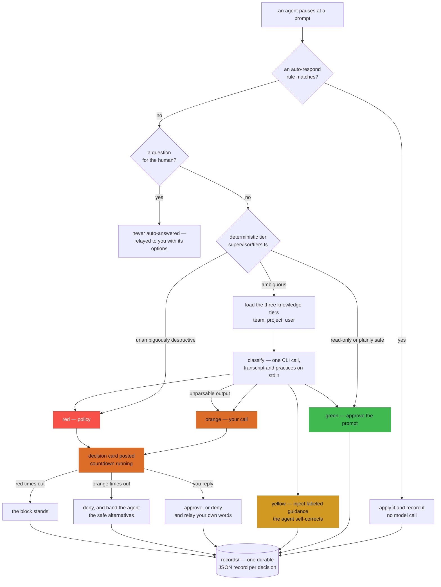
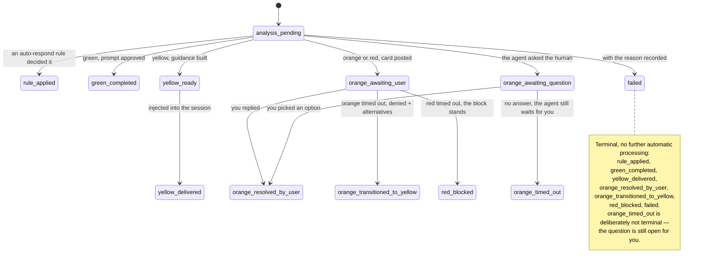

# Supervision

Coding agents do not stop when you close the laptop. They keep working — overnight, through your
meetings — and every prompt they pause on is either a decision nobody makes or a decision made
carelessly. Supervision is the layer for the moments you are not there.

When an agent pauses for approval, the extension classifies **that specific pending action**
against knowledge learned from your team's past sessions, and acts:

| Light | Meaning | What happens |
|:---:|---|---|
| 🟢 **Green** | the action is fine | Approve the prompt so the agent proceeds. Record it. No human contact. |
| 🟡 **Yellow** | a safe, unambiguous correction | Inject a labeled `[Session Supervisor]` message. The agent self-corrects. No human contact. |
| 🟠 **Orange** | your call | Block the action and send a decision card with a countdown. On timeout: deny, and hand the agent safe alternatives. |
| 🔴 **Red** | policy, not judgment | Block outright. Send an alert. On timeout the block stands. |

Two rules are absolute. **Silence is never approval** — a timeout denies. And a **question is
never auto-answered** — `ask_followup_question` and `AskUserQuestion` go to a human who picks a
real option, because resolving them through the approval channel makes the agent report that you
gave no answer at all.

## The path a paused action takes



Three edges in there are the whole design. The **deterministic tier** keeps a governance layer off
the critical path of every read: a `read_file` never costs a model call. The two **timeout** edges
are what "silence is never approval" means in code. And **unparsable output escalates to Orange**
rather than failing open — see *Recovery, and why it never fails closed* in
[`ARCHITECTURE.md`](ARCHITECTURE.md#recovery-and-why-it-never-fails-closed).

---

## Turning it on

Supervision is off until you give it a state directory.

```jsonc
{
  // Required. Where transcripts, decisions and deliveries live.
  "sessionSitter.supervisorStateDir": "/home/you/.ai-sessions/state",

  // Where your BDI knowledge lives (a repo containing data/knowledge/).
  "sessionSitter.dataRepoPath": "/home/you/work/team-corpus",

  // Which knowledge applies to you.
  "sessionSitter.knowledge.user": "your-slug",
  "sessionSitter.knowledge.project": "your-project",
  "sessionSitter.knowledge.team": "your-team",

  // On by default.
  "sessionSitter.autoSupervise": true
}
```

Then pick a classifier and a channel — settings again, no environment needed:

```jsonc
{
  "sessionSitter.supervisor.engine": "bob",                 // or: "claude"
  "sessionSitter.supervisor.bobApiKey": "…",                // for the bob engine
  "sessionSitter.supervisor.messagingChannel": "telegram",  // or: "stub" (writes to files)
  "sessionSitter.supervisor.telegramBotToken": "…",
  "sessionSitter.supervisor.telegramChatId": "…",
  "sessionSitter.supervisor.orangeResponseTimeoutMinutes": 30
}
```

VS Code stores settings in plain text, so if you would rather keep a token out of
`settings.json`, leave that setting empty: the matching environment variable or `.env` entry
(`BOBSHELL_API_KEY`, `TELEGRAM_BOT_TOKEN`, `TELEGRAM_CHAT_ID`) is still read as a fallback. Full
list: [`CONFIGURATION.md`](CONFIGURATION.md).

**You do not run anything by hand.** The extension classifies every un-handled prompt and polls
for replies and timeouts in-process. There is no daemon to start.

---

## What you see

The **Supervision activity** panel under the session list shows every decision, newest first:
the light, what you asked for, what the agent wanted to do, the notification text, the choices
offered, and your answer. An Orange awaiting you is highlighted with its countdown. A failed
supervision expands to the recorded error, with buttons to open the record JSON or copy its path
— a failure is debuggable from the panel instead of being a dead end.

**Every row and every card names its session and its machine** — `🗂 fix the login flow` with
`🖥 devbox` — because one panel lists decisions from several sessions and one Telegram chat receives
them from several machines, and a session id answers neither question. The Telegram card carries the
same thing on its `session:` line, with the raw id kept in parentheses for support. A record written
before this existed still reads as it always did: the id alone.

**Both tiers appear here.** A decision your `sessionSitter.autoRespond` rules took is tagged
**⚙ rule**; one the supervisor took is tagged **🧠 AI**. Rule decisions also go out as one-way
updates on your messaging channel, so nothing Session Sitter does to a session is invisible —
whether you are looking at the panel or at your phone. They are recorded even with
`sessionSitter.autoSupervise: false`, since no classifier is involved; silence them on the channel
(but keep the records) with `sessionSitter.supervisor.notifyRuleDecisions: false`.

---

## The lifecycle



Orange and Red share `orange_awaiting_user` because they wait the same way: a card, a countdown, and
a human. What differs is only where a timeout lands. There is no `red_awaiting_user`.

Each state is one JSON file under `<stateDir>/records/`, written atomically, carrying its own
event trail. That is what makes the whole thing restart-safe: kill the window mid-Orange, reopen
it, and the pending decision is still there with its deadline intact.

### How a reply is interpreted

Deterministically, with no second model call — that path was slow and fragile.

- A reply containing an approval word (`approve`, `allow`, `yes`, `ok`, `proceed`, `accept`, `go`,
  `confirm`) lets the original action proceed.
- **Anything else denies it** — including a redirect like "Create PR", "Just commit" or "Cancel".

Either way your own words are relayed into the session, so the agent follows the new direction
rather than just seeing a rejection. A message that is not a reply to a live card is forwarded to
the active session as a plain instruction.

---

## Auto-approve rules come first

The supervisor is the fallback, not the first responder. A prompt that a rule handles never
reaches it — which keeps a read-only sweep from spending a model call.

```jsonc
"sessionSitter.autoRespond": [
  // Approval rules: resolve a pending prompt.
  { "toolPattern": "read_file|list_files|glob|grep", "decision": "approveOnce" },
  { "toolPattern": "execute_command", "argumentPattern": "\"command\":\\s*\"git (status|diff)",
    "decision": "approveOnce" },

  // Text rules: reply to a matching assistant message.
  { "matchPattern": "Do you want to continue\\?", "response": "Yes" },

  // Scope a rule to one project, or to Claude instead of Bob.
  { "toolPattern": "*", "decision": "approveOnce", "sessionPattern": "/scratch/" },
  { "matchPattern": "continue\\?", "response": "yes", "source": "claude" }
]
```

Rules are evaluated in order; the first match wins. No matching rule means: hand it to the
supervisor, or leave it for you if supervision is off.

---

## Running it by hand

The supervisor also ships as a CLI, for offline runs, replays and debugging. Same argument
contract the Python entrypoint had:

```bash
npm run compile

# Classify one already-exported session
node out/supervisor/cli.js run <sessionId> --user you --project p --team t

# Point straight at a transcript export (no state dir needed for the read)
node out/supervisor/cli.js run <sessionId> --transcript ./export.json

# Apply replies and timeouts once, or on an interval
node out/supervisor/cli.js poll
node out/supervisor/cli.js poll --loop 5
```

Run `poll` from the CLI **only** when `sessionSitter.autoSupervise` is off. Two pollers both calling
Telegram `getUpdates` is one consumer too many, and Telegram answers the second with
`409 Conflict`.

Deliveries the CLI writes are applied by the extension when it next sees them, exactly as if the
extension had produced them.

---

## Trying it without Telegram

Set `sessionSitter.supervisor.messagingChannel` to `stub`. Decision cards are written to
`<stateDir>/notifications/<requestId>.txt`,
and you reply by dropping a file:

```bash
echo "Create PR" > <stateDir>/inbox/<requestId>.txt
```

The next poll picks it up and the full Orange lifecycle runs, offline.

---

## When something goes wrong

| Symptom | Cause | Fix |
|---|---|---|
| No activity at all | the panel is reading a different state dir than the window that made the decisions | the `state dir: …` line the log prints on activation is the one in use; on a remote setup (WSL, SSH, Bob IDE) `sessionSitter.supervisorStateDir` must be in the settings that window actually reads |
| No **🧠 AI** activity, only **⚙ rule** | the AI supervisor is off | set `sessionSitter.supervisorStateDir` — rule decisions need no state dir, the supervisor does |
| `supervision not started` in the log | no workspace root could be derived | set `sessionSitter.supervisorRepoPath` |
| Decisions always time out | `getUpdates` is failing — usually a second consumer or a webhook | check the log for `getUpdates failed`; stop the other poller |
| Records say `classify: … not found` | the classifier CLI is not on `PATH` | fix `sessionSitter.supervisor.engine`, or set `sessionSitter.supervisor.bobCliPath` / `.claudeCliPath` |
| Rule decisions show in the panel but not on Telegram | reporting is off, or the channel is `stub` | check `sessionSitter.supervisor.notifyRuleDecisions` and `.messagingChannel` |
| `state: failed` with `knowledge:` | a slug is unknown to a **configured registry** | fix the slug, or drop `sessionSitter.knowledge.registryPath` |
| Decisions cite no BDI | no `sessionSitter.knowledge.user`, or the tier files are absent | supervision still runs, just without knowledge; set the routing slugs and check `sessionSitter.dataRepoPath` |
| An approval never lands | the delivery is being retried, not lost | the `outbox/` file stays until the agent confirms; check the log for `resolve … → notfound` |

Everything is logged to the **Session Sitter** output channel and mirrored to
`<stateDir>/session-sitter.log`, which is the one to read in a multi-window setup.

---

## See also

- [`ARCHITECTURE.md`](ARCHITECTURE.md) — how the pieces fit, and why the outbox exists
- [`KNOWLEDGE.md`](KNOWLEDGE.md) — the BDI schema and the three tiers
- [`CONFIGURATION.md`](CONFIGURATION.md) — every setting and environment variable
- [`CORPUS.md`](CORPUS.md) — feeding sessions in so the knowledge can grow
