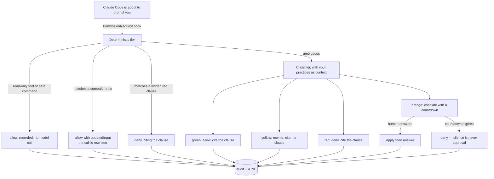

# Design: Session Sitter as a Claude Code plugin, and in the terminal

**Date:** 2026-09-01
**Status:** Approved

---

## Why this document exists

Session Sitter today is a VS Code extension. Two things changed in the ecosystem while it was
being built, and together they invalidate the pitch rather than the product:

1. **Claude Code shipped Agent view** (`claude agents`) — a worklist of sessions grouped
   `Needs input` / `Working` / `Completed`, with waiting timers, peek and attach. That is the
   first half of Session Sitter, first-party, in the terminal.
2. **Claude Code shipped Auto mode** — a classifier model that reviews every tool call and
   blocks the irreversible ones. It is the *default* starting mode on Pro, Max and Team plans,
   and it reads `CLAUDE.md`. That is the second half of Session Sitter, first-party, on by
   default.

Also shipped: **Remote Control** (permission prompts forwarded to a phone) and **Channels**
(first-party Telegram/Discord/iMessage bridges into a running session).

So "a dashboard of your sessions plus smart auto-approval with Telegram escalation" is now a
re-implementation of four shipped features, three of them on by default. That version of this
project has no reason to exist.

**What is still missing is narrower, and better.** Auto mode decides with Anthropic's judgment
and reports the fixed string `Blocked by classifier` — it does not tell you *which* of your
rules it applied, it cannot *fix* a call, it keeps no trail you can hand to anyone, and it
covers Claude Code only. Agent view's sessions are explicitly local to one machine. Nothing in
the ecosystem distinguishes an agent that is *working* from one that is *wedged*.

That gap is what this design builds, and it is defensible precisely because it is
organization-specific: a policy layer and an evidence layer are things a vendor cannot ship for
you, because the policy is yours.

---

## What this becomes

**Category:** agent governance for the terminal.

**One sentence:** your agents can run unattended, under your team's written rules, with a log of
every call they were allowed to make.

**The principle, unchanged and now the headline:** *silence is never approval.*

The four capabilities, in priority order. Each one is unclaimed today, and each is reachable
through a documented hook.

| | Capability | Why it is ours |
|---|---|---|
| 1 | **Practices as policy, with the clause cited.** Every decision names the rule it applied: `denied — practices §4: never force-push to a shared branch`. | Auto mode reads `CLAUDE.md` but emits `Blocked by classifier`. Naming the clause is the wedge. |
| 2 | **The correction lane.** An unsafe call is *rewritten* into the safe one instead of blocked: `git push --force` → `--force-with-lease`. | `PermissionRequest` returns `decision.updatedInput`, and the rewritten input is re-evaluated against deny rules, so it is safe. Nothing in the ecosystem uses this. This is the demo. |
| 3 | **Unattended survival.** A standing written policy so overnight runs neither stall nor get waved through. | In a session that cannot prompt, if no hook returns a decision the call is **denied**. So today unattended means silently denied. A policy hook is the only fix. |
| 4 | **The audit trail as a product.** Every decision as JSONL — clause, actor, latency, outcome — queryable and exportable. | Nobody has built the query surface. This is what a security-minded lead forwards to their manager. |

Kept, because they remain differentiators: **cross-vendor** (Claude Code, IBM Bob, Codex, VS Code
Chat under one policy) and **cross-machine** (Agent view is local-only).

Deliberately *not* the headline: Telegram escalation. Six independent repos implement it and none
has traction, first-party Channels exists, and users are actively filing bugs to make phone
prompts *stop*. Escalation stays, framed as the rare case, and rides Channels where it can.

---

## Shape of the change

The supervision engine is already pure Node: `src/supervisor/*` is 4,659 lines across 19 files
with **zero** `import 'vscode'`, and every dependency enters through `OrchestratorOptions`.
There is already a working CLI at `src/supervisor/cli.ts`. So this is not a rewrite — it is a
second front end on an engine that was built host-free.

```
session-sitter/
├── .claude-plugin/
│   └── marketplace.json        # the repo IS a marketplace: /plugin marketplace add eranra/session-sitter
├── plugin/                     # the Claude Code plugin
│   ├── .claude-plugin/plugin.json
│   ├── hooks/hooks.json        # PermissionRequest, PostToolUse, Notification, SessionStart/End
│   ├── commands/*.md           # /session-sitter:status, :log, :policy, :digest
│   ├── skills/*/SKILL.md       # authoring a practices file; reading the audit trail
│   ├── statusline.js           # traffic-light + decision count
│   └── lib/                    # BUILD OUTPUT, committed — see "Why lib/ is committed"
├── src/
│   ├── policy/                 # NEW: practices parsing, clause citation, correction rules
│   ├── hooks/                  # NEW: the hook entry points (pure Node)
│   ├── cli/                    # NEW: the `session-sitter` bin — status, log, digest
│   ├── supervisor/             # unchanged, reused wholesale
│   └── …                       # the extension, unchanged
└── out/                        # tsc output (gitignored, as today)
```

One engine, three front ends: the VS Code panel, the Claude Code plugin's hooks, and a terminal
CLI. Each front end only adapts input and output; no decision logic lives in a front end.

### The decision path



The deterministic tier matters more than it looks: it is what keeps a governance layer off the
critical path of every read. `PermissionRequest` sits in front of a human-visible prompt, so its
budget is milliseconds, not the 60 s the hook contract allows.

### Why `plugin/lib/` is committed build output

A plugin is installed by cloning a git ref into `~/.claude/plugins/cache/…`. Nothing compiles it
on the way in — node dependencies auto-install from a lockfile, but no build step runs. So a
plugin written in TypeScript must ship JavaScript.

The alternative — writing the hooks in hand-rolled JavaScript — would fork the decision logic
away from the 833-test TypeScript engine and give us two sources of truth for what "red" means.
That is the worse trade.

So `make plugin` compiles `src/` and copies the needed output into `plugin/lib/`, and a CI guard
rebuilds and runs `git diff --exit-code plugin/lib` so a stale artifact fails the build rather
than shipping. The generated tree carries a header saying it is generated and where from.

### What the hooks do

| Hook | Job |
|---|---|
| `PermissionRequest` | The governance decision. Returns `decision.behavior` allow/deny, with `updatedInput` for the correction lane and `updatedPermissions` (echoing the dialog's own `permission_suggestions`) so a settled question stops coming back. Writes the audit record. |
| `SessionStart` | Register this session — including a bare terminal session — so it appears in the worklist and the audit knows its identity. |
| `PostToolUse`, `PostToolUseFailure` | Feed the wedge detector: repeated identical calls, no file or token delta, retry loops. |
| `Notification` (`idle_prompt`, `permission_prompt`) | Observe the waiting state. Cannot answer it — that is what `PermissionRequest` is for. |
| `SessionEnd` | Close the audit for the session and make the overnight digest available. |

Exit-code discipline: `PermissionRequest` honours only the `decision` object, not exit 2, so the
hook must always emit valid JSON. A hook that throws must fail **closed** for red-adjacent calls
and **open** for nothing — the contract is that an unreachable supervisor never invents an
approval.

### The terminal front end

`session-sitter` as a real `bin`, so `npx session-sitter` works with no install:

| Command | What it does |
|---|---|
| `status` | The worklist, in the terminal: every session across Claude Code, Bob, Codex and Chat, on this machine and on peers, with who needs you. |
| `log` | Query the audit trail: `--since`, `--denied`, `--corrected`, `--session`, `--json`, `--csv`. |
| `digest` | "What did my agents do last night" — one page per run: decisions, corrections, escalations, cost. |
| `policy check` | Lint a practices file; replay the last N real decisions against a proposed change before shipping it. |

`status` reads the same sources the extension reads. On macOS that path is currently broken —
`getActiveSessionIds` judges every session dead because `/proc` does not exist — which is fixed
as a prerequisite, not as part of this design.

---

## What is deliberately out of scope

- **Answering a user-facing question.** Only `AskUserQuestion`/`ExitPlanMode` can be answered
  programmatically, and only through `PreToolUse` `allow` + `updatedInput`. A genuine question to
  the human stays a question to the human. That was already this project's rule.
- **A Telegram bridge as a headline feature.** It stays as one transport among several.
- **`defer`.** Documented as `-p`-only, ignored in interactive sessions, and only when the turn
  makes a single tool call — too narrow to build the human-checkpoint story on yet.
- **Replacing Auto mode.** This layer sits in front of it and complements it. Both can be on.
- **A budget that acts.** Highest-demand adjacent idea, but ccusage owns measurement and the
  quota surface is awkward. Noted, not built.

---

## How we will know it works

- `make check` stays green, and the new policy/hook/CLI code arrives with tests in the existing
  vitest style.
- `claude plugin validate ./plugin --strict` exits 0, in CI.
- A real end-to-end run: a live `claude` session in a scratch repo, with the plugin installed via
  `--plugin-dir`, hitting a real `git push --force` prompt, and the correction lane rewriting it
  to `--force-with-lease` with the clause cited — captured as the demo GIF.
- `session-sitter log` over that run shows the decision, the clause, the actor and the latency.
