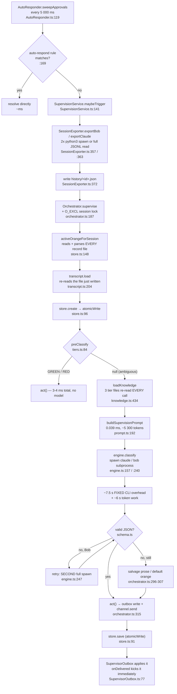

# Supervisor latency audit — where the ~13.5 s goes

Date: 2026-09-02. Branch: `ss/latency-audit`. Scope: **analysis only**, no redesign.

Ground truth carried in (not re-derived): the classifier tier's success path is ~13.5 s
(11.2–16.7 s, n=3); the deterministic tier is 3–4 ms.

Everything below is labelled **measured** (with the command that produced it) or **estimated**.
Nothing here is invented.

---

## 1. Call graph of one classification

From "a session is seen waiting" to "a decision is recorded". Every hop is `file:line`.

```
AutoResponder.start                          src/AutoResponder.ts:119
  setInterval(sweepApprovals, APPROVAL_SWEEP_MS = 5_000)   src/AutoResponder.ts:12
AutoResponder.sweepApprovals                 src/AutoResponder.ts:132
  approver.listAllPending()                  (Bob) / sweepClaudeApprovals src/AutoResponder.ts:192
  matchApprovalRule → no rule                src/AutoResponder.ts:169
  onUnhandledPending(p)                      src/AutoResponder.ts:171
extension.ts wires that callback             src/extension.ts:353 / :358
SupervisionService.maybeTrigger              src/SupervisionService.ts:141
  dedup by requestId                         src/SupervisionService.ts:143-144
  new SessionExporter(bobDbPath)             src/SupervisionService.ts:147
  exporter.exportBob(taskId, historyDir, p)  src/SessionExporter.ts:357
    readBobTranscript → queryBobDb x2        src/SessionExporter.ts:258, :262
      execPython3('python3 -c …sqlite3…')    src/BobDatabase.ts:54-61
    writeExport → JSON.stringify + write     src/SessionExporter.ts:372-377
  (Claude path instead) exportClaude         src/SessionExporter.ts:363  ← reads the whole JSONL
SupervisionService.superviseExported         src/SupervisionService.ts:195
Orchestrator.supervise                       src/supervisor/orchestrator.ts:187
  store.withSessionLock (O_EXCL lock file)   src/supervisor/store.ts:201-213
Orchestrator.superviseLocked                 src/supervisor/orchestrator.ts:203
  store.activeOrangeForSession               src/supervisor/orchestrator.ts:208
    → recordsBySession → allRecords          src/supervisor/store.ts:158, :148-153
      readdir + readFile + JSON.parse of EVERY record file  src/supervisor/store.ts:132-141
  transcript.load(sessionId)                 src/supervisor/orchestrator.ts:218
    FileTranscriptSource.load                src/supervisor/transcript.ts:204
      readFile + JSON.parse + sessionFromDict  src/supervisor/transcript.ts:208-225
  store.create → atomicWrite                 src/supervisor/orchestrator.ts:230, store.ts:96-111
  question short-circuit                     src/supervisor/orchestrator.ts:246-249
  preClassify (deterministic tier)           src/supervisor/orchestrator.ts:254 → tiers.ts:84
     GREEN → act()                           orchestrator.ts:255-260
     RED   → act()                           orchestrator.ts:261-266
     null  → keep going (the expensive path)
  loadBundle → loadKnowledge                 orchestrator.ts:270 → knowledge.ts:434
    optional registry read                   knowledge.ts:436-444
    fetchBdiFiles                            knowledge.ts:379
      localRepo: 3x readTierFile             knowledge.ts:386-393, :349-365
      no localRepo: git clone --depth 1 + rm -rf  knowledge.ts:400-412
    parseBottomLine per tier                 knowledge.ts:461 → :277
  buildSupervisionPrompt(session, bundle)    orchestrator.ts:279 → prompt.ts:192
    ROLE + sessionBlock + footer             prompt.ts:45, :166, :180
    renderTurns(session, maxTurns = 40)      prompt.ts:134  ← sliding window
    renderKnowledge (sort + render)          prompt.ts:121
  engine.classify(prompt)                    orchestrator.ts:282
    ClaudeCodeEngine.classify                engine.ts:157
      spawn('claude', ['-p','--output-format','json'])  engine.ts:167 → runWithStdin engine.ts:85-122
      prompt on stdin (never argv)           engine.ts:120
      extractResult (unwrap envelope)        engine.ts:183
    BobCliEngine.classify (default engine)   engine.ts:240
      up to TWO runBob() passes              engine.ts:247-250  ← retry on non-JSON
      runBob spawns 'bob' in a temp cwd      engine.ts:255-276, :234
  parseAndValidate(result.raw)               orchestrator.ts:291 → schema.ts
    on SchemaError: salvageAssessmentFromText / unclassifiedOrangeAssessment  orchestrator.ts:296-307
  act(record, assessment, light)             orchestrator.ts:315
    GREEN: agent.deliver → outbox JSON write orchestrator.ts:323, agentControl.ts (deliver)
    YELLOW: deliverYellow                    orchestrator.ts:345
    ORANGE/RED: actInteractive → channel.send orchestrator.ts:370-397
    store.save (atomicWrite)                 store.ts:91-94
SupervisorOutbox applies the delivery        src/SupervisorOutbox.ts:77-82 (setInterval 1500 ms,
                                             short-circuited by onDelivered)
```

### Mermaid



---

## 2. Real prompt-size numbers (measured)

Script: `/tmp/ss-measure/measure.js` — it `require`s the repo's **own compiled** builders
(`out/supervisor/prompt.js`, `transcript.js`, `knowledge.js`), so these are the exact strings the
supervisor sends. No `vscode` stub was needed: nothing on the prompt path imports `vscode`.

```
$ node /tmp/ss-measure/measure.js
CONSTANT scaffolding (0 turns, 0 BDI)              7273 chars  ~  2020 tok
  (template parsed into 5 BDI entries)
scaffolding + 1 tier of real BDI template          9188 chars  ~  2552 tok
full prompt,  10 turns (renderer caps at 40)      11654 chars  ~  3237 tok
full prompt,  40 turns (renderer caps at 40)      18894 chars  ~  5248 tok
full prompt,  80 turns (renderer caps at 40)      19003 chars  ~  5279 tok
full prompt, 200 turns (renderer caps at 40)      19043 chars  ~  5290 tok

shared prefix between call N (60 turns) and call N+1 (63 turns): 744 chars (~207 tok) of 19256
  diverges at: "0] tool: tool_result[Read] error=False: xxxxxxxx…"

footer (DECISION+SCHEMA_RULES+SAFETY+OUTPUT_SCHEMA) = 6394 chars (~1776 tok), placed AFTER the
  variable content, at offset 879 of the 7273-char empty prompt
ROLE header (truly constant, at the very front) = 504 chars (~140 tok)
```

Tokens estimated at 3.6 chars/token, as specified. Character counts are exact.

Caveat, stated plainly: the **scaffolding, footer, BDI and prefix numbers are exact** (real
builder, real `knowledge/bottom-line.template.md`). The transcript turns are **synthetic**
(a 1.2 KB tool result per tool turn, a `Read` tool call, a one-line user turn) rendered through
the real `renderTurns`. A production transcript's turn sizes will differ; the *shape* —
saturating at ~19 KB because of the 40-turn cap — does not.

Second script, `/tmp/ss-measure/prefix2.js`:

```
$ node /tmp/ss-measure/prefix2.js
cross-session shared prefix: 554 chars (~154 tok); diverges at "aaa source=claude project=session-sitter"
```

CPU-side steps, `/tmp/ss-measure/cpu.js` (mean over 2 000–20 000 iterations):

```
$ node /tmp/ss-measure/cpu.js
preClassify              0.0005 ms
buildSupervisionPrompt   0.0385 ms
parseAndValidate         0.0048 ms
parseBottomLine(3197 chars, 5 entries)  0.0192 ms
```

The classifier CLI's fixed cost, isolated with a prompt small enough that generation is nil:

```
$ for i in 1 2 3 4 5 6; do /usr/bin/time -p sh -c \
    "echo 'Reply with exactly: ok' | claude -p --output-format json >/dev/null" 2>&1 | grep real; done
real 9.54
real 7.76
real 16.47
real 7.40
real 6.50
real 7.22
```

**Median 7.58 s, mean 9.15 s, n=6, for a ~6-token prompt.** This is the headline measurement of
this audit: the fixed cost of *starting `claude -p` and getting any answer at all* accounts for
roughly 7.5 s of the 13.5 s success path, before a single prompt token is paid for.

Bob DB access, for the export step:

```
$ for i in 1 2 3; do /usr/bin/time -p python3 -c 'import sqlite3,json' 2>&1 | grep real; done
real 0.04
real 0.03
real 0.03
```

`claude --version` returns in 0.01 s, which tells us the 7.5 s is *not* process exec — it is the
CLI's own boot (config/settings load, MCP + tool init, auth) plus one API round trip.

---

## 3. Latency budget

One classifier-tier success path, ~13.5 s total.

| # | Step | file:line | Cost | Measured / estimated | Reducible? |
|---|------|-----------|------|----------------------|-----------|
| 0 | Detection delay before anything starts | `AutoResponder.ts:12,119` | 0–5 000 ms (mean ~2 500 ms) | measured constant, latency estimated | **Yes** — event-driven trigger, or a shorter interval |
| 1 | Bob export: 2x `python3 -c` sqlite spawn | `SessionExporter.ts:258,262`; `BobDatabase.ts:54` | ~60–80 ms | measured (30–40 ms per `python3` boot) | **Yes** — one query, or a node sqlite reader |
| 1b | Claude export: read whole session JSONL | `SessionExporter.ts:366` | ~5–50 ms (file-size bound) | estimated | Partly |
| 2 | `writeExport` JSON.stringify(…, 2) + write | `SessionExporter.ts:372-377` | ~2–10 ms | estimated | **Yes** — see #3 |
| 3 | `transcript.load` re-reads + re-parses the file just written | `transcript.ts:208-225` | ~2–10 ms | estimated | **Yes** — pure round-trip waste, pass the object |
| 4 | `activeOrangeForSession` → reads + parses **every** record file | `store.ts:148-153`, `orchestrator.ts:208` | ~0.05 ms x N records; ~50 ms at 1 000 records, unbounded growth | estimated | **Yes** — index by session, or filename convention |
| 5 | `withSessionLock` O_EXCL create + read-back + unlink | `store.ts:201-227` | ~1–3 ms | estimated | No (correctness) |
| 6 | `store.create` atomicWrite | `store.ts:96-111` | ~1–3 ms | estimated | Marginal |
| 7 | `preClassify` | `tiers.ts:84` | **0.0005 ms** | measured | No (already free) |
| 8 | `loadKnowledge`, local repo: 3 file reads + 3 parses | `knowledge.ts:386-393,461` | ~1–3 ms | measured parse (0.019 ms); I/O estimated | **Yes** — cache/mtime-watch; re-read every call today |
| 8b | `loadKnowledge`, **no** local repo: `git clone --depth 1` + `rm -rf` | `knowledge.ts:400-412` | **1 000–5 000 ms, every single call** | estimated | **Yes** — clone once, or require a local checkout |
| 9 | `buildSupervisionPrompt` | `prompt.ts:192` | **0.0385 ms** | measured | No (already free) |
| 10 | **`claude -p` fixed boot + auth + round trip** | `engine.ts:167` | **~7 500 ms (median, n=6)** | **measured** | **Yes** — direct API call, or a warm reusable process |
| 11 | Token work: ~5 300-token prompt + assessment generation | `engine.ts:157` | ~6 000 ms (13.5 s ground truth − 7.5 s fixed) | derived from measurements | **Yes** — smaller prompt, cheaper model, capped output |
| 11b | Bob engine only: a **second full spawn** when pass 1 returns prose | `engine.ts:247-250` | +100 % of #10+#11 (~13 s) when it fires | estimated | **Yes** — structured output instead of a retry |
| 12 | `extractResult` envelope unwrap | `engine.ts:183` | <0.01 ms | estimated | No |
| 13 | `parseAndValidate` (schema validation) | `schema.ts` via `orchestrator.ts:291` | **0.0048 ms** | measured | No (already free) |
| 14 | `agent.deliver` → outbox atomic write | `agentControl.ts` (`deliver`) | ~2–5 ms | estimated | Marginal |
| 15 | `channel.send` (Telegram HTTP) on orange/red | `orchestrator.ts:376` | ~150–600 ms network | estimated | Partly |
| 16 | `store.save` atomicWrite | `store.ts:91-94` | ~1–3 ms | estimated | Marginal |
| 17 | Outbox apply back into the agent | `SupervisorOutbox.ts:77-82` | ~0 ms (`onDelivered` fires it) or ≤1 500 ms if that fails | measured constant | Already handled |

**Read of the table:** ~99 % of the classifier path is step 10 + step 11 — the subprocess and its
model call. Every TypeScript step in this repo, summed, is **under 0.1 ms**. There is nothing to
optimise in the supervisor's own code except the things that *multiply* step 10 (the Bob retry,
the per-call git clone) and the things that sit *before* it (the 5 s sweep interval).

---

## 4. Irreducible vs. pure waste

**Irreducible.** One model round trip's inference time for a genuinely ambiguous decision — call
it 1–3 s against a fast model with a short prompt. The transcript and BDI actually needed to
judge the pending action. Schema validation, the session lock, one record write. These are all
either free (measured µs) or required for correctness.

**Pure waste, in order of time burned.**

1. **~7.5 s per classification spent booting an agentic CLI to make one stateless
   classification.** Measured, n=6. `claude -p` loads settings, MCP servers, and a tool surface
   the classifier is told not to use (`prompt.ts:50-52` literally says "do not read files you
   don't need"; `prompt.ts:182` grants read-only repo access and then `:183` says the BDI is
   already inline and authoritative). The task is a single structured completion. A direct API
   call would pay the round trip and nothing else.
2. **Bob's retry doubles the whole cost when it fires** (`engine.ts:247-250`). The comment
   acknowledges Bob "sometimes returns a prose summary instead". Each retry is a second full
   spawn — another ~13 s. Bob is the *default* engine (`config.ts:19`).
3. **A `git clone --depth 1` per classification** whenever `knowledgeLocalRepo` is unset but
   `knowledgeRepo` is set (`knowledge.ts:400-412`). Seconds, on the hot path, for three small
   markdown files, then `rm -rf`'d so the next call repeats it.
4. **Up to 5 s of detection delay before the supervisor is even told** (`AutoResponder.ts:12`).
   Nothing is computed during it. It is a third of the user-visible wait.
5. **Nothing is cached between calls, anywhere.** `loadKnowledge` re-reads and re-reparses the
   three tier files on every classification (`orchestrator.ts:270`); the engine is stateless by
   design (`engine.ts:6-7`); no prompt, prefix, or assessment is memoised. Individually cheap
   (0.019 ms/parse, measured) — but it means the ~1 776-token constant instruction block is
   rebuilt *and re-sent* every time.
6. **The transcript is written to disk and immediately read back.** `exportBob`/`exportClaude`
   serialise to `history/<id>.json` (`SessionExporter.ts:372`) and `transcript.load` parses that
   same file microseconds later (`transcript.ts:208`). Milliseconds, but it is round-tripping an
   object through the filesystem for no reason on this path.
7. **`activeOrangeForSession` scans the entire record store** (`store.ts:148`) to answer "is
   there an open orange for this one session". Unnoticeable today; grows without bound.

**And yes: the full transcript is re-sent on every call.** There is no incremental
"here is what changed" path. `renderTurns` (`prompt.ts:134`) re-renders the last 40 turns from
scratch, per call, at ~5 300 prompt tokens saturated.

---

## 5. The prefix question — is it cache-friendly?

**No. KV-cache reuse is effectively impossible today, and it fails twice over.**

**Failure 1 — the stable prefix is far too short to be cacheable.** Measured: two consecutive
calls in the *same* session, three turns apart, share only **744 chars (~207 tokens)** of a
19 256-char prompt. Across two *different* sessions they share **554 chars (~154 tokens)**.
Anthropic's prompt cache has a minimum cacheable prefix of 1 024 tokens (2 048 on the smaller
models). At ~207 tokens the shared prefix does not reach the minimum, so **zero** of it would be
cached even if caching were requested.

**Failure 2 — the exact thing that varies, at file:line.** The front of the prompt is *not*
polluted by a timestamp or a counter — that much is fine. `ROLE` (`prompt.ts:45`, 504 chars) is
byte-identical on every call anywhere. The divergence starts immediately after, in this order:

- `src/supervisor/prompt.ts:169` — `SESSION: id=${session.sessionId}` … `status=${session.status}`.
  The session id is stable *within* a session but differs across sessions, so it caps
  cross-session reuse at the 554 chars above. `status` can also change mid-session.
- **`src/supervisor/prompt.ts:135` — `const turns = session.turns.slice(-maxTurns)` — this is the
  one that matters.** It is a *sliding window*. Every new turn shifts the window by one, so the
  first rendered turn is a different turn on every call, and every byte of the transcript block
  changes.
- **`src/supervisor/prompt.ts:137` — `` const header = `[${t.index}] ${t.role}` ``** — turn
  indices are *absolute*. Even with an unshifted window the numbers printed at the head of the
  block would move. The measured divergence point lands exactly here: the prompts differ first at
  `"[20] tool:"` vs `"[23] tool:"`.

**Failure 3 — the layout is backwards for caching.** The ~1 776-token constant instruction block
(`DECISION` + `SCHEMA_RULES` + `SAFETY` + `OUTPUT_SCHEMA`) is emitted by `footer()`
(`prompt.ts:180-190`) and assembled *last* (`prompt.ts:193`), i.e. **after** the variable
transcript. It is the single largest genuinely-constant chunk in the prompt — on its own nearly
big enough to clear the 1 024-token minimum — and it sits where a cache can never reach it.
Put bluntly: the prompt places its variable content in front of its constant content.

None of this is exercised today anyway, because the classifier is a fresh `claude`/`bob`
subprocess per call (`engine.ts:6-7`, `:157`, `:240`) with no session resumption and no
`cache_control` anywhere in the repo — so there is no cache to hit even in principle.

---

## 6. What a follow-up should measure that this audit did not

- A real end-to-end run with a *production* transcript, to replace the synthetic turn sizes in §2.
- Bob's spawn cost and its retry rate in practice — `bob` is the default engine and was not timed
  here (only `claude` was, and only its minimal round trip).
- Whether the `claude` CLI's ~7.5 s floor moves with `--strict-mcp-config` / a trimmed settings
  file, which would say how much of it is MCP and tool init versus auth.
