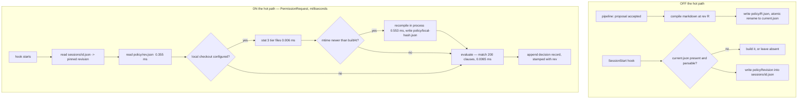
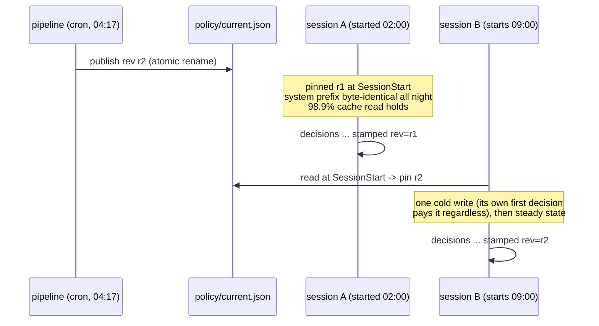
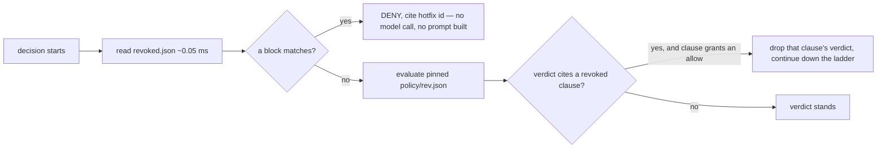
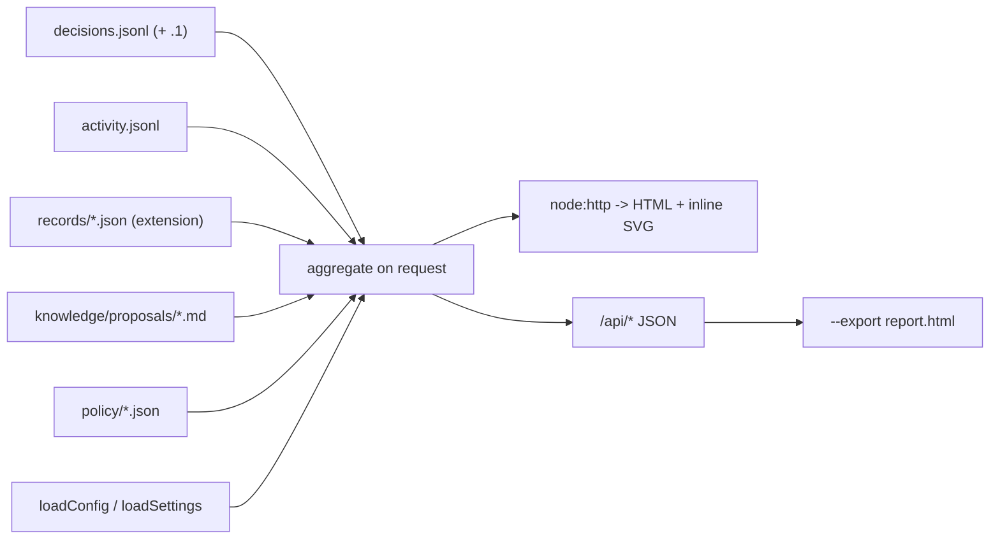

# 14 — Runtime transfer and observability

**Design, not implementation.** Two halves: (A) getting learned knowledge into the runtime fast and
without breaking the prompt cache, (B) what an org manager sees.

Every number below is measured on this machine (Node v25.1.0, darwin 24.6.0) or quoted from
`docs/superpowers/specs/2026-09-02-fast-supervisor.md`. Commands that produced
the new numbers are in §T5.

---

## 0. The two decisions, up front

**1. Prompt-cache vs learning: pin the corpus revision per session.** A session resolves the
compiled policy revision once, at `SessionStart`, and every decision in that session's life uses
that revision. The learning pipeline may publish a new revision at any moment; no running session
ever sees it. New sessions pick it up. This is not a cadence knob, it is the only mechanism that
actually works — see §A2 for why ordering the prefix and splitting breakpoints cannot help.

**2. Storage: a plain precompiled JSON artifact. No SQLite in v1.** A 200-clause artifact is
**112 KB**, read+parse **0.355 ms**, regex-compile **0.034 ms**, and matching all 200 clauses
against one command is **0.0065 ms**. A 100,000-record decision log is 28.5 MB and aggregates
in **133 ms** (47 ms read + 86 ms parse). SQLite would buy nothing measurable. §A6 states the
thresholds that would change this.

---

## HALF A — knowledge into the runtime

### A1. The compiled artifact load path

#### Where it lives

`<dataDir>/policy/` where `dataDir()` is already defined
(`src/hooks/paths.ts:21` — `SESSION_SITTER_DATA_DIR` → `CLAUDE_PLUGIN_DATA` →
`~/.claude/session-sitter`).

```
<dataDir>/policy/
  current.json          the artifact the next NEW session will pin
  <revision>.json       retained artifacts, newest 20, so old citations resolve offline
  revocations.jsonl       deny-only channel, machine-local, CLI-written (§A2)
  revocations-team.jsonl  mirror of the corpus's revocations.jsonl, refresher-written
```

`current.json` **is** the artifact, not a pointer to one — one file open per decision, not two, with
its `revision` inside it. It is an atomically-written **copy** of the current `<revision>.json`, not a
replacement for it: the immutable per-revision files are what makes a March decision resolve to the
text that actually fired. The duplicated 112 KB is cheaper than either compromise.

**The compiled artifact is never committed.** It is a pure function of the markdown at revision R
and is named by R, so it cannot drift from its source, and there is no generated file in git to
conflict on. This repo already commits build output (`plugin/lib/`) because plugins are cloned and
never built — that reason does not apply here, because the artifact is built by the pipeline that
also writes the markdown.

#### How it is found and refreshed



#### Staleness detection — two regimes, deliberately

| Knowledge source | Staleness check on the hot path | Cost | Why |
|---|---|---|---|
| git URL (`knowledgeRepo`) | **none** | 0 | Resolving a remote ref is a network call (`git ls-remote` ≈ 200 ms, `git clone --depth 1` 1–5 s per the latency audit). It has no business in front of a human-visible prompt. The refresher owns freshness. |
| local checkout (`knowledgeLocalRepo`) | 3 × `statSync` against the tier files, compared to `builtAt` | **0.006 ms** (0.0019 ms each) | Preserves the property `knowledge.ts` documents deliberately: *"someone editing their own knowledge repo should see the edit on the next decision, not in five minutes."* A recompile is 0.553 ms — cheap enough to do inline. |

#### The cache, and why the hook needs none

The plugin hook runs in a fresh process per invocation (`permissionRequest.ts:483`), so an
in-process `Map` cannot survive — the `fastsup` 5-minute clone TTL cache
(`src/supervisor/knowledge.ts:388`) does nothing for it. **The artifact file
is the cross-process cache.** 0.355 ms of `readFileSync` + `JSON.parse` replaces a `git clone`;
adding a second cache layer in front of a 0.355 ms read is the kind of thing that gets someone
paged.

The long-lived **extension** process does keep one entry: `Map<revision, CompiledPolicy>`,
invalidated by revision string (and, for a local checkout, by mtime). One entry per revision, and
revisions are published at most daily, so it needs no eviction policy. `clearPolicyCache()` for
tests, mirroring the existing `clearKnowledgeCache()`.

This also fixes the double-load the internal review found: with both `PreToolUse` and
`PermissionRequest` installed, each currently calls `loadClauses` independently — two full loads
(two clones) per tool call. Both read the same one artifact file instead.

#### Cost budget

| Step | Measured | Budget |
|---|---|---|
| read pinned revision from `sessions/<id>.json` | ~0.05 ms | 0.2 ms |
| read + parse `policy/<rev>.json` (200 clauses) | **0.355 ms** | 1.0 ms |
| compile regexes (600 patterns) | **0.034 ms** | 0.2 ms |
| staleness stat (local checkout only) | **0.006 ms** | 0.05 ms |
| match all 200 clauses | **0.0065 ms** | 0.1 ms |
| read `revoked.json` (< 1 KB) | ~0.05 ms | 0.2 ms |
| **total policy path** | **≈ 0.50 ms** | **≤ 2 ms hard** |

For contrast: the markdown path is `readFile` + `parseBottomLine` at **0.553 ms** for 200 entries —
i.e. *parsing was never the problem*. The artifact's win is deleting the clone (1–5 s), bounding
the prompt (§A3), pinning a revision (§A2), and making citation a lookup (§A4). It is not a parser
optimisation, and the docs must not claim it is.

#### Failure is closed and loud

| Condition | Behaviour |
|---|---|
| `current.json` absent | Fall back to today's markdown `loadClauses` path. Record `policy_source: 'markdown'`, `rev: null`. No behaviour change, no fail-open. |
| `current.json` unparsable / wrong `schema` | Same fallback, plus a `policy_artifact_invalid` event. Never treated as "no rules" — an empty policy in enforce mode denies the world for a reason nobody can see (`permissionRequest.ts:124` already argues this). |
| pinned revision file missing (retention rolled it off) | Use `current.json`, record `policy_revision_missing: '<rev>'`. A drifted revision is worse than a fresh one, but it must be visible. |
| pinned revision below `min_revision` | Re-pin to `current.json` and record `policy_repinned`. Only `policy repin` writes that floor (§A2 Revocation), so this is always a human's deliberate act. |
| one clause throws while matching | **Skip it, report it** (Cedar's skip-on-error). `skipped_clauses: ['<id>']` on the record. Not fail-open, not fail-closed — the other clauses still decide. |

---

### A2. Prompt-cache stability vs a learning system

This is the subtle one, and most of the plausible answers are wrong.

#### The mechanism, precisely

`buildRequestBody` (`fastClassifier.ts:240`) renders `system = [rubric, practices]` with the cache
breakpoint on the **last system block**, then `messages` = one content block per conversation turn
with breakpoints on the last block and 16 blocks back. Render order is `tools → system → messages`,
and the cache key is the **exact bytes of the prefix up to each breakpoint**.

Therefore: **any byte change in the practices block invalidates every message block after it.**
Not just the practices block — the whole conversation.

#### What a break actually costs (measured prefix, real pricing)

PR #37's measured steady state, `aws/claude-opus-5`, ~11k-token conversation:

| | tokens | rate (Opus 5, $5/MTok input) | cost |
|---|---|---|---|
| steady state: cache read | 11,286 | ×0.1 | $0.00564 |
| steady state: cache write (new turns) | 772 | ×1.25 | $0.00483 |
| **steady-state input per decision** | | | **$0.0105** |
| after a prefix break: cache write | 11,416 | ×1.25 | **$0.0714** |
| after a prefix break: cache read | 0 | | $0 |

**A prefix break costs 6.8× a normal decision, and the multiplier is not the interesting part —
the scaling is.** Because `system` renders before `messages`, the break cost is linear in *that
session's whole conversation length*:

| session conversation size | one-time cost of one knowledge change | latency penalty |
|---|---|---|
| 11 k tokens (the benchmark) | $0.071 | +590 ms (4477 ms cold vs 3886 ms warm median) |
| 100 k tokens | **$0.625** | ~+5 s, extrapolated |
| 500 k tokens (1M-context agent, late in a long run) | **$3.13** | ~+25 s, extrapolated |

And it is **once per live session**, not once globally. Ten agents running overnight against a
200 k-token context: one accepted proposal costs $12.50 and adds ten multi-second stalls, for a
rule none of those sessions asked for.

#### Why the obvious mitigations do not work

The brief asks me to consider four. Three of them are dead, and saying why is the design:

| Idea | Verdict |
|---|---|
| **Order the prefix so volatile content sits last** | **No effect.** A cached block is one key over its whole byte range; reordering *within* the practices block changes the same bytes and breaks the same prefix. Ordering only matters across a breakpoint boundary. |
| **Split stable/volatile across breakpoints** | **Cannot fix it.** Splitting `system` into `[rubric | stable clauses] [volatile clauses]` preserves the read on the stable half — but the volatile half is still *upstream of every message block*, so the conversation (which is 95% of the tokens) is rewritten anyway. It saves a few hundred tokens and costs a breakpoint. Rejected. |
| **Breakpoint on the rubric block** | **Rejected, measured.** `FAST_RUBRIC` is **1,681 chars ≈ 420 tokens**. The minimum cacheable prefix is model-dependent, 512–4096 tokens. A breakpoint there caches *nothing*, silently. Leave the 4th slot unused as headroom. |
| **Change knowledge only on a cadence** | Necessary but insufficient — it reduces the *frequency* of a break, not the fact that a break lands on running sessions mid-flight and costs proportional to their context. |

#### The resolution: pin the revision per session



- `SessionStart` resolves `current.json` once and writes `policyRevision` into the existing
  `<dataDir>/sessions/<id>.json` registration file (`paths.ts:38`).
- Every decision in that session reads `policy/<pinned>.json`. The practices block is therefore
  **byte-identical for the session's entire life, by construction** — not by hoping nobody edits a
  file.
- A session's first decision pays a cold write anyway (it has no cache yet), so pinning at
  `SessionStart` costs **zero extra** cache writes. This is the property that makes it the right
  answer rather than a tradeoff.
- Mid-session adoption exists but is explicit and priced: `session-sitter policy reload --session <id>`
  re-pins and prints *"this will cost one full prompt-cache rewrite for this session (≈N tokens,
  ≈$X)"* computed from the session's own last recorded `cache_read_input_tokens`. Nobody does it by
  accident.

#### Revocation — the consequence of pinning, and the one channel that bypasses it

Pinning means **a running session can never be told anything new.** That is correct for cost and
determinism, and it is a real hole: at 02:00 someone discovers agents doing something harmful,
writes a red clause and publishes; ten unattended sessions at 200 k context keep evaluating the
revision they pinned hours ago, and the new clause reaches none of them. `des-governance`
independently flagged "there is no revocation" as a weakness, so this is a gap in the design, not a
misreading of it.

**Position: ship (1) a deny-only out-of-band channel, document (3) as the default expectation, and
keep (2) as an explicit priced command.** All three, because they answer different questions —
"stop the bleeding now", "when does normal policy apply", and "make this session current".

##### The channel

**Append-only JSONL, one entry per line, read on the hot path, never rendered into a prompt.**
JSONL over a single JSON object on `des-governance`'s suggestion, and they are right: one malformed
line is skipped instead of losing the whole file, appends never conflict in git, and it matches the
review plane's existing shape.

Two files, both optional, **unioned**:

| File | Written by | Scope | Effective |
|---|---|---|---|
| `<dataDir>/policy/revocations.jsonl` | the CLI, locally | this machine | **next decision** |
| `<dataDir>/policy/revocations-team.jsonl` | the refresher, mirroring `data/knowledge/revocations.jsonl` in the corpus | the team | refresh interval + next decision (see the window below) |

Union works because **every entry is deny-only**: merging two deny-only lists cannot conflict and is
order-independent, so there is no precedence rule to get wrong. That property is why the channel can
have two writers and no arbitration.

```jsonl
{"revoke":"proj-deploy-011","author":"osher","at":"2026-09-01T02:14:07Z","reason":"granted too broadly, see inc-114"}
{"block":["gh pr merge --admin","/gh\\s+pr\\s+merge\\b.*--admin/i"],"id":"hotfix-2026-09-01-01","message":"Admin-merge is blocked pending review of last night's incident. Merge through the normal review path.","author":"osher","at":"2026-09-01T02:14:07Z","expires":"2026-09-08"}
```

`min_revision` is not in this file — it lives in `policy/current.json`, written only by
`policy repin` (§A2 re-pin), so the deny-only file stays deny-only.



Two operations, and only two:

| Operation | Effect | Direction |
|---|---|---|
| `blocks[]` | A pattern that denies, checked deterministically **before** the pinned policy and before any model call — **in `PreToolUse` as well as `PermissionRequest`** (see below). | adds a block |
| `revoked_clauses[]` | Named clause stops producing its verdict — **restricted to clauses that grant an allow** (`level: green`/`yellow`, and any correction/rewrite lane, which is allow-shaped because it returns `updatedInput`). Revoking a `red`/`orange` through this channel is **refused by the CLI and ignored by the runtime**, recorded as `revoke_refused`. | removes a permission |

Disarming a red goes through the corpus: a reviewed diff setting `status: retired` +
`retired_reason: 'manual'` (des-schema §2.4's canonical enum), which is
exactly the human act §A3 already requires. An emergency channel that can remove a block is not an
emergency channel, it is a backdoor.

##### Why it may not add a full clause

The supervised agent can write files. Anything the hook reads from disk is therefore, in the worst
case, attacker-controlled — and this file is deliberately outside the corpus, so it has no git
history, no review, no `CODEOWNERS`, no schema gate, no replay, and no revision. Its safety comes
entirely from its **grammar being incapable of expressing an approval**:

- A `block` has exactly one outcome, `deny`. There is no `level`, so no `green`. No `fix`, so no
  rewrite (a rewrite is an *allow* carrying `updatedInput`). No `paths`, no tier, no weight, so no
  precedence interaction that could shadow a stricter clause.
- A `revoke` can only subtract, and only from the allow-granting half.

So the worst an attacker who owns the file can do is **deny the user's own work** — loud,
immediately visible, and fixed by deleting a file. A channel that could add a full clause could
grant `level: green` on `curl … | sh`, and the entire review gate would have been decoration. That
asymmetry is the whole reason bypassing the pinning discipline is acceptable here, and it is the
reason the file's grammar is smaller than a clause's rather than the same shape.

##### Blocks are evaluated in `PreToolUse`, not only `PermissionRequest`

`PermissionRequest` fires **only when Claude Code was already going to prompt.** A call the harness
allows on its own never reaches it — proven in a real session where `cat .env` succeeded and
`PermissionRequest` was not invoked once, while `PreToolUse` was invoked for both calls
(`src/hooks/preToolUse.ts:1-11`). So a block evaluated only in
`PermissionRequest` cannot reach exactly the calls that most need it: the ones already permitted.

`PreToolUse` fires on every tool call and its contract is *"deny **only** on an explicit matched red
clause, or the built-in destructive table"* — a revocation block **is** an explicit matched red, so
this fits the contract without weakening the fail-open direction that file exists to protect.

Both hooks call **one shared evaluator**, not two copies. The blocks check belongs in the function
they both already route through, so there is one place a block can be missed rather than two that
must be kept in agreement.

##### Integrity — the file's absence is the attack

The grammar argument (above) covers what the file can *add*. It does **not** cover what the file can
*lose*: `revocations.jsonl` is the only thing keeping a revoked green clause from granting again, so
**deleting or truncating it restores every revoked permission** — the unsafe direction, achieved by
exactly the actor already assumed hostile. And it is not a suspicious-looking call: the deterministic
red table (`tiers.ts:48-56`) matches `rm -rf`, secrets paths and destructive SQL, and a plain
`rm <dataDir>/policy/revocations.jsonl` or a `> file` truncation matches none of them. Absent and
legitimately-empty are also indistinguishable unless made so. Both halves are closed:

**Guard — the path is a built-in red.** Any write, truncate, move, chmod or delete targeting
`<dataDir>/policy/**` is added to the existing deterministic red table, at the rung *before* any
clause is consulted, so it cannot itself be revoked or blocked away. This is four lines in a table
that already exists, and it makes the channel's integrity a property of the product rather than of
filesystem permissions.

**Detector — one integer, no new file.** `policy/current.json` carries
`revocations_min_count: <n>`, bumped by the CLI on every append. If the revocation files hold fewer
than `n` entries, that is tampering, not emptiness. On mismatch the runtime **fails closed in the
affected direction only**: no clause-granted allow is honoured (`revocation_integrity_failed` on the
record, red dashboard banner, non-zero `policy revoke --check`) until it is resolved. Deterministic
greens — read-only tools — still allow, so the session is degraded, not bricked, and the conservative
superset is exactly right: the lost information was *which* permissions were revoked, so distrusting
all clause-granted permissions is the smallest safe cover. Hiding this now requires editing two files,
one of which is behind the guard above.

##### Residual risk, stated plainly

| Risk | Status |
|---|---|
| agent deletes/truncates the revocation file | closed — guard + detector above |
| agent adds a `block` on the command a human would use to investigate (`git log`, `gh run view`) | **open, and accepted.** Deny-only is not the same as harmless: a denial can hide a mess. Bounded by being loud — the deny message names the hotfix `id` and `author`, `/policy` lists every active block with who added it and when, and blocks are lint errors after 30 days. A human who sees "blocked by hotfix-… (author: unknown)" has been told exactly what happened. |
| user runs the agent with `bypassPermissions`, or as themselves outside the hook | **outside any guarantee this design can make.** No hook fires, so no guard exists to apply. Say this in the docs rather than implying otherwise. |
| an already-emitted permission rule | **cannot be recalled — see below.** |

##### The one thing revocation cannot reach

`generalisedPermission` (`src/policy/generalise.ts`) can emit
`updatedPermissions` — a standing `behavior: 'allow'` rule handed to **Claude Code's own permission
set**. Once the harness holds `Bash(git status:*)` as an allow rule, `PermissionRequest` **is never
called again** for matching calls, so revoking the clause that produced it changes nothing. This is
not our memo to invalidate; the permission has left our reach.

Three things make it bounded rather than alarming, and the first two already exist:

1. It is **opt-in** — echoed back "only when the operator opted in" (`permissionRequest.ts:38`).
2. The default destination is `session`, *"in memory, gone when the session ends"*. That default is
   load-bearing, and this is the reason: a session-scoped grant expires with the thing it was scoped
   to. **Keep it.**
3. For a persistent destination (`localSettings`/`projectSettings`/`userSettings`), revocation cannot
   reach the rule through the API at all — `updatedPermissions` is **allow-only**, so there is no
   `removeRules` to emit. The answer is a ledger and a human gesture:

   - **`<dataDir>/policy/granted.jsonl`**, append-only, one line per rule we caused:
     `{"clause":"proj-test-011","rule":"git status:*","tool":"Bash","destination":"projectSettings","at":"…","session":"6f1c…"}`.
     A new file, reluctantly: `decisions.jsonl` already records the rule in `note` and
     `updatedPermissions` and would have been free, but it **rotates** (4 MiB, one generation), so a
     persisted rule can outlive the only record of it. A ledger that ages out is not a ledger. This
     one never rotates and is tiny — it gets a line only when `persistRules` is on, a clause allowed,
     and a rule could be derived.
   - `policy revoke <clauseId>` reads it and **prints the exact `/permissions` lines to remove**.
     `--retract` edits the settings file, and only with that flag: `generalise.ts` refuses to touch a
     git-tracked settings file behind someone's back (*"a hook that edits a git-tracked settings file
     behind someone's back is a bad citizen"*), and revocation is not the excuse to start. An
     explicit flag is a human gesture; a silent write is the thing that file already declined to do.
   - A block still covers the call in the meantime, because blocks run in `PreToolUse` (above) — so
     the standing rule stops mattering even before anyone edits settings. **That is the actual
     mitigation**; the ledger is how you clean up afterwards.

##### Why it costs nothing in cache terms

The invariant: **nothing in the revocation channel ever changes a byte of the `system` block.**

- A `block` is evaluated at the deterministic rung, before a prompt exists. If it fires, no model is
  called at all. If it does not fire, it left no trace in the request.
- A `revoke` is applied **after** the verdict, never before the prompt. A revoked clause therefore
  **stays in the rendered practices block**, byte-identical — this is why it is applied late rather
  than filtered out of selection, which would break the prefix for every subsequent decision in the
  session. If the model cites a revoked clause, the verdict for that clause is dropped and the
  citation is recorded as `revoked_clause: '<id>'` — the same machinery §A4 already uses for an
  unknown id.

Cost: two small reads per decision, **~0.1 ms**, inside the existing 2 ms budget (total policy path
0.45 ms → 0.55 ms). No cache write, no cache miss, no prompt change.

##### The worst-case window, stated as a number

| Path | Window from `policy block` to the last running session honouring it |
|---|---|
| local (`policy block`) | **the session's next `PermissionRequest`.** Sub-millisecond of work; the wait is the agent's next tool call. |
| team, corpus is a **local checkout** | **next decision.** The refresher's mtime check is already on the hot path (3 × `statSync`, 0.006 ms). |
| team, corpus is a **git URL** | **refresh interval + next decision — 5 minutes** with the existing TTL (`knowledge.ts:371`). `policy sync --now` collapses it to one clone (1–5 s). |

**There is no per-decision memo to invalidate.** The plugin hook is a fresh process per invocation
(`permissionRequest.ts:483`), so nothing is remembered between decisions — the window below is the
whole window, with the single exception of an already-emitted permission rule (above). *Forward
constraint, not a thing to build:* if anyone later adds a per-`(tool, input)` memo, **it must be
keyed on the revocation files' mtime**, or a memo will outlive a revoke inside a session. Cheapest
correct form is including that mtime in the memo key rather than wiring an invalidation path.

**There is no watcher and no push, and I am not adding one.** A session that never asks for
permission again never sees the revocation — which is acceptable, because a session that never asks
never does the thing we would have blocked. The honest gap to document is the git-URL 5-minute
window, and the answer to "I need it now" is `policy block` locally, which is instant.

##### Failure behaviour

| Condition | Behaviour |
|---|---|
| file absent | No revocations. The normal case; no warning. |
| one malformed line | **That line is skipped and logged**; every other line still applies. The reason for JSONL. |
| whole file unreadable | **Treated as empty**, plus a loud `revoke_list_invalid` event, a red dashboard banner, and a non-zero exit from `session-sitter policy revoke --check`. Denying the world because an emergency patch file has a typo is worse than losing the patch — the corpus is still the policy, and the file is written atomically by the CLI, so a torn read cannot produce this. A human hand-edit can, and then a banner is the right answer. |
| a `block` regex throws | Skipped and reported, like any clause (`skipped_clauses`). |
| a `block`'s `expires` is past | Ignored, and `lint` tells you to delete it. Blocks are *meant* to be temporary — an entry older than 30 days is a lint **error** telling you to promote it into the corpus, where it belongs. |

##### The re-pin command (option 2), priced

`session-sitter policy repin --all` sets `min_revision` to the current revision; every session
pinned below it re-pins on its next decision. **This is the only thing that writes `min_revision`**,
so there is one mechanism, not a command and a field that can disagree. It prints the bill before
doing anything, computed from each session's own last recorded `cache_read_input_tokens`:

```
$ session-sitter policy repin --all
  10 sessions pinned below a1b2c3d. Re-pinning forces one full prompt-cache
  rewrite each — the whole conversation, because system renders before messages:

    session   context     cost
    6f1c…     198k tok    $1.24
    a92b…     203k tok    $1.27
    …
    total     2.0M tok    $12.53   (+ one cold-latency stall each, ~5-25 s)

  Proceed? [y/N]
```

At 200 k context that is ≈$1.25 per session (200,000 × $5/MTok × 1.25) and ≈$12.50 for ten — the
§A2 numbers, unchanged. It is never an automatic consequence of publishing, and every re-pin lands
on the record as a `policy_repinned` event naming who ran it.

##### The documented default (option 3)

> **Published policy applies to sessions started after publication.** A running session keeps the
> revision it pinned, so its decisions stay cheap, fast and reproducible. To apply new policy to a
> running session, restart it — or, if it must be now, `session-sitter policy repin`, which costs one
> full prompt-cache rewrite per session (≈$1.25 at 200 k context, ≈$12.50 for ten sessions) and
> tells you the bill first. **To stop something immediately, don't re-pin — add a block:**
> `session-sitter policy block 'gh pr merge --admin' --message '…'` takes effect on the very next
> decision in every session, running or not, and costs nothing.

##### What this does *not* solve — the boundary with `des-governance`

`des-governance:587` lists "there is no revocation" as a weakness of the *distribution* model: a
clause accepted last month is in every clone, and there is no way to pull it back across a fleet.
**This channel does not fix that, and must not be described as if it does.** `revoked.json` lives in
`<dataDir>` and is therefore **machine-local**: it stops the bleeding on *this* machine, in *this*
session, in the next few milliseconds. Fleet-wide revocation is the same problem as fleet-wide
mandate, and `des-governance` already gives the honest answer — that needs MDM/managed settings above
this layer, because the knowledge path is a user setting a developer can unset. The two axes are:

| Axis | Answered by | Answer |
|---|---|---|
| A running session cannot be told anything new | this design | deny-only channel (instant, $0), priced re-pin, documented default |
| A published clause cannot be pulled back across machines | `des-governance` | it cannot, without MDM. `revoked.json` is per-machine; distributing it is distributing a config file, i.e. the same unsolved problem. |

For an org that does have MDM: `revoked.json` is a plain file with a stable schema and no secrets, so
it is a reasonable thing for a managed fleet to push — but that is a deployment story, not a feature
this design ships.

That is the blast radius stated plainly, with the one exception that makes the earlier wording too
generous: **a new *permission* or a softer verdict does not reach a running session — the safe
direction — and neither does a *revoked* permission that we already persisted as a standing rule.**
That second half is unsafe, it is our own doing, and it has two answers above: the `session`
destination default means it usually expires on its own, and a `block` reaches it in `PreToolUse`
even when `PermissionRequest` never fires. A brake advertised as a kill switch is worse than no
brake, so: **`revoke` narrows future decisions; `block` is the thing that stops a call now.** Everything in the unsafe
direction — a new prohibition — has a zero-cost path that works instantly. A new *allow* reaching a
session late costs an unnecessary escalation, not an unsafe approval.

#### Cadence, now an informed choice rather than a load-bearing one

With pinning, cadence stops protecting cost and starts protecting *comprehensibility*: a corpus
that changes four times a day produces a decision log nobody can reason about, and a session
restarted three times overnight straddles three policies.

**Publish at most once per day, on a cron minute deliberately off the hour (e.g. `17 4 * * *`).**
Rationale, stated as numbers: at one revision/day and ~8 h sessions, at most one session boundary
per session crosses a revision, and no running session ever crosses one. At four/day the log gains
four policy epochs per day for a corpus that gains maybe one clause. Batch accepted proposals into
one publish; `--publish-now` exists for a red-level safety clause someone needs in the next
session, which is the one case where waiting is worse than the churn.

#### Breakpoint budget (max 4 per request)

| # | Position | Status |
|---|---|---|
| 1 | last `system` block (rubric + compiled policy) | keep — the whole policy prefix |
| 2 | last `messages` content block | keep (`markBreakpoints`) |
| 3 | `messages` block at `length - 16` | keep — covers the documented 20-block lookback |
| 4 | — | **deliberately unused.** Measured: the only candidate (rubric-only) is 420 tokens, below the minimum cacheable prefix. |

#### Revision stamping (see §A5) is what makes this auditable

Every record carries the revision it was evaluated against, so "why did this March decision differ
from today's?" is answerable, and the pipeline can compare outcomes under r1 vs r2 — which is how
you find out whether a learned rule helped.

---

### A3. Bounding the prompt

#### The problem, measured

`renderKnowledge` (`prompt.ts:121`) emits every entry from every tier, unfiltered and untruncated.
Rendered at 200 realistic entries: **45,890 chars ≈ 11,473 tokens** — on its own it more than
doubles the 11 k prefix PR #37 measured, and it grows without bound as the pipeline learns. Contrast
`renderTurns`, which caps at 40 turns and truncates payloads to 400 chars (`prompt.ts:134,141`).
The learning pipeline breaks the runtime unless selection ships with it.

#### The budget

**Two budgets, because the prompt has two regions with opposite cache behaviour.** A single pass over
one budget puts per-call content *inside* the cached prefix and invalidates it on every decision —
the exact failure §A2 exists to prevent, so this was a self-inconsistency in my own spec, not a
preference. `fastClassifier.ts:253-260` renders `system = [rubric, knowledge]` with `cache_control` on
the **last system block**, and the judging instruction rides a trailing **user** turn because
Anthropic has no trailing-system channel (`fastClassifier.ts:21-22`). Nothing after that breakpoint is
cached, which is exactly where per-call content belongs.

```
CORE_TOKEN_BUDGET     = 1500 tokens   cached `system` knowledge block — revision-stable ONLY
PER_CALL_TOKEN_BUDGET =  500 tokens   trailing user turn — this call's clauses, uncached
CLAUSE_TEXT_LIMIT     =  400 chars    (same limit renderTurns already uses for tool payloads)
```

| Region | Contents | Changes when |
|---|---|---|
| cached `system` knowledge block | the revision-stable core: **patternless clauses only** (prose, advisory) | the pinned revision changes — i.e. never, within a session |
| trailing user turn | clauses whose patterns **matched this call** and were not already settled deterministically | every decision, and it costs nothing because it is past the last breakpoint |

The two pools are **disjoint by construction**, which is why this needs no arbitration: a patternless
clause cannot match, and a clause that matched has a pattern. Deterministic rungs (225/228/272/292)
have already settled every matched `red` and `green` before rung 6, so the per-call turn carries only
matched clauses of other levels — a handful, hence 500 tokens.

1,500 + 500 keeps policy at ≤ ~17% of the measured prefix and ≤ 20% of the practices-free budget,
with the cold-write cost of the policy block at 2000 × $5/MTok × 1.25 = **$0.0125** once per
session. It is a constant in one place, not a setting; a setting here is a footgun that makes
prompts non-reproducible across machines.

#### The selection rule — deterministic, in this order

```
select(clauses, pendingCall, today) -> {selected, dropped}
  0. expired (expires < today):
       level red|orange -> KEEP for evaluation, drop from PROMPT only  -> 'expired-safety'
       everything else  -> drop entirely                               -> 'expired'
  1. keep only status == accepted for the PROMPT         -> reason: 'not-active'
       status == audit -> evaluated deterministically, recorded, NEVER rendered (see below)
  2. ALWAYS include every level=red clause, any tier     (safety is never budgeted out)
  3. include clauses whose compiled patterns match haystackFor(pendingCall)   -> 'matched'
  4. EXCLUDE clauses with patterns that were evaluated and missed  -> 'evaluated-missed'
     (so the remainder to fill from is PATTERNLESS clauses only)
  5. fill the remainder in total-order:
       tier precedence DESC (user 2 > project 1 > team 0)
       then weight DESC          (bucketed and FROZEN at accept time — never recomputed)
       then id ASC (lexicographic)                       -- total order, no ties
  6. fill each region to its own budget:
       step 3's matched clauses -> trailing user turn, PER_CALL_TOKEN_BUDGET
       step 5's patternless     -> cached system block, CORE_TOKEN_BUDGET
     stop at each budget                                 -> reason: 'budget'
```

Three properties this buys:

- **Step 0 finally consumes `expires` — but a date may not disarm a safety clause.** The internal
  review complained that *"an expired red rule keeps firing forever"*. That is one hazard; the
  opposite one is worse. An expiry date that silently stops a red from firing is an **invisible**
  failure — nobody notices protection that quietly went away, and the first symptom is the incident
  it was written to prevent. A stale red that still fires is loud, annoying, and self-reporting.
  So the two directions are treated differently, deliberately:

  | Clause | On expiry |
  |---|---|
  | `level: red` / `orange` | **Still fires deterministically.** Expiry removes it from *prompt selection* only, and is surfaced three ways: a `lint` **error** (not a warning) on the corpus, a standing `/policy` and `/` dashboard warning naming the clause and its date, and `expired_safety_clauses: ['<id>']` on every decision record where one was evaluated. |
  | `level: yellow` / `green` / prose-only | Dropped from selection **and** evaluation, counted under `dropped.expired`. Silent is fine: expiry there removes a permission or a hint, which is the safe direction. |

  **A red clause requires a human act to disarm, not the passage of time.** `lint` tells you to
  either renew it (`expires`) or retire it (`status: retired` + `retired_reason: 'manual'`, or
  `superseded` with a named successor), and both are a reviewed diff. Same treatment for `status`,
  except `retired`/`superseded`/`declined` *is* the human act, so it disarms a red immediately.
  This makes the expiry semantics an explicit design position rather than a field finally being
  read: **`expires` prunes the prompt; it never removes a block.**
- **`status: audit` clauses are deterministic-only and never rendered.** `des-governance` moved audit
  mode to real Kyverno semantics — the clause is loaded and matched, its would-be verdict is recorded,
  and it contributes nothing to the outcome. That only holds if the model never sees it: a clause in
  the prompt *does* influence the outcome, which is the opposite of audit. So an audit clause is
  matched deterministically, written to the record as
  `audit_verdicts: [{clause, would_be_light, matched_pattern}]`, and never rendered. This is also the
  lazier build — audit costs **zero prompt tokens** and cannot break the cached prefix, so a team can
  trial a clause on ten thousand real decisions for free. Corollary: a prose-only clause (no `Match:`
  line) in `audit` is **inert** — not rendered because it is not `accepted`, not matchable because it
  has no pattern — which is why `des-governance`'s `accept --audit` refuses it outright rather than
  parking it in a trial that can never record a hit. The same clause at `accepted` is *not* inert: it
  is rendered, and prose influences the model. Inert-in-audit and advisory-when-accepted, not
  "permanently in audit". Promotion to `accepted` is what puts it in
  the prompt, and that is a revision bump like any other.
- **Step 2 is non-negotiable and can exceed either budget.** If red clauses alone exceed their region's budget,
  include all of them and set `budget_exceeded_by_safety: true`. Silently dropping a safety clause
  to fit a token budget is the worst failure this system could have.
- **Step 4 excludes clauses whose patterns were evaluated and missed** (des-validate2 §5.3). Not an
  optimisation: the classifier is rung 6 (`permissionRequest.ts:458`) and deterministic matching runs
  at rungs 225/228/272/292 *before* it, so by the time a prompt is built every matchable clause has
  already been tested against this call and lost. Rendering it is prose claiming to be about
  something its own pattern says this call is not — it cannot fire deterministically (already tried)
  and it consumes compliance budget to contribute nothing. Structural consequence: a deterministic
  clause costs **zero** rendered budget, so it can never create eviction pressure against a red, and
  evicting a red is a widening. **Do not extend this to "any clause with a `Match:` field"** — a red
  *without* patterns still renders as prose at full budget, which is the right price signal against
  writing prose reds.
- **Step 5 is a total order**, so the selected set is a pure function of
  `(revision, selector version, pending call, today)`. No `Math.random`, no `Date.now()` beyond the
  date, no map-iteration order.

#### Explainability — replayable, not logged wholesale

A decision must be able to say what was considered. Logging 200 clause ids per decision at 20 k
decisions is megabytes of noise. Because selection is deterministic, the record needs only enough
to **replay** it:

```json
"policy": {
  "revision": "a1b2c3d4e5f6a7b8",
  "selector": "v1",
  "clauses_total": 214,
  "selected": ["team-git-002", "proj-deploy-011", "..."],
  "dropped": { "expired": 3, "not_active": 41, "budget": 132 },
  "budget_tokens": 2000,
  "budget_exceeded_by_safety": false,
  "skipped_clauses": []
}
```

`selected` is bounded by the budget (≤ 64 ids, ~35 typical) so it is cheap and directly readable
without tooling. The dropped counts are aggregates. **`session-sitter explain <decisionId>`**
reconstructs the full considered set by re-running `selector v1` against `policy/<revision>.json`
and the recorded input summary, and prints the *whole* ranked list with per-clause include/exclude
reasons. The selector version is stamped because a selector change means an old decision's set can
only be reproduced by the old selector — the same reason the corpus revision is stamped.

---

### A4. Cite-by-construction

The citation is a **lookup in the compiled artifact**, keyed by clause id. The model never writes
citation text; it writes an id, and an id that is not in the artifact is a hallucination that gets
dropped rather than printed.

#### The artifact shape

```json
{
  "schema": 1,
  "revision": "a1b2c3d4e5f6a7b8c9d0e1f2a3b4c5d6e7f8a9b0",
  "corpus_ref": "9c1f0a3e7b4d2c5a8f6e1b0d3c7a4f9e2b5d8c1a",  // informational only
  "built_at": "2026-09-01T04:17:03.114Z",
  "built_from": ["data/knowledge/teams/platform/bottom-line.md",
                 "data/knowledge/projects/sitter/bottom-line.md"],
  "selector": "v1",
  "routing": { "user": "osher", "project": "sitter", "team": "platform" },
  "clauses": [
    {
      "id": "team-git-002",
      "tier": "team",
      "kind": "intention",
      "level": "red",
      "status": "accepted",
      "title": "Never force-push to a protected branch",
      "message": "Force-pushing to a protected branch rewrites history other people have already pulled. Push to a feature branch, or use --force-with-lease if you own the branch.",
      "fix": "git push --force-with-lease origin HEAD:refs/heads/<your-branch>",
      "patterns": [
        { "raw": "push --force",  "isRegex": false },
        { "raw": "push\\s+-f\\b", "isRegex": true, "flags": "i" }
      ],
      "paths": ["**/*"],
      "tags": ["git", "history"],
      "weight": 90,                  // bucket, frozen at accept — never recomputed
      "expires": null,
      "supersedes": [],
      "source_file": "data/knowledge/teams/platform/bottom-line.md",
      "source_line": 42,
    }
  ]
}
```

`message` carries **both the why and the remediation** (Semgrep's `message` doctrine) and `fix` is
declared, not computed — that is what turns a bare `deny` into a `rewrite` the agent can act on.
`weight` is a **bucket frozen at accept time and never recomputed** (des-schema T15). Live
`support`/`evidence`/`contradictions` stay in the corpus and the audit log for the offline tools and
are deliberately **absent from the compiled clause**: if editing a support count moved the revision,
every running session's cached prefix would be invalidated at 6.8×, scaling with context — $0.625 at
100 k tokens, per session. A ranking that depends on a counter which changes whenever mining runs
cannot coexist with a pinned hashed artifact. §A3's total order is unchanged in shape; only the
number's provenance moves. A support change big enough to matter is a new clause revision through
review.

#### The lookup

```
type CitedClause = { id, citation, level, message, fix, source_file, source_line }

cite(artifact, id) -> CitedClause | null           // Map<string, Clause>, built once at load
citation format:    "practices §team-git-002@a1b2c3d"      // id + revision[0:7]
```

The `@rev` suffix extends the existing `citation` field (`practices.ts:184` produces
`practices §<clauseId>`) so a citation is resolvable forever rather than only against whatever the
corpus says today. `resolveCitation` reads `policy/<rev>.json` if retained (last 20, ≈2.2 MB), else
`git show <rev>:<source_file>`.

#### The anti-hallucination contract

| Path | Behaviour |
|---|---|
| deterministic match (`findMatchingClause`) | The matched clause object *is* the citation. Cannot be wrong by construction. |
| fast classifier returns `clause: "<id>"` | `cite(artifact, id)`. Hit → emit the artifact's **verbatim** `message` + `fix`. |
| fast classifier returns an id not in the artifact | Citation dropped: `clause: null`, `hallucinated_clause: "<the string>"` on the record. **The light still stands** — the model's judgement is not invalidated by its bad bookkeeping — but nothing unverifiable is printed to the user, and the counter is a first-class dashboard metric (§B8 `/decisions?hallucinated=1`). |
| fast classifier returns `clause: "none"` | `clause: null`, no note. Already the contract (`fastClassifier.ts:88`). |

**No inverted index in v1.** Brute-force matching over 200 clauses × 3 patterns is **0.0065 ms**.
An index becomes worth building at ~20,000 clauses, where the same scan reaches ~0.65 ms. Add it
then; the trigger is a measured threshold, not a feeling.

---

### A5. Revision stamping

#### The fields

**`DecisionRecord`** (`src/audit/trail.ts:45`) — the plugin's JSONL:

```ts
  /** UUID per decision, for traceability (OPA's decision_id). */
  decisionId: string;
  /** Corpus revision this decision was evaluated against. Null on a pre-artifact record. */
  rev: string | null;
  /** Where the policy came from: the compiled artifact, or the markdown fallback. */
  policySource: 'artifact' | 'markdown' | 'none';
  /** Selection trace — see §A3. Null when no policy was loaded. */
  policy: PolicyTrace | null;
```

**`SupervisionRecord`** (`src/supervisor/models.ts:198`) — the extension's per-request JSON:

```ts
  policy_revision: string | null;
  policy_selection: PolicyTrace | null;
```

#### Migration for existing records

Two record stores, two answers, one rule: **nothing already written is ever rewritten.** An audit
trail you edit is not an audit trail.

| Store | Migration |
|---|---|
| `decisions.jsonl` / `activity.jsonl` | None. JSONL has no schema; readers treat a missing key as `null`. Every reader (dashboard, `explain`, pipeline mining) normalises `rev ?? null` and reports unstamped records in a distinct bucket labelled *"before revision stamping"* — never folded into a real revision, which would fabricate provenance. Rotation (`MAX_BYTES` 4 MiB, one generation) ages the unstamped records out on its own within weeks. |
| `records/*.json` | Add the two keys to `newRecord`'s defaults, which already exists precisely so *"every key present, so JSON round-trips are stable"* (`models.ts:254`). On load, coerce `undefined → null` — the same treatment `session_name` already documents (*"Null on a record written before names existed … never assume it is set"*). No migration script, no version field, no rewrite pass. |

Pipeline consequence worth stating: **the pipeline may not mine unstamped records for
before/after comparisons**, only for gap detection. Comparing outcomes needs both epochs named.

---

### A6. Storage decision

**v1: a plain precompiled JSON artifact for policy, and JSONL read directly for decisions. No
`node:sqlite`, no FTS5.**

Measured, this machine:

| Workload | Size | Time |
|---|---|---|
| 200-clause compiled policy | 112 KB | read+parse **0.355 ms** |
| match all 200 clauses (600 patterns) vs one command | — | **0.0065 ms** |
| 100,000-record decision log | 28.5 MB (285 B/record) | read 47 ms + parse & aggregate 86 ms = **133 ms** |

And 100,000 records is already beyond what the product retains: the trail rotates at 4 MiB with one
generation kept (`trail.ts:40`), i.e. **≈28,000 records maximum on disk by default**, aggregating in
~40 ms. `node:sqlite` + FTS5 is verified to work with zero dependencies, and it is still the right
escape hatch — but adding it now would be a schema, a migration, a query layer and a second source
of truth in exchange for 90 ms nobody is waiting on.

**Triggers that move us to `node:sqlite` + FTS5** — any one, measured, not assumed:

1. Dashboard cold aggregate exceeds **1.5 s** on the target machine. Linearly that is ~1.1 M
   records / ~310 MB, which requires deliberately raising retention.
2. Corpus exceeds **~5,000 clauses**, where the linear match reaches ~0.16 ms and the artifact
   ~2.8 MB — i.e. the hook budget starts being spent on policy rather than on the decision.
3. A real requirement for **free-text search across decision inputs** (not filter-by-field, which
   a linear scan does fine). FTS5 is the actual reason to want SQLite, and nobody has asked yet.

Explicitly rejected for v1, with reasons already established in the research: sqlite-vec (extension
binary), better-sqlite3 (native compile), LanceDB (Rust binary + transitive deps), chromadb (needs a
server), duckdb-wasm (**38.74 MB measured** for one `.wasm`), any embedding model or vector store.

---

## HALF B — observability and the dashboard

### B7. What an org manager must see, and the lightest thing that shows it

Five questions, and the artefact that answers each:

| Question | View | Data source |
|---|---|---|
| Is the learning loop actually running? | `/` funnel: sessions collected → candidates → validated → proposed → accepted/declined | proposals dir + corpus git log |
| What policy applies to whom, and why? | `/policy` — the resolution chain, showing which tier won and what it overrode | the same loader the runtime uses |
| What did my agents do last night, under which rule? | `/decisions` — every decision with cited clause, light, actor, rev | `decisions.jsonl` |
| What is it costing me, and how slow is it? | `/` cost & latency panel: p50/p95 latency by actor, tokens and $ by tier | `latencyMs` + fast-tier telemetry |
| What is the current configuration? | `/config` — rendered from `loadConfig`/`loadSettings` | the runtime's own loaders |

#### The three surfaces, and the option evaluation

| Option | Verdict |
|---|---|
| **A — full platform** (Langfuse / Opik / Phoenix) | **No, as default.** 4 cores / 16 GiB recommended, five containers, and none of them ingests plain JSONL — we would write and maintain an exporter regardless. Legitimate as tier 3 for an org already running one. |
| **B — tiny `node:http` server** | **Commit. The default org view.** `node:http` + `node:fs`, zero deps, no build step, reads `<dataDir>` directly, real aggregation over full history, works in any browser, and it can show cross-project rollups a per-window webview cannot. |
| **C — single static HTML** | **Ship it too, as an artefact, not a dashboard.** `session-sitter dashboard --export report.html` bakes the same JSON the routes return into one self-contained file. This is "email this to your manager", and it is ~20 extra lines given B exists. |
| **VS Code webview** (exists) | Stays the *my sessions, live* surface (§B9). |
| **`gh` dashboard issue** | Tier 1, the review queue (§B10). Owned by the governance design. |

Respected from the do-not-build list: no duckdb-wasm, no Docker/Postgres/ClickHouse/Python in the
default path, no build step (so no Evidence.dev / Observable Framework), **no Sankey** (five numbers
and four percentages), no Prometheus as the primary path, no second rule evaluator for replay.

#### Asset reuse, concretely

`src/webview/styles.css` is 878 lines and references **45 distinct `var(--vscode-*)` tokens across
95 uses**, with no `:root` fallback block. So reuse is: **`styles.css` verbatim + a ~50-line
`theme.css`** that defines those 45 tokens for a browser, light and dark via
`prefers-color-scheme`. `toolbarMenu.js` (168 lines) is reusable as-is. `main.js` is **not**
reusable — it is built around `acquireVsCodeApi()` and `postMessage` (`main.js:7`); the dashboard
gets its own ~250-line `dashboard.js` that `fetch`es the `/api/*` routes. Total new front-end:
~300 lines, no framework, no bundler.

---

### B8. The dashboard spec

#### Invocation and binding

```
$ session-sitter dashboard
  Session Sitter dashboard  →  http://127.0.0.1:7391/?t=6f1c…  (token printed once)
  reading /Users/…/.claude/session-sitter   ·  revision a1b2c3d  ·  14,208 decisions
  Ctrl-C to stop.
```

| Concern | Decision | Why |
|---|---|---|
| bind address | **`127.0.0.1` only, default** | The page shows redacted-but-real command lines from the team's actual work, the effective policy, and the config. Binding that to `0.0.0.0` by default would publish it to every device on the coffee-shop wifi. Loopback is the only defensible default. |
| auth | 32-hex token, generated per run, required as `?t=` or `X-SS-Token`; anything else → **403** with no body | On loopback the threat is another *local* process or a browser page (a `fetch` to `127.0.0.1:7391` from any open tab). A token defeats that at the cost of one line. |
| port | 7391, `--port` to override; refuse to start if taken (never silently pick another) | A silently-moved port is how someone ends up reading a stale dashboard. |
| non-loopback | `--bind <addr>` requires `--token <yours>` and prints a warning naming what is exposed | Possible for a shared box, never accidental. |
| methods | **GET only** in v1. No POST, no PUT, no policy mutation. | A read-only dashboard cannot be tricked into changing policy. Accept/decline lives in the CLI (`session-sitter proposals accept`), where the actor is a person at a shell. "Propose from this decision" lives in the VS Code panel (§B9), which already has a trusted host. |
| CORS | none (no `Access-Control-Allow-Origin`) | Nothing should be embedding this. |
| CSP | `default-src 'self'; script-src 'self'; style-src 'self'` | No CDN, no inline handlers — matches the webview's existing discipline. |
| path handling | serve only three known asset filenames from a hard-coded map; never join a request path onto a filesystem path | Path traversal in a server whose whole job is reading a state directory is not a risk worth being clever about. |

#### Routes

| Route | Returns | Notes |
|---|---|---|
| `GET /` | overview HTML | funnel, today's lights, cost/latency, revision, warnings |
| `GET /decisions` | decision table HTML | filters: `?light=&actor=&clause=&rev=&session=&tool=&hallucinated=&since=&until=&page=` |
| `GET /decisions/<decisionId>` | one decision | the cited clause **verbatim at the revision it fired**, the §A3 selection trace, the rewrite if any |
| `GET /policy` | effective-policy resolution chain | `?user=&project=&team=` |
| `GET /pipeline` | proposal queue | pending candidates + their replay reports, and declines |
| `GET /config` | current config | rendered by the runtime's own loader, so drift cannot be displayed wrongly |
| `GET /api/overview` | JSON | the aggregates behind `/` |
| `GET /api/decisions` | JSON | same filters, `{rows, total, page, pages}` |
| `GET /api/decisions/<id>` | JSON | one record + resolved clause |
| `GET /api/policy` | JSON | the resolution chain |
| `GET /api/pipeline` | JSON | the queue |
| `GET /api/config` | JSON | config + `dataDir` + retention state |
| `GET /assets/{styles.css,theme.css,dashboard.js,toolbarMenu.js}` | static | hard-coded map, no path join |
| anything else | 404 (after the token check) | |

`--export report.html` inlines `/api/overview` + the first 2,000 rows of `/api/decisions` +
`/api/policy` into one file. Documented as a snapshot, with the generation timestamp and revision in
the header so nobody mistakes it for live.

#### Data flow



Read strategy, sized by the measurement: **read and aggregate per request, no index, no cache** —
133 ms for 100 k records, ~40 ms for the ~28 k the default retention keeps. A 300 ms page is not
worth an invalidation bug. If the file exceeds 64 MB, switch to a streaming line reader
(`readline` over `createReadStream`) and cap at the most recent 200 k lines with a banner saying so;
never load unbounded bytes into a string.

**100 k records specifically:** aggregate server-side, paginate the table at 200 rows, and never
ship more than the current page (≈60 KB) to the browser. Buckets for the sparklines are computed
server-side and emitted as an inline `<svg><polyline>` — no chart library, no client-side
aggregation over 28 MB.

#### View mockups

```
┌─ Session Sitter ─────────────── revision a1b2c3d · 2026-09-01 21:14 ─┐
│  Overview   Decisions   Policy   Pipeline   Config                    │
├───────────────────────────────────────────────────────────────────────┤
│  LEARNING PIPELINE                          last run 04:17 (17h ago)  │
│                                                                       │
│   sessions      candidates     validated      proposed     accepted   │
│     1,284    →      96      →      41      →     12     →      7      │
│              7.5%          42.7%           29.3%          58.3%       │
│                                                                       │
│  DECISIONS (last 24h)                            14,208 all time      │
│   ● green 1,902   ● yellow 61   ● orange 8   ● red 14                 │
│   allow 1,957   deny 22   none 6        cited a clause: 1,412 (71%)   │
│   ▁▂▃▅▇▆▃▂▁▁▂▄▆▇▅▃▂▁▁▂▃▅  hourly                                     │
│                                                                       │
│  COST & LATENCY (last 24h)                                            │
│   deterministic  1,844 calls   p50 3ms     p95 6ms      $0.00         │
│   policy (clause)  113 calls   p50 4ms     p95 9ms      $0.00         │
│   fast classifier   34 calls   p50 3.9s    p95 8.1s     $0.36         │
│   agent CLI          9 calls   p50 13.4s   p95 16.2s    $1.12         │
│   cache reads 98.9% · prefix breaks 0 · hallucinated clauses 1        │
│                                                                       │
│  ⚠ 3 clauses have not fired in 90 days   ⚠ 41 records unstamped       │
└───────────────────────────────────────────────────────────────────────┘
```

```
┌─ Decisions ────────────────────────────────────────────────────────────┐
│ light[all▾] actor[all▾] clause[…] rev[all▾] since[24h▾]   14,208 → 212 │
├────────────┬──────┬───────┬────────────────────────┬─────────┬────┬────┤
│ time       │ light│ dec   │ tool · input           │ clause  │ ms │rev │
├────────────┼──────┼───────┼────────────────────────┼─────────┼────┼────┤
│ 21:03:44   │ ●red │ deny  │ Bash git push --force… │ §team-  │  4 │a1b │
│            │      │       │                        │ git-002 │    │2c3d│
│ 21:01:12   │ ●grn │ allow │ Read src/app.ts        │ —       │  3 │a1b │
│ 20:58:07   │ ●yel │ allow │ Bash npm publish  ✎rw  │ §proj-  │  9 │a1b │
│            │      │       │  → npm publish --dry…  │ rel-004 │    │2c3d│
│ 20:41:55   │ ●org │ deny  │ Bash rm -rf ./build    │ §team-  │3.9k│a1b │
│            │      │       │  (timeout, no answer)  │ fs-001  │    │2c3d│
└────────────┴──────┴───────┴────────────────────────┴─────────┴────┴────┘
  ‹ prev   page 1 of 2   next ›            ✎rw = input was rewritten
```

```
┌─ Decision d-8f2a4c… ───────────────────────────────────────────────────┐
│  2026-09-01 21:03:44  ·  session 6f1c…  ·  rev a1b2c3d  ·  4 ms        │
│  Bash: git push --force origin main                                    │
│  → DENY, decided by policy (deterministic match, no model call)        │
│                                                                        │
│  CITED CLAUSE  practices §team-git-002@a1b2c3d          level: red     │
│  "Never force-push to a protected branch"                              │
│  ┌──────────────────────────────────────────────────────────────────┐  │
│  │ Force-pushing to a protected branch rewrites history other       │  │
│  │ people have already pulled. Push to a feature branch, or use     │  │
│  │ --force-with-lease if you own the branch.                        │  │
│  │                                                                  │  │
│  │ fix: git push --force-with-lease origin HEAD:refs/heads/<branch> │  │
│  └──────────────────────────────────────────────────────────────────┘  │
│  matched pattern: "push --force"   source: teams/platform/…:42         │
│  provenance: EXTRACTED · support 47 · learned 08-30  (from the corpus,  │
│  not the artifact — live counters never enter a hashed revision)        │
│                                                                        │
│  SELECTION  selector v1 · 214 clauses · 34 selected (2000 tok budget)  │
│    dropped: 3 expired · 41 not-active · 132 budget                     │
│    $ session-sitter explain d-8f2a4c   (full ranked list, replayed)    │
└────────────────────────────────────────────────────────────────────────┘
```

```
┌─ Effective policy ─ user[osher▾] project[sitter▾] team[platform▾] ─────┐
│  Resolution chain — narrower tier first, and what it overrode          │
│                                                                        │
│  §team-git-002  force-push          red    ← team      (not overridden)│
│  §proj-rel-004  npm publish         yellow ← project                   │
│       overrides  §team-rel-004 (team, orange)   ⚠ same id, both live   │
│  §user-fmt-001  prettier on save    green  ← user                      │
│                                                                        │
│  loaded: teams/platform/bottom-line.md, projects/sitter/bottom-line.md │
│  missing: users/osher/bottom-line.md  (skipped, not an error)          │
│  214 clauses · 173 with a Match: pattern · 41 prose-only (advisory)    │
│                                                                        │
│  NOTE conflicts are NOT resolved at load time by design — every tier's │
│  entries reach the classifier tagged with their tier, so a team red    │
│  cannot be silently dropped by a narrower file reusing an id.          │
└────────────────────────────────────────────────────────────────────────┘
```

This view is the one most tools get wrong: it shows **why**, not just what — the layer each rule
came from and the layers it overrode, like `kubectl auth can-i` or `terraform plan`.

```
┌─ Pipeline ─────────────────────────────────────────────────────────────┐
│  PENDING (12)                              rate limit 2/h · 10 open    │
│  ┌──────────────────────────────────────────────────────────────────┐  │
│  │ prop-0043  "Deny gh pr merge --admin"        EXTRACTED  supp 31  │  │
│  │   replay: 412 decisions · would flip 6 · 0 previously-accepted   │  │
│  │   ✓ schema  ✓ can-fire  ✓ has test case      → ready             │  │
│  │   $ session-sitter proposals accept prop-0043                    │  │
│  ├──────────────────────────────────────────────────────────────────┤  │
│  │ prop-0044  "Allow terraform plan"            AMBIGUOUS  supp 4   │  │
│  │   replay: 412 decisions · would flip 44 · 3 previously-accepted  │  │
│  │   ✓ schema  ✓ can-fire  ✗ flips accepted     → auto-rejected     │  │
│  └──────────────────────────────────────────────────────────────────┘  │
│  DECLINED (5, permanent)   ACCEPTED (7, in rev a1b2c3d)                │
└────────────────────────────────────────────────────────────────────────┘
```

#### Degradation with no data

Every empty state names the next command rather than showing an empty table:

| State | What renders |
|---|---|
| `dataDir` absent | *"No Session Sitter state yet. Install the plugin or run a supervised session; decisions appear here as they happen."* |
| `decisions.jsonl` absent/empty | Overview renders with the funnel and config only; the decisions card says *"No decisions recorded yet."* |
| no proposals dir | *"The learning pipeline has not run. `session-sitter learn --dry-run` to see what it would find."* |
| no compiled artifact | Amber banner: *"Running from markdown, no compiled revision — decisions cannot be revision-stamped. `session-sitter policy build`."* |
| corpus not a git repo | `/policy` still renders; revision shows `(uncommitted local checkout)` + the content hash. |
| some records unstamped | Counted in its own bucket, labelled *"before revision stamping"*, never merged into a revision. |

**The dashboard never fabricates.** A missing number renders as `—`, never as `0`.

---

### B9. VS Code panel additions

Two changes, both in `src/webview/main.js` + the existing provider. No new files, per the research's
recommendation.

**1. The cited clause on each decision row.** The activity feed already carries records
(`main.js:31` `activityItems`). Add a clause chip that renders `§team-git-002` when
`clause !== null`, `—` when it is, and a distinct amber `⚠ unverified` chip when
`hallucinated_clause` is set. Clicking it opens the source file at `source_line` via
`vscode.window.showTextDocument` — the shortest possible path from "this was blocked" to "here is
the sentence that blocked it", which is the whole product.

**2. "Propose a clause from this decision"** — a context-menu item on any decision row (the menu
machinery exists: `contextMenuEl` at `main.js:46`, `toolbarMenu.js`). Webview posts
`{ type: 'proposeClause', requestId }`; the host writes a pre-filled candidate:

```
knowledge/proposals/prop-<n>-<slug>.md
  status: proposed          provenance: HUMAN
  learned_from.decisions: [<decisionId>]     learned_from.support: 1
  the tool, the redacted input summary, a suggested Match: line,
  the light the human actually wanted, and an empty message/fix to fill in
```

**This is the highest-value signal in the system** and the one first-party tooling deliberately
discards: "don't ask again" saves the literal or prefix rule, never a generalisation, and never the
*disagreement*. A human overriding a decision at the prompt boundary is a labelled example of the
policy being wrong. It must be written down as a first-class event, not lost.

The action **never** writes to the corpus — only to `proposals/`, `status: proposed`, so it enters
the same review gate as a machine-extracted candidate. A human's shortcut is still a proposal.

---

### B10. Optional tiers

Each strictly opt-in, off by default, with a stated benefit and an honest cost. The default path
works with nothing but Node and git.

| Tier | Requires | Benefit | Honest cost / caveat |
|---|---|---|---|
| **`gh` review queue** | `gh` (most GitHub users have it) | One long-lived dashboard issue, a checkbox per candidate, one PR per accepted candidate with the replay report as the body, `CODEOWNERS` + required review on the policy path = per-path approval authority for free. Review becomes `git diff` — the one review UI every team already runs. | Nothing works offline. Closed-PR state must **never** be the source of truth for declines, or the no-GitHub path dies. |
| **Grafana / Perses dashboard JSON** | an existing Grafana or Perses install | One pane with the org's other dashboards. We ship a JSON file, not an install. | Grafana is **AGPL-3.0**; Perses is Apache-2.0 but young (2.4k stars). Both want metrics/logs, so the cited clause — the thing that makes the product good — gets flattened. Ship the JSON, keep the local dashboard authoritative. |
| **OTel exporter** | an OTLP endpoint | Point Session Sitter at whatever the org already runs. `gen_ai.*` attribute mapping in **one file**, so a spec break is a one-file edit. | The GenAI semantic conventions moved to a separate 322-star repo, the span doc is **Development status** (breaking changes expected without deprecation), and the README's Schema URL section literally reads `TODO`. **Our on-disk record shape stays ours.** Map to it; do not marry it. |
| **Langfuse** | an org already running Langfuse | Agent-governance traces beside their LLM-app traces. | License is **split**: core is MIT Expat, but `ee/`, `web/src/ee/` and `worker/src/ee/` are under a separate commercial license, and the copyright holder is now **ClickHouse, Inc.** — GitHub reports `NOASSERTION`. Never write "Langfuse is MIT" flatly. Self-hosting docs recommend **4 cores / 16 GiB / 100 GiB**, and the compose file is explicitly "the simplest way to try it", lacking HA, scaling and backup. |
| **promptfoo** | `npx` | Validating LLM-judgement candidates against a JSONL dataset. MIT, Node. | Only for the judgement candidates; the deterministic replay gate must reuse the production evaluator. |
| **Marimo / Python notebook** | Python + pip | "If you already do Python analysis, the JSONL is your input." | A **40-line unsupported example**, stated as such in the docs. Not a tier the product depends on. |

**Not offered:** Arize Phoenix (Elastic License 2.0 — not OSI-approved, fails the fully-open-source
bar; raise it as a decision if the bar is really "no SaaS account"), duckdb-wasm (38.74 MB
measured), Docker/Postgres/ClickHouse anywhere in the default path, a feature-flag service (a
percentage check in the clause is the whole feature), partial-PR acceptance.

---

## Interface assumptions to the other designs

State these as contracts; if a peer design disagrees, this one changes.

**To the schema design (des-schema):**
1. Every clause has a stable `id` (slug, not a number) unique within its tier; the compiler fails
   the build on a duplicate `(tier, id)` rather than silently picking one.
2. Every clause carries `message` (why + remediation, one string) and optional `fix`. Citation
   emits `message` verbatim — the runtime never composes citation prose.
3. `level ∈ {red, orange, yellow, green, null}` and `status` is **des-schema §2.4's canonical six**:
   `proposed | audit | accepted | declined | superseded | retired`. Only `accepted` is rendered into
   the prompt; `audit` is matched deterministically and recorded (§A3); a `red` is never budgeted out.
   **`audit` clauses must be present in the compiled artifact** — see the note to des-schema below.
4. `expires` is an ISO date and is now **enforced — asymmetrically** (§A3 step 0): it prunes a
   clause from the prompt, and removes a `yellow`/`green` from evaluation, but **never stops a
   `red`/`orange` from firing**. Disarming a safety clause needs `status: retired` +
   `retired_reason: 'manual'` (or `superseded`), i.e. a reviewed diff. Absent means never expires.
5. `weight` is a bucket **frozen at accept time**, never recomputed from live support (des-schema
   T15) — a mutable counter in a hashed artifact would invalidate every pinned session's prefix.
   Still not hand-authored: the review found hand-typed `confidence` measured nothing.
6. **`audit` clauses must be compiled into the artifact, carrying `status: 'audit'`.** des-schema
   currently omits them; that would make audit mode dead on arrival, because audit is evaluated
   deterministically at runtime against the artifact and nowhere else. They are excluded from
   *rendering*, not from *compilation* — the exclusion is one `status === 'accepted'` check in the
   selector, not an absence from the file.
7. `Match:` patterns stay as they are (`practices.ts:149`): substring, or `/re/flags`. No new DSL.
   `provenance ∈ {EXTRACTED, INFERRED, AMBIGUOUS}` is an annotation with no evaluation impact.

**To the pipeline design (des-pipeline):**
7. The compile step is **part of the pipeline**, not the runtime: whatever writes markdown also
   emits `policy/<rev>.json` and atomically renames `current.json`. The runtime only ever reads.
8. `revision` is the **content hash** of the compiled clause set — not the corpus git SHA, which is
   informational as `corpus_ref`. Identical content must produce an identical revision, because that
   is what makes a pinned session's prefix byte-identical (§A2), and a content hash covers the
   uncommitted-checkout case with no `local-` special form. Settled with des-schema §5.5.
9. Publish cadence ≤ 1/day, cron minute off the hour; `--publish-now` for a red safety clause.
10. The pipeline may mine `decisions.jsonl` freely but must treat `rev: null` records as
    epoch-unknown — usable for gap detection, not for before/after comparison.

**To the validation design (des-validate):**
11. Replay reuses the production evaluator against `policy/<candidate-rev>.json`. A second
    evaluator would make the report lie.
12. A candidate that flips a decision a human previously accepted is auto-rejected. The replay
    report is the PR body and the `/pipeline` card.
13. "Can never fire" is checkable offline against the audit log's tool names and command shapes; a
    clause that cannot fire fails the gate.

**To the governance design (des-governance):**
14. `decisions.jsonl` gains `decisionId` (UUID) and `rev`. Both are additive; readers tolerate their
    absence.
15. Declines live in a file, never in closed-PR state.
15b. **Revocation is deny-only and lives outside the corpus** (`policy/revoked.json`, §A2). It may
    add a block or subtract an allow-granting clause, and nothing else — governance owns the CLI
    surface (`policy block`, `policy revoke`, `policy repin`), this design owns the runtime
    semantics and the invariant that it never touches the cached prefix. A block older than 30 days
    is a lint error telling you to promote it into the reviewed corpus.
16. The dashboard is **GET-only**. Any accept/decline/propose gesture goes through the CLI or the
    VS Code panel, never an HTTP endpoint.

---

## Budgets, in one table

| Thing | Budget | Measured |
|---|---|---|
| policy load + match + revoke check, per decision (hook) | ≤ 2 ms | **0.50 ms** at 200 clauses |
| compiled artifact size | ≤ 1 MB | **112 KB** at 200 clauses (560 B/clause) |
| knowledge tokens, cached core | ≤ 1,500 | 11,473 unbounded today at 200 entries |
| knowledge tokens, per-call turn (uncached) | ≤ 500 | n/a — region does not exist today |
| per-clause rendered size | ≤ 400 chars text | ~230 chars ≈ 57 tokens typical |
| prompt-cache read rate, steady state | ≥ 95% | 98.9% measured (PR #37) |
| prefix breaks per session | **0** | 0 by construction (pinning; revocation is deny-only and outside the prefix) |
| cost of an emergency block reaching every running session | **$0** | 0 tokens — deterministic rung, no prompt built |
| cost of a forced re-pin | priced, never automatic | ≈$1.25/session at 200 k ctx; ≈$12.50 for ten |
| dashboard cold aggregate | ≤ 1.5 s | **133 ms** at 100 k records; ~40 ms at default retention |
| dashboard bytes to browser per page | ≤ 200 KB | ~60 KB at 200 rows |
| new front-end code | ≤ 400 lines | ~300 (`dashboard.js` + `theme.css`) |
| runtime npm dependencies added | **0** | 0 |

---

## Test plan

Existing style: no network, no real agent, no VS Code instance, `make check` green.

**T1 — artifact load path**
- Golden artifact fixture (10 clauses) → assert parse, `Map` build, citation lookup.
- `current.json` absent → falls back to markdown, `policySource: 'markdown'`, `rev: null`, **no
  allow produced by the fallback itself**.
- `current.json` truncated mid-JSON, and with `schema: 99` → same fallback + the invalid event; never
  an empty policy.
- Local checkout: write artifact, `utimes` a tier file forward → next load recompiles; unchanged →
  does not. Asserts the instant-edit property survives.
- Pinned revision file deleted → uses `current.json` and records `policy_revision_missing`.
- A clause whose regex throws at match time → skipped, listed in `skipped_clauses`, others still
  decide.
- Two hooks (`PreToolUse` + `PermissionRequest`) in one tool call read the same artifact once each,
  and never `git clone` (assert by injecting a `shallowClone` spy that fails the test if called).

**T2 — prompt-cache stability** (no network; assert on the request body)
- Build the fast-classifier body twice for the same session with the same pinned revision → the
  `system` array is **byte-identical**. This is the regression test for the whole §A2 argument.
- Publish a new `current.json` mid-session → the body is still byte-identical (pinning holds).
- `policy reload` → the body changes exactly once, and the printed cost estimate is derived from the
  recorded token counts.
- Assert exactly 3 `cache_control` markers and that none is on the judging turn.
- Assert the practices block is the last `system` block.
- **Revoke a clause mid-session → the request body is still byte-identical.** This is the
  regression test for "revocation is applied after the verdict, never before the prompt", and it is
  the one that will actually catch someone later 'tidying up' by filtering revoked clauses out of
  selection.

**T2b — revocation**
- A `block` matching the pending call → deny, cites the hotfix id, **and no prompt is built**
  (inject a classifier spy that fails the test if called).
- `revoked_clauses` naming a `green` clause → that clause stops granting an allow; the decision
  continues down the ladder and does **not** become an allow by default.
- `revoked_clauses` naming a `red` clause → **ignored**, `revoke_refused` recorded, the red still
  denies. (The one test that must never be deleted. `des-governance` test 23 asserts the CLI's exit
  `3` at the same seam, so neither side can quietly drop its half.)
- The widening property test and the union-order-independence test are **`des-governance`'s tests 24
  and 25** — pointing at theirs rather than writing a second copy.
- A `block` matching a call that Claude Code allows on its own → denied in **`PreToolUse`**, and
  `PermissionRequest` is never invoked (assert on which hook produced the record). This is the test
  for the "revocation cannot reach a persisted permission" hole.
- A clause that emitted a standing rule → one line in `granted.jsonl`; `policy revoke` prints exactly
  that rule's `/permissions` line; without `--retract` the settings file is **unchanged** (assert
  byte-identical).
- one malformed line among three good ones → the three still apply; the bad one is logged.
- whole file unreadable → treated as empty, `revoke_list_invalid` event, decisions still work, banner
  shown. Assert no parse failure can produce an allow (it cannot — the grammar has no allow).
- local and team files both present with overlapping entries → union, idempotent, order-independent.
- `rm`, `> `-truncate, `mv` and `chmod` against `<dataDir>/policy/**` → deterministic red, denied
  before any clause is consulted, and the deny itself cannot be blocked or revoked away.
- delete the revocation file with `revocations_min_count: 3` still in `current.json` → no
  clause-granted allow is honoured, `revocation_integrity_failed` recorded, banner shown, and a
  read-only tool **still allows** (degraded, not bricked).
- a legitimately-empty file with `revocations_min_count: 0` → normal operation, no warning. Absence
  and emptiness must not be conflated in either direction.
- a `status: audit` clause that matches → `audit_verdicts` recorded, outcome unchanged, and the clause
  is **absent from the rendered prompt** (assert on the request body — the whole point of audit).
- expired block → ignored; a block older than 30 days → `lint` exits non-zero.
- `min_revision` above the pinned revision → session re-pins once, `policy_repinned` recorded, and
  the printed estimate matches the session's recorded `cache_read_input_tokens`.

**T3 — selection and bounding**
- **T40 (mirrors des-validate2's):** a clause with a non-matching `Match:` line never appears in the
  rendered bundle; the same clause with its `Match:` line removed does. Guards against "simplifying"
  the selector back to `bundleFor`'s unfiltered `clauses.map(...)` (`permissionRequest.ts:145`).
- 500 synthetic clauses → cached core ≤ 1,500 tokens and per-call turn ≤ 500; **the cached `system`
  block is byte-identical across two different pending calls at the same revision** (the test that
  proves the split actually split); the same input yields the identical
  selected list across 100 runs and across two processes (determinism).
- All 12 red clauses present even when they alone exceed the budget →
  `budget_exceeded_by_safety: true`, and **no red dropped**.
- `expires: 2020-01-01` on a **yellow/green** clause → dropped from selection and evaluation,
  counted, and the drop is visible. (Today it loads, ranks and renders normally — this is the test
  that closes the review's "dangerous" finding.)
- `expires: 2020-01-01` on a **red** clause → **still denies**, absent from the prompt,
  `expired_safety_clauses` on the record, `lint` exits non-zero, dashboard warning present. A date
  may not disarm a safety clause.
- `explain` replays a recorded decision from `(revision, selector, input)` and reproduces the
  logged `selected` list exactly.

**T4 — citation, stamping, dashboard**
- Deterministic match → citation is the matched clause, byte-for-byte from the artifact.
- Model returns an unknown id → `clause: null`, `hallucinated_clause` set, **light preserved**, and
  no fabricated message reaches the user.
- Citation resolves against a retained old artifact after `current.json` has moved on (the
  "March decision after September's corpus" case).
- Records written before the new fields load with `null`, and the dashboard buckets them separately
  rather than attributing them to a revision.
- Dashboard: 100 k-record fixture → `/api/overview` under 1.5 s, page payload under 200 KB;
  `?t=` missing/wrong → 403 with no body; a traversal path (`/assets/../../decisions.jsonl`) → 404;
  every empty-state renders its named next command; every aggregate over an absent file renders `—`
  not `0`.
- `--export` output opens from `file://` with no network requests (assert no external URLs in the
  HTML).

**T5 — the measurement harness** (skips with exit 0 when there are no credentials, like PR #37's)
- Reproduce the artifact numbers: `node -e` scripts in this spec's provenance — 200-clause artifact
  size / parse / regex-compile / match, 100 k JSONL read+aggregate, `statSync`, 200-entry
  `parseBottomLine`, `renderKnowledge` char count, `FAST_RUBRIC.length`.
- Against a real gateway: confirm 0 prefix breaks across a session that spans a published revision,
  and record the real cost of a deliberate `policy reload` so the §A2 table stays honest.

---

## Explicitly not built

- No inverted index over patterns (0.0065 ms brute force; revisit at ~20 k clauses).
- No `node:sqlite` (§A6 triggers).
- No second cache in front of a 0.355 ms file read.
- No breakpoint on the rubric (420 tokens, below the minimum cacheable prefix).
- No stable/volatile policy split across breakpoints (cannot fix conversation invalidation).
- No Sankey. No chart library. No build step. No new runtime dependency.
- No POST on the dashboard.
- No general-purpose out-of-band clause injection — the revocation channel is deny-only, on purpose
  (§A2). No `min_revision` written by anything but `policy repin`. No automatic re-pin on publish.
- No rewrite of existing audit records.
